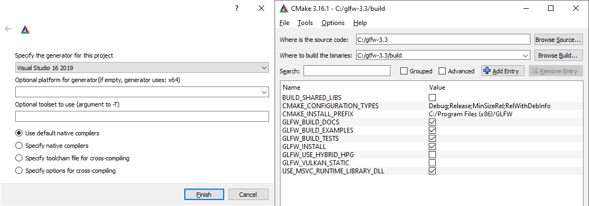
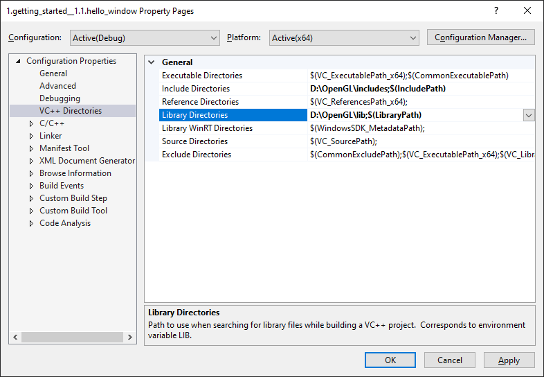

# Bir Pencere Oluşturma 🪟

Göz alıcı grafikler ve üç boyutlu sahneler oluşturmaya başlamadan önce yapmamız gereken ilk şey; üzerinde çizim yapabileceğimiz bir **OpenGL Bağlamı (Context)** ve işletim sistemine ait bir **uygulama penceresi** oluşturmaktır.

Ancak bu işlemler işletim sistemlerine göre (Windows, macOS, Linux) tamamen farklılık gösterir ve OpenGL, taşınabilirliğini korumak amacıyla bilerek kendini bu sistem seviyesindeki operasyonlardan soyutlar. Bu durum; bir pencere açma, pencere boyutunu yönetme ve klavye/fare girdilerini yakalama işini bizim kendimizin halletmesi gerektiği anlamına gelir.

Neyse ki, tekerleği sıfırdan icat etmemize gerek yok! Bize tam olarak aradığımız bu özellikleri sağlayan ve doğrudan OpenGL'i hedefleyen çok başarılı açık kaynak kütüphaneler bulunmaktadır. Bu kütüphaneler bizi işletim sistemine özel hantal kodlar yazmaktan kurtarır ve bize doğrudan render alabileceğimiz hazır bir pencere sunar. Sektördeki en popüler alternatifler **GLUT**, **SDL**, **SFML** ve **GLFW**'dir. 

Bu rehber boyunca **GLFW** kütüphanesini kullanacağız. Eğer başka bir kütüphane tercih etmek isterseniz özgürsünüz; çünkü temel kurulum mantığı neredeyse hepsinde aynıdır.

---

## GLFW Nedir?

GLFW; doğrudan OpenGL, OpenGL ES ve Vulkan'ı hedefleyen, C dilinde yazılmış hafif ve yüksek performanslı bir kütüphanedir. Bize ekrana çizim yapabilmemiz için gereken en temel yapı taşlarını sunar: Bir OpenGL bağlamı oluşturmak, pencere parametrelerini belirlemek ve kullanıcı girdilerini (klavye, fare, oyun kumandası) yakalamak. Bizim amaçlarımız için fazlasıyla yeterli ve mükemmel bir araçtır.

Bu ve bir sonraki bölümün ana odağı; GLFW'yi projemize dahil etmek, doğru bir şekilde bir OpenGL bağlamı oluşturduğundan emin olmak ve üzerinde deneyler yapabileceğimiz ilk penceremizi ekranda görmektir.

---

## GLFW'nin Edinilmesi ve Kurulumu

GLFW'yi [resmi indirme sayfasından](https://www.glfw.org/download.html) temin edebilirsiniz. Burada önünüzde iki seçenek bulunur:

1. **Kaynak Kodu İndirip Derlemek (Source package):** Kaynak kodları indirip **CMake** aracıyla kendi derleyiciniz için bizzat derleyebilirsiniz. Bu yöntem, kütüphanenin sisteminiz ve derleyici sürümünüzle %100 uyumlu olmasını garanti eder.
2. **Önceden Derlenmiş İkilileri Kullanmak (Pre-compiled binaries):** Kendi işletim sisteminize ve derleyicinize (örneğin 64-bit Windows / Visual Studio) uygun hazır `.lib` ve `.dll` dosyalarını doğrudan indirip kullanabilirsiniz.

!!! tip "64-bit vs 32-bit"
    Önceden derlenmiş paketleri indiriyorsanız kesinlikle **64-bit ikililerini (64-bit binaries)** tercih edin. Günümüzdeki tüm modern oyunlar ve grafik uygulamaları 64-bit mimaride geliştirilmektedir.

### Kaynak Koddan Derleme (Önerilen Yol)
Eğer kaynak kodu kendiniz derlemek isterseniz:
1. Kaynak paketini indirip bir klasöre çıkartın.
2. [CMake](https://cmake.org/download/) aracını açın. Kaynak kod klasörünü ve çıktı klasörünü (`build`) seçip **Configure** butonuna tıklayın.



3. Derleyicinizi (örneğin Visual Studio 16 2019 veya 2022) seçin, ardından **Generate** butonuna basın.
4. Oluşan çözüm dosyasını (`GLFW.sln`) açıp projeyi **Release** modunda derleyin. `src/Release` klasörü içinde **`glfw3.lib`** dosyanız hazır olacaktır!

---

## Visual Studio Projesine Dahil Etme

Hazırladığımız kütüphaneyi C++ projemize bağlamak için şu iki ana unsura ihtiyacımız vardır:

* **Başlık Dosyaları (`include` klasörü):** GLFW fonksiyonlarının tanımlarını (`glfw3.h`) içerir. Kodumuzun bu fonksiyonları tanıması için derleyiciye bu dizini göstermeliyiz.
* **Kütüphane Dosyası (`lib` klasörü):** Fonksiyonların derlenmiş gerçek makine kodlarını (`glfw3.lib`) içerir. Bağlayıcıya (*Linker*) bu dosyayı bildirmeliyiz.

Proje klasörünüzün içine örneğin `Libraries` adında bir klasör açıp içine GLFW'nin `include` ve `lib` klasörlerini kopyalayın.

Visual Studio'da projenize sağ tıklayıp **Özellikler (Properties)** penceresini açın:

1. Sağ üstten yapılandırmanın **All Configurations** (Tüm Yapılandırmalar) ve platformun **x64** olduğundan emin olun.
2. **C/C++ -> General (Genel) -> Additional Include Directories (Ek İçerme Dizinleri):**  
   GLFW'nin `include` klasörünün yolunu buraya ekleyin.


3. **Linker (Bağlayıcı) -> General (Genel) -> Additional Library Directories (Ek Kütüphane Dizinleri):**  
   `glfw3.lib` dosyasının bulunduğu klasör yolunu buraya ekleyin.



4. **Linker (Bağlayıcı) -> Input (Girdi) -> Additional Dependencies (Ek Bağımlılıklar):**  
   Buraya kütüphane adlarını ekleyin:
   * **`glfw3.lib`**
   * **`opengl32.lib`** (Windows'un içinde dahili olarak gelen temel OpenGL kütüphanesidir).


---

## GLAD Nedir ve Neden Hayati Önem Taşır?

GLFW ile penceremizi ayarladık; fakat henüz işimiz bitmedi! Çok kritik bir adım daha var: **GLAD**.

### Fonksiyon İşaretçileri Çilesi
Bölüm 1'de konuştuğumuz gibi, OpenGL bir teknik şartnamedir ve sürücüyü ekran kartı üreticileri yazar. OpenGL'in desteklediği fonksiyonların (örneğin `glDrawArrays`, `glBindBuffer` vb.) ekran kartınızdaki tam bellek adresleri **derleme zamanında (compile-time) bilinemez!** Bu adresler, programınız çalışırken çalışma zamanında (*runtime*) sürücüden dinamik olarak sorgulanmak zorundadır.

Windows üzerinde bunu geleneksel olarak yapmak için her bir fonksiyonu tek tek işletim sisteminden istemeniz gerekirdi:

```cpp
// Eski ve çileli yöntem: Her fonksiyonu tek tek elle bağlamak!
typedef void (*GL_GENBUFFERS)(GLsizei, GLuint*);
GL_GENBUFFERS glGenBuffers = (GL_GENBUFFERS)wglGetProcAddress("glGenBuffers");
```

Tahmin edebileceğiniz gibi modern OpenGL'de yüzlerce fonksiyon vardır. Her biri için tek tek bu işaretçileri tanımlayıp bellek adreslerini sormak tam anlamıyla bir kabustur!

İşte **GLAD** tam olarak bu çileyi ortadan kaldıran harika bir açık kaynak araçtır. Çalışma zamanında arka planda ekran kartı sürücünüzle konuşur ve ihtiyaç duyduğumuz tüm modern OpenGL fonksiyon işaretçilerini otomatik olarak yükler.

---

## GLAD Kurulumu

GLAD, popüler bir web servisi üzerinden doğrudan projenize özel olarak üretilir:

1. [GLAD Web Üreticisine](https://glad.dav1d.de/) gidin.
2. **Language (Dil):** `C/C++` olarak kalsın.
3. **Specification (Şartname):** `OpenGL` seçin.
4. **API -> gl:** En azından **`Version 3.3`** sürümünü seçin.
5. **Profile (Profil):** Kesinlikle **`Core`** seçeneğini işaretleyin.
6. *"Generate a loader"* kutucuğunun işaretli olduğundan emin olun ve sayfanın altındaki **Generate** butonuna tıklayın.

{ width=500 }

GLAD size bir `.zip` dosyası verecektir. Bu arşivin içinde iki önemli parça bulunur:
* **`include/` klasörü:** İçindeki `glad/` ve `KHR/` klasörlerini projenizin include dizinine kopyalayın.
* **`src/glad.c` dosyası:** Bu C dosyasını doğrudan Visual Studio projenizin kaynak dosyaları arasına ekleyin (Solution Explorer -> Add -> Existing Item).

!!! warning "Başlık Dosyalarının Sıralaması Çok Önemlidir!"
    Kod yazarken **GLAD başlık dosyasını daima GLFW'den ÖNCE dahil etmelisiniz**:
    ```cpp
    #include <glad/glad.h> // Her zaman İLK sırada olmalıdır!
    #include <GLFW/glfw3.h>
    ```
    Çünkü `glad.h`, arkada gerekli olan doğru OpenGL başlık tanımlarını yapar. Eğer GLFW'yi önce eklerseniz, GLFW eski OpenGL başlıklarını çağırabilir ve derleme çakışmaları yaşanır.

---

## Tebrikler! Altyapımız Tamamlandı 🎉

Artık hem penceremizi yöneteceğimiz **GLFW**, hem de tüm modern OpenGL fonksiyonlarını parmaklarımızın ucuna getiren **GLAD** kütüphanelerimiz projemize bağlandı.

Bir sonraki bölümde, C++ kodumuzu yazmaya başlayacak, ilk penceremizi ekranda açacak, render döngümüzü kuracak ve pencereyi dilediğimiz renkle temizleyeceğiz!

👉 **[Sonraki Bölüm: Merhaba Pencere! (Hello Window)](03-merhaba-pencere.md)**
