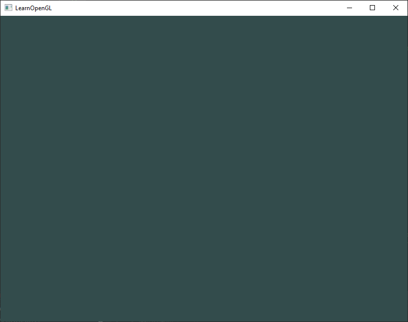

# Merhaba Pencere! (Hello Window) 🖥️

Önceki bölümlerde GLFW ve GLAD kütüphanelerimizi projemize başarıyla bağladık. Şimdi sıra, modern grafik programlama dünyasının meşhur ilk adımını atmaya geldi: **Kendi ilk penceremizi ekranda açmak ve render döngümüzü kurmak!**

Hemen C++ projenizde yeni bir `.cpp` dosyası (örneğin `main.cpp`) oluşturun ve dosyanın en üstüne şu başlıkları ekleyin:

```cpp
#include <glad/glad.h>
#include <GLFW/glfw3.h>
#include <iostream>
```

!!! warning "Unutmayın: GLAD Her Zaman İlk Sırada!"
    Bölüm 2'de de vurguladığımız gibi, `#include <glad/glad.h>` satırı her zaman `#include <GLFW/glfw3.h>` satırından **ÖNCE** gelmelidir. Çünkü GLAD, arka planda gerekli olan temel OpenGL başlıklarını (`GL/gl.h` gibi) sisteme dahil eder.

---

## GLFW'yi Başlatma ve Yapılandırma

Kodumuzun kalbi olan `main` fonksiyonumuzu yazmaya başlayalım. İlk olarak GLFW kütüphanesini ayağa kaldırmalı ve penceremizin hangi OpenGL standartlarını kullanacağını belirtmeliyiz:

```cpp
int main()
{
    // 1. GLFW'yi başlat
    glfwInit();

    // 2. Kullanacağımız OpenGL sürümünü bildir (OpenGL 3.3)
    glfwWindowHint(GLFW_CONTEXT_VERSION_MAJOR, 3);
    glfwWindowHint(GLFW_CONTEXT_VERSION_MINOR, 3);

    // 3. Çekirdek Profil (Core-profile) kullanacağımızı belirt
    glfwWindowHint(GLFW_OPENGL_PROFILE, GLFW_OPENGL_CORE_PROFILE);

#ifdef __APPLE__
    // macOS işletim sistemine özel ileriye dönük uyumluluk ayarı
    glfwWindowHint(GLFW_OPENGL_FORWARD_COMPAT, GL_TRUE);
#endif

    return 0;
}
```

Burada kullandığımız `glfwWindowHint` fonksiyonu, GLFW'ye oluşturacağımız pencere ve OpenGL bağlamı hakkında "ipuçları" (ayarlar) verir. 
* İlk argüman değiştirmek istediğimiz özelliği,
* İkinci argüman ise bu özelliğe atayacağımız değeri temsil eder.

Biz ana sürümü (**MAJOR**) `3`, alt sürümü (**MINOR**) `3` yaparak **OpenGL 3.3** standardını hedeflediğimizi bildirdik. Ayrıca profili `GLFW_OPENGL_CORE_PROFILE` seçerek, eski ve verimsiz fonksiyonlara ihtiyacımız olmadığını ve modern çekirdek mimariyle çalışmak istediğimizi açıkça belirttik.

---

## Pencere Nesnesini Oluşturma

Sıra işletim sisteminden gerçek bir pencere talep etmeye geldi:

```cpp
GLFWwindow* window = glfwCreateWindow(800, 600, "LearnOpenGL TR", NULL, NULL);
if (window == NULL)
{
    std::cout << "GLFW penceresi oluşturulamadı!" << std::endl;
    glfwTerminate();
    return -1;
}
glfwMakeContextCurrent(window);
```

* `glfwCreateWindow` fonksiyonu sırasıyla: Pencere genişliği (800 px), yüksekliği (600 px), pencere başlığı ("LearnOpenGL TR") ve iki adet monitör/paylaşım parametresi alır (tam ekran istemediğimiz için şimdilik `NULL`).
* Fonksiyon bize bir `GLFWwindow*` işaretçisi döndürür. Eğer bir şeyler ters giderse (örneğin donanım OpenGL 3.3 desteklemiyorsa) işaretçi `NULL` döner; bu durumu bir `if` kontrolüyle yakalayıp GLFW'yi güvenle kapatıyoruz.
* Son olarak `glfwMakeContextCurrent(window)` çağrısı yaparak, az önce oluşturduğumuz bu pencerenin OpenGL bağlamını, programımızın çalıştığı ana iş parçacığının (*thread*) **geçerli bağlamı** haline getiriyoruz.

---

## GLAD'i Başlatma

Bölüm 2'de konuştuğumuz gibi, OpenGL fonksiyonlarının adreslerini çalışma zamanında işletim sisteminden çekmek zorundayız. Artık geçerli bir pencere bağlamımız olduğuna göre, GLAD'e bu fonksiyon işaretçilerini yükleme emrini verebiliriz:

```cpp
if (!gladLoadGLLoader((GLADloadproc)glfwGetProcAddress))
{
    std::cout << "GLAD başlatılamadı!" << std::endl;
    return -1;
}
```

Burada `glfwGetProcAddress` fonksiyonunu GLAD'e parametre olarak geçiriyoruz. GLFW, çalıştığı işletim sistemine (Windows, Linux, macOS) göre fonksiyonların bellekteki adresini nasıl bulacağını çok iyi bilir; GLAD de bu sayede tüm modern OpenGL fonksiyon işaretçilerini bizim için otomatik olarak bağlar.

---

## Görünüm Alanı (Viewport)

OpenGL üzerinde çizim yapmaya başlamadan önce, çizim alanımızın boyutlarını OpenGL'e bildirmeliyiz:

```cpp
glViewport(0, 0, 800, 600);
```

`glViewport` fonksiyonunun ilk iki parametresi pencerenin sol-alt köşesinin koordinatlarını (0, 0), son iki parametresi ise render penceresinin genişlik ve yüksekliğini (800, 600) belirler.

Arka planda OpenGL, `(-1)` ile `1` arasındaki **Normalleştirilmiş Cihaz Koordinatlarını (NDC)** bu görünüm alanını kullanarak penceremizdeki piksel koordinatlarına dönüştürür. Örneğin `(-0.5, 0.5)` koordinatındaki bir nokta, ekranda `(200, 450)` pikseline eşlenir.

### Pencere Boyutlandırma Geri Çağrısı (Callback)
Kullanıcı penceremizi kenarlarından tutup yeniden boyutlandırdığında, görünüm alanının da otomatik olarak güncellenmesini isteriz. Bunu GLFW'nin **Geri Çağrı (Callback)** fonksiyonu ile çözeriz:

```cpp
void framebuffer_size_callback(GLFWwindow* window, int width, int height)
{
    glViewport(0, 0, width, height);
}
```

Ardından `main` fonksiyonu içinde GLFW'ye bu fonksiyonu kaydederiz:

```cpp
glfwSetFramebufferSizeCallback(window, framebuffer_size_callback);
```

Artık kullanıcı pencereyi ne kadar büyütür ya da küçültürse küçültsün, OpenGL çizim alanını anında yeni boyutlara uyarlayacaktır!

---

## Render Döngüsü (The Render Loop)

Eğer programımızı bu haliyle çalıştırırsak ne olur? Pencere saliseler içinde açılır ve `main` fonksiyonu sona erdiği için anında kapanır! 

Penceremizin ekranda kalmasını ve biz kapatana kadar sürekli çizim yapmasını isteriz. İşte bu yüzden bir **Render Döngüsü (Render Loop)** kurarız:

```cpp
while (!glfwWindowShouldClose(window))
{
    // 1. Kullanıcı girdilerini kontrol et
    processInput(window);

    // 2. Çizim / Render komutları buraya gelecek...

    // 3. Tamponları değiştir ve olayları dinle
    glfwSwapBuffers(window);
    glfwPollEvents();
}
```

* `glfwWindowShouldClose`: Her turun başında pencereye kapatma emri (kırmızı çarpı butonu gibi) verilip verilmediğini kontrol eder.
* `glfwPollEvents`: Klavye tuşları, fare hareketleri veya pencere olayları gibi durumları kontrol eder ve ilgili geri çağırma fonksiyonlarını tetikler.
* `glfwSwapBuffers`: **Çift Tamponlama (Double Buffering)** mekanizmasını yürütür.

!!! tip "Çift Tamponlama (Double Buffering) Nedir?"
    Bir uygulamanın tek bir tampon üzerinde çizim yapması ekranda titremelere ve görüntü yırtılmalarına (*screen tearing*) sebep olur; çünkü pikseller ekranda çizilirken kullanıcı yarım kalmış görüntüleri görür. 
    Bunu önlemek için **iki tampon** kullanılır:
    * **Ön Tampon (Front Buffer):** O anda ekranda kullanıcıya gösterilen tamamlanmış resimdir.
    * **Arka Tampon (Back Buffer):** Ekran kartının arkada bir sonraki kareyi sessizce çizdiği alandır.
    Çizim bittiğinde `glfwSwapBuffers` ile iki tampon anında yer değiştirir (Swap) ve kullanıcı her zaman pürüzsüz, bitmiş bir görüntü görür!

---

## Kullanıcı Girdilerini Yakalama (Input)

Kullanıcının klavyeden bir tuşa (örneğin **ESC** tuşuna) bastığında uygulamadan çıkmasını sağlamak son derece basittir. Ayrı bir fonksiyon yazalım:

```cpp
void processInput(GLFWwindow *window)
{
    if (glfwGetKey(window, GLFW_KEY_ESCAPE) == GLFW_PRESS)
        glfwSetWindowShouldClose(window, true);
}
```

Burada `glfwGetKey`, ilgili tuşa basılıp basılmadığını sorgular. Eğer kullanıcı ESC tuşuna basmışsa, `glfwSetWindowShouldClose` ile pencerenin kapatılması gerektiği bayrağını `true` yaparız ve döngü bir sonraki turda sonlanır.

---

## Ekranı Temizleme ve Renklendirme 🎨

Her yeni render karesine başlarken ekranı bir önceki kareden kalan artıklardan temizlemek isteriz. 

Bölüm 1'de öğrendiğimiz **Durum Makinesi** modelini hatırlayın:
1. Önce ekranı temizlerken hangi rengi kullanmak istediğimizi belirleriz (**Durum Değiştirici**),
2. Ardından ekranı temizleme emrini veririz (**Durum Kullanıcı**):

```cpp
// Render döngüsünün içi:
glClearColor(0.2f, 0.3f, 0.3f, 1.0f);
glClear(GL_COLOR_BUFFER_BIT);
```

`glClearColor`, kırmızı (0.2), yeşil (0.3), mavi (0.3) ve alfa (1.0) değerleriyle koyu bir petrol yeşili / turkuaz tonunu aktif temizleme rengi yapar. `glClear` ise mevcut renk tamponunu (`GL_COLOR_BUFFER_BIT`) bu renkle tamamen doldurur.

---

## Temiz Kapanış (Cleanup)

Render döngüsü bittiğinde, işletim sistemine ayırdığımız tüm kaynakları iade etmeliyiz:

```cpp
glfwTerminate();
return 0;
```

---

## Eksiksiz Çalışan C++ Kaynak Kodu 🚀

Tüm bu parçaları bir araya getirdiğimizde ortaya çıkan eksiksiz ve çalışan ilk programımız:

```cpp
#include <glad/glad.h>
#include <GLFW/glfw3.h>
#include <iostream>

// Fonksiyon prototipleri
void framebuffer_size_callback(GLFWwindow* window, int width, int height);
void processInput(GLFWwindow *window);

// Ayarlar
const unsigned int SCR_WIDTH = 800;
const unsigned int SCR_HEIGHT = 600;

int main()
{
    // 1. GLFW'yi başlat ve yapılandır
    glfwInit();
    glfwWindowHint(GLFW_CONTEXT_VERSION_MAJOR, 3);
    glfwWindowHint(GLFW_CONTEXT_VERSION_MINOR, 3);
    glfwWindowHint(GLFW_OPENGL_PROFILE, GLFW_OPENGL_CORE_PROFILE);

#ifdef __APPLE__
    glfwWindowHint(GLFW_OPENGL_FORWARD_COMPAT, GL_TRUE);
#endif

    // 2. Pencere nesnesini oluştur
    GLFWwindow* window = glfwCreateWindow(SCR_WIDTH, SCR_HEIGHT, "LearnOpenGL TR", NULL, NULL);
    if (window == NULL)
    {
        std::cout << "GLFW penceresi olusturulamadi!" << std::endl;
        glfwTerminate();
        return -1;
    }
    glfwMakeContextCurrent(window);
    glfwSetFramebufferSizeCallback(window, framebuffer_size_callback);

    // 3. GLAD fonksiyon işaretçilerini yükle
    if (!gladLoadGLLoader((GLADloadproc)glfwGetProcAddress))
    {
        std::cout << "GLAD baslatilamadi!" << std::endl;
        return -1;
    }

    // 4. Render Döngüsü
    while (!glfwWindowShouldClose(window))
    {
        // Girdileri kontrol et
        processInput(window);

        // Render komutları: Ekranı temizle ve renklendir
        glClearColor(0.2f, 0.3f, 0.3f, 1.0f);
        glClear(GL_COLOR_BUFFER_BIT);

        // Tamponları değiştir ve olayları işle
        glfwSwapBuffers(window);
        glfwPollEvents();
    }

    // 5. Kaynakları temizle ve çık
    glfwTerminate();
    return 0;
}

// Pencere boyutu değiştiğinde çalışan geri çağırma fonksiyonu
void framebuffer_size_callback(GLFWwindow* window, int width, int height)
{
    glViewport(0, 0, width, height);
}

// Klavye girdilerini işleyen fonksiyon
void processInput(GLFWwindow *window)
{
    if (glfwGetKey(window, GLFW_KEY_ESCAPE) == GLFW_PRESS)
        glfwSetWindowShouldClose(window, true);
}
```

Bu kodu derleyip çalıştırdığınızda (Visual Studio'da **F5**), karşınızda şu büyüleyici ilk pencereniz belirecektir:



Pencereyi kenarlarından büyütüp küçültebilir ve klavyeden **ESC** tuşuna basarak penceremizi zarifçe kapatabilirsiniz.

---

## Tebrikler! 🥂

Modern grafik programlama dünyasının en kritik eşiklerinden birini aştınız: Artık çalışan bir pencereniz, aktif bir OpenGL bağlamınız ve canlı bir render döngünüz var!

Bir sonraki bölümde, grafik dünyasının "atomu" kabul edilen **üçgeni** GPU belleğine gönderecek (**VBO**, **VAO**), ilk **Vertex ve Fragment Shader** programlarımızı yazacak ve ekranda ilk şeklimizi çizeceğiz!

👉 **[Sonraki Bölüm: Merhaba Üçgen! (Hello Triangle)](04-merhaba-ucgen.md)**
