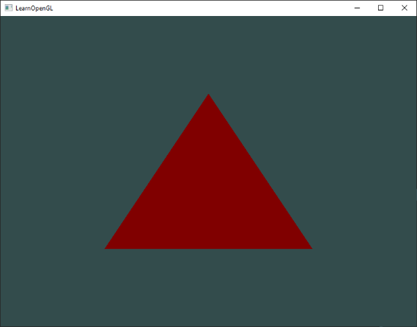
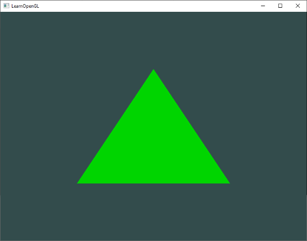
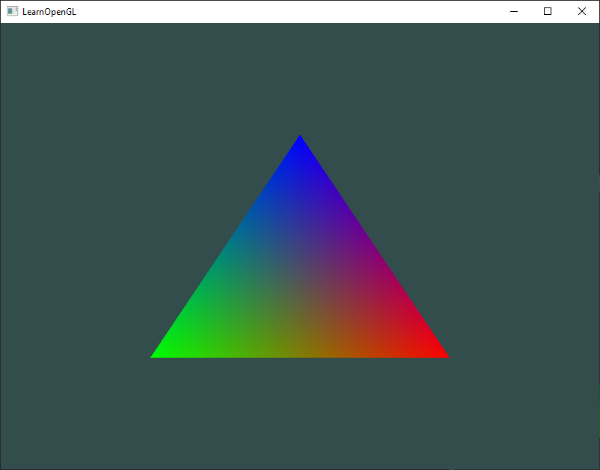

# Shader'lar (Gölgelendiriciler) 🎨

Bölüm 4'te kısaca bahsettiğimiz gibi **Shader'lar (Gölgelendiriciler)**, doğrudan ekran kartı (GPU) üzerinde çalışan küçük ve son derece hızlı programlardır. 

Grafik işlem hattının her bir aşamasında girdi verilerini alır, üzerlerinde matematiksel işlemler yürütür ve bir sonraki aşamaya iletirler. Gölgelendiriciler doğası gereği birbirlerinden izoledir; yani bir shader programı başka bir shader'ın anlık durumunu doğrudan göremez veya değiştiremez. Birbirleriyle yalnızca tanımladığımız **girdiler (inputs)** ve **çıktılar (outputs)** üzerinden haberleşirler.

Bu bölümde modern OpenGL'in programlama dili olan **GLSL**'in derinliklerine inecek, dinamik değişkenleri (**Uniform**) öğrenecek ve kendi yeniden kullanılabilir **Shader Sınıfımızı** inşa edeceğiz!

---

## GLSL Nedir?

Gölgelendiriciler **GLSL (OpenGL Shading Language)** adı verilen, C diline çok benzeyen özel bir dilde yazılır. GLSL, özellikle 2B/3B vektör ve matris matematiğini donanımsal düzeyde ışık hızında işlemek için tasarlanmıştır.

Tipik bir GLSL gölgelendiricisinin genel anatomisi şöyledir:

```glsl
#version versiyon_numarasi core
in tip girdi_degiskeni_adi;
in tip baska_bir_girdi;

out tip cikti_degiskeni_adi;

uniform tip tekduze_degisken_adi;

void main()
{
    // Grafik hesaplamaları ve matematiksel işlemler...
    // Çıktı değişkenine nihai değerin atanması:
    cikti_degiskeni_adi = islenmis_deger;
}
```

* **`#version`:** İlk satırda her zaman OpenGL sürümü belirtilir (`#version 330 core`).
* **`in`:** Bu gölgelendiriciye dışarıdan gelen girdi değişkenleridir.
* **`out`:** Bir sonraki aşamaya aktarılacak çıktı değişkenleridir.
* **`uniform`:** C++ kodumuzdan doğrudan GPU'ya gönderebileceğimiz özel global değişkenlerdir.
* **`main()`:** Tıpkı C++'ta olduğu gibi gölgelendiricinin giriş noktasıdır.

---

## GLSL Veri Tipleri ve Vektörler

GLSL; `int`, `float`, `double`, `uint` ve `bool` gibi temel C veri tiplerini destekler. Ancak GLSL'in asıl süper gücü, grafik matematiğinde sürekli kullandığımız **Vektör (Vector)** ve **Matris (Matrix)** konteynerleridir.

En sık kullanacağımız vektör tipleri:
* **`vec2`:** 2 adet ondalıklı sayı (`float`) tutan vektör.
* **`vec3`:** 3 adet `float` tutan vektör (3B koordinatlar veya RGB renkler için idealdir).
* **`vec4`:** 4 adet `float` tutan vektör (Homojen koordinatlar veya RGBA renkler için idealdir).

### Swizzling (Bileşen Karıştırma) Mucizesi!
GLSL vektörlerinin en harika özelliklerinden biri **Swizzling** adı verilen bileşen seçme yeteneğidir. Bir vektörün bileşenlerine şu harflerle erişebilirsiniz:
* Koordinat için: `.x`, `.y`, `.z`, `.w`
* Renk için: `.r`, `.g`, `.b`, `.a`
* Doku koordinatı için: `.s`, `.t`, `.p`, `.q`

Üstelik bu bileşenleri istediğiniz sırada birleştirerek yepyeni vektörler üretebilirsiniz:

```glsl
vec2 someVec;
vec4 differentVec = someVec.xyxx; // someVec'in x ve y'sini kullanarak 4B vektör yaptık!
vec3 anotherVec   = differentVec.zyw;
vec4 otherVec     = someVec.xxxx + anotherVec.yxzy;
```

---

## Gölgelendiriciler Arası İletişim (`in` ve `out`)

Her gölgelendirici kendi başına bağımsız bir dünyadır; peki verileri **Vertex Shader**'dan **Fragment Shader**'a nasıl aktarırız?

Cevap çok basit: **İsim ve tip eşleşmesi!**
1. Vertex Shader'da bir değişkeni **`out`** olarak tanımlarız.
2. Fragment Shader'da **birebir aynı isim ve tipte** bir değişkeni **`in`** olarak karşılarız.

OpenGL bu iki shader'ı bir programda bağlarken (`glLinkProgram`), aynı isme sahip değişkenleri arka planda otomatik olarak birbirine bağlar:

```glsl
// --- VERTEX SHADER ---
#version 330 core
layout (location = 0) in vec3 aPos;

out vec4 vertexColor; // Fragment Shader'a gönderilecek çıktı

void main()
{
    gl_Position = vec4(aPos, 1.0);
    vertexColor = vec4(0.5, 0.0, 0.0, 1.0); // Koyu kırmızı rengi çıktı veriyoruz
}
```

```glsl
// --- FRAGMENT SHADER ---
#version 330 core
out vec4 FragColor;

in vec4 vertexColor; // Vertex Shader'dan gelen çıktıyı aynı isimle karşılıyoruz!

void main()
{
    FragColor = vertexColor; // Pikseli gelen renge boyuyoruz
}
```

Kodu çalıştırdığınızda üçgeninizin koyu kırmızı renkte boyandığını göreceksiniz:



---

## Uniforms: CPU'dan GPU'ya Canlı Veri Aktarımı ⚡

Peki C++ kodumuzdaki bir değişkeni (örneğin geçen zamanı, kamera konumunu veya bir rengi) shader'a çalışma zamanında dinamik olarak göndermek istersek ne yapacağız?

İşte burada **Uniform (Tekdüze)** değişkenler devreye girer:
* Bir `uniform`, tüm shader aşamaları için **globaldir**.
* Değeri C++ kodumuz tarafından değiştirilene kadar GPU belleğinde sabit kalır.

Hemen Fragment Shader'ımızda bir uniform tanımlayalım:

```glsl
#version 330 core
out vec4 FragColor;

uniform vec4 ourColor; // C++ tarafından atanacak global uniform

void main()
{
    FragColor = ourColor;
}
```

### Uniform'u C++ Tarafından Güncellemek
Zamana bağlı olarak üçgenimizin rengini yeşilin tonları arasında dalgalandıralım:

```cpp
// Render döngüsünün içi:
float timeValue = glfwGetTime(); // Çalışma süresini saniye cinsinden al
float greenValue = (sin(timeValue) / 2.0f) + 0.5f; // 0.0 ile 1.0 arasına sıkıştır

// 1. Uniform'un shader içindeki adresini (Location) bul:
int vertexColorLocation = glGetUniformLocation(shaderProgram, "ourColor");

// 2. Shader programını aktif et:
glUseProgram(shaderProgram);

// 3. Değeri GPU'ya gönder:
glUniform4f(vertexColorLocation, 0.0f, greenValue, 0.0f, 1.0f);
```

!!! tip "C Fonksiyonlarındaki Sonek (Suffix) Gösterimi"
    OpenGL C dilinde yazıldığı için fonksiyon aşırı yüklemeyi (*function overloading*) desteklemez. Bu yüzden fonksiyona göndereceğiniz parametre tipini fonksiyonun adının sonundaki harflerden anlarsınız:
    * `f`: `float` parametre alır (örn: `glUniform1f`).
    * `i`: `int` parametre alır (örn: `glUniform1i`).
    * `4f`: 4 adet `float` parametre alır (örn: `glUniform4f`).
    * `3fv`: 3 elemanlı bir float vektörü/dizisi alır.

Artık üçgenimiz nefes alır gibi yeşil tonları arasında parıldayacaktır:



---

## Daha Fazla Nitelik! Renkli Tepe Noktaları 🌈

Şimdiye kadar tepe noktası başına sadece 3 adet koordinat (`x, y, z`) gönderdik. Peki her bir tepe noktasına kendine ait özel bir **renk** de atayabilir miyiz? Kesinlikle!

Tepe noktası verilerimizi güncelleyelim:

```cpp
float vertices[] = {
    // Konumlar (x, y, z)    // Renkler (r, g, b)
     0.5f, -0.5f, 0.0f,      1.0f, 0.0f, 0.0f,   // Sağ alt: Kırmızı
    -0.5f, -0.5f, 0.0f,      0.0f, 1.0f, 0.0f,   // Sol alt: Yeşil
     0.0f,  0.5f, 0.0f,      0.0f, 0.0f, 1.0f    // Tepe:    Mavi
};
```

Artık her bir tepe noktamız **6 adet float** büyüklüğündedir (3 konum + 3 renk). Bu bellek düzenine **Interleaved (İç İçe Geçmiş) Veri** denir:


Vertex Shader'ımızı güncelleyelim:

```glsl
#version 330 core
layout (location = 0) in vec3 aPos;   // Konum girdisi
layout (location = 1) in vec3 aColor; // Renk girdisi

out vec3 ourColor; // Fragment shader'a aktarılacak renk

void main()
{
    gl_Position = vec4(aPos, 1.0);
    ourColor = aColor; // Gelen rengi doğrudan çıktıya ver
}
```

C++ tarafında nitelik işaretçilerimizi yapılandıralım:

```cpp
// 1. Konum Niteliği (Location = 0)
glVertexAttribPointer(0, 3, GL_FLOAT, GL_FALSE, 6 * sizeof(float), (void*)0);
glEnableVertexAttribArray(0);

// 2. Renk Niteliği (Location = 1)
glVertexAttribPointer(1, 3, GL_FLOAT, GL_FALSE, 6 * sizeof(float), (void*)(3 * sizeof(float)));
glEnableVertexAttribArray(1);
```

* Adım (*Stride*) artık `6 * sizeof(float)` bayttır; çünkü bir sonraki tepe noktasına geçmek için 6 float atlamamız gerekir.
* Renk verisinin başlangıç ötelemesi (*Offset*) `(void*)(3 * sizeof(float))` olarak verilir; çünkü renk verisi ilk 3 float'lık konum verisinden hemen sonra başlar!

Fragment Shader'ımız ise gelen bu rengi karşılar:

```glsl
#version 330 core
out vec4 FragColor;
in vec3 ourColor;

void main()
{
    FragColor = vec4(ourColor, 1.0);
}
```

### Parça İnterpolasyonu (Fragment Interpolation)
Programı çalıştırdığınızda karşınıza büyüleyici bir görüntü çıkacaktır:



Üçgenin köşeleri kırmızı, yeşil ve mavi; fakat üçgenin içi **kusursuz bir gökkuşağı renk geçişine** sahiptir! 

Bu nasıl oldu?  
Grafik işlem hattındaki **Rasterizasyon Aşaması**, üçgenin köşeleri arasındaki tüm pikseller için renk değerlerini mesafelerine göre otomatik olarak **enterpole eder (ağırlıklı ortalamasını alır)**. Örneğin kırmızı köşe ile yeşil köşe arasındaki orta nokta otomatik olarak sarı renge boyanır. Bu mekanizmaya **Parça İnterpolasyonu (Fragment Interpolation)** denir.

---

## Kendi Shader Sınıfımızı İnşa Ediyoruz 🛠️

Shader kodlarını C++ dosyalarının içine uzun karakter dizileri (`const char*`) olarak gömmek büyük projelerde sürdürülemez bir karmaşa yaratır.

Gerçek bir grafik motorunda shader kodları diskteki bağımsız dosyalarda saklanır (örneğin `shader.vs` ve `shader.fs`). Gelin, bu dosyaları diskten okuyan, derleyen, bağlayan ve hataları raporlayan şık bir C++ **`Shader`** sınıfı yazalım!

Yeni bir başlık dosyası oluşturun: **`shader_s.h`**

```cpp
#ifndef SHADER_H
#define SHADER_H

#include <glad/glad.h>
#include <string>
#include <fstream>
#include <sstream>
#include <iostream>

class Shader
{
public:
    unsigned int ID; // Program ID'si

    // Kurucu fonksiyon: Dosya yollarını alır, okur ve derler
    Shader(const char* vertexPath, const char* fragmentPath)
    {
        // 1. Dosyalardan kaynak kodlarını oku
        std::string vertexCode;
        std::string fragmentCode;
        std::ifstream vShaderFile;
        std::ifstream fShaderFile;

        vShaderFile.exceptions(std::ifstream::failbit | std::ifstream::badbit);
        fShaderFile.exceptions(std::ifstream::failbit | std::ifstream::badbit);
        try 
        {
            vShaderFile.open(vertexPath);
            fShaderFile.open(fragmentPath);
            std::stringstream vShaderStream, fShaderStream;
            vShaderStream << vShaderFile.rdbuf();
            fShaderStream << fShaderFile.rdbuf();
            vShaderFile.close();
            fShaderFile.close();
            vertexCode   = vShaderStream.str();
            fragmentCode = fShaderStream.str();
        }
        catch (std::ifstream::failure& e)
        {
            std::cout << "HATA::SHADER::DOSYA_OKUNAMADI: " << e.what() << std::endl;
        }
        const char* vShaderCode = vertexCode.c_str();
        const char* fShaderCode = fragmentCode.c_str();

        // 2. Shader'ları derle
        unsigned int vertex, fragment;
        int success;
        char infoLog[512];

        // Vertex Shader
        vertex = glCreateShader(GL_VERTEX_SHADER);
        glShaderSource(vertex, 1, &vShaderCode, NULL);
        glCompileShader(vertex);
        checkCompileErrors(vertex, "VERTEX");

        // Fragment Shader
        fragment = glCreateShader(GL_FRAGMENT_SHADER);
        glShaderSource(fragment, 1, &fShaderCode, NULL);
        glCompileShader(fragment);
        checkCompileErrors(fragment, "FRAGMENT");

        // Shader Programı
        ID = glCreateProgram();
        glAttachShader(ID, vertex);
        glAttachShader(ID, fragment);
        glLinkProgram(ID);
        checkCompileErrors(ID, "PROGRAM");

        glDeleteShader(vertex);
        glDeleteShader(fragment);
    }

    // Shader programını aktif et
    void use() 
    { 
        glUseProgram(ID); 
    }

    // Pratik Uniform yardımcı fonksiyonları
    void setBool(const std::string &name, bool value) const
    {         
        glUniform1i(glGetUniformLocation(ID, name.c_str()), (int)value); 
    }
    void setInt(const std::string &name, int value) const
    { 
        glUniform1i(glGetUniformLocation(ID, name.c_str()), value); 
    }
    void setFloat(const std::string &name, float value) const
    { 
        glUniform1f(glGetUniformLocation(ID, name.c_str()), value); 
    }

private:
    void checkCompileErrors(unsigned int shader, std::string type)
    {
        int success;
        char infoLog[1024];
        if (type != "PROGRAM")
        {
            glGetShaderiv(shader, GL_COMPILE_STATUS, &success);
            if (!success)
            {
                glGetShaderInfoLog(shader, 1024, NULL, infoLog);
                std::cout << "HATA::SHADER_DERLEME_HATASI tip: " << type << "
" << infoLog << std::endl;
            }
        }
        else
        {
            glGetProgramiv(shader, GL_LINK_STATUS, &success);
            if (!success)
            {
                glGetProgramInfoLog(shader, 1024, NULL, infoLog);
                std::cout << "HATA::PROGRAM_BAGLAMA_HATASI tip: " << type << "
" << infoLog << std::endl;
            }
        }
    }
};

#endif
```

### Sınıfımızı Kullanmak Artık Çocuk Oyuncağı!
Artık `main.cpp` dosyamızda tek satırla shader oluşturup kullanabiliriz:

```cpp
Shader ourShader("shader.vs", "shader.fs");
...
while (!glfwWindowShouldClose(window))
{
    ...
    ourShader.use();
    ourShader.setFloat("someUniform", 1.0f);
    glBindVertexArray(VAO);
    glDrawArrays(GL_TRIANGLES, 0, 3);
    ...
}
```

---

## Alıştırmalar 🏋️

1. **Baş Aşağı Üçgen:** Vertex Shader kodunuzu öyle değiştirin ki üçgen tepe taklak (baş aşağı) dönsün (ipucu: `gl_Position` değerini ayarlarken y koordinatının işaretini tersine çevirin).
2. **Yatay Öteleme:** Bir `uniform` değişken tanımlayın ve bu değişkeni Vertex Shader'da `x` koordinatına ekleyin. Render döngüsü içinde bu uniform'u güncelleyerek üçgeni sağa ve sola kaydırın!
3. **Konumdan Renk Üretme:** Vertex Shader'daki `aPos` konum verisini Fragment Shader'a aktarın ve `FragColor` rengini bu konum değerine eşitleyin. Üçgenin neden alt kısmının siyah göründüğünü açıklamaya çalışın!

---

Sırada üçgenlerimize gerçekçi ahşap, tuğla ve metal resimleri giydireceğimiz **Bölüm 6: "Dokular (Textures)"** var!

👉 **[Sonraki Bölüm: Dokular (Textures)](06-dokular.md)**
