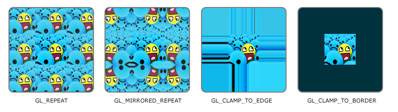
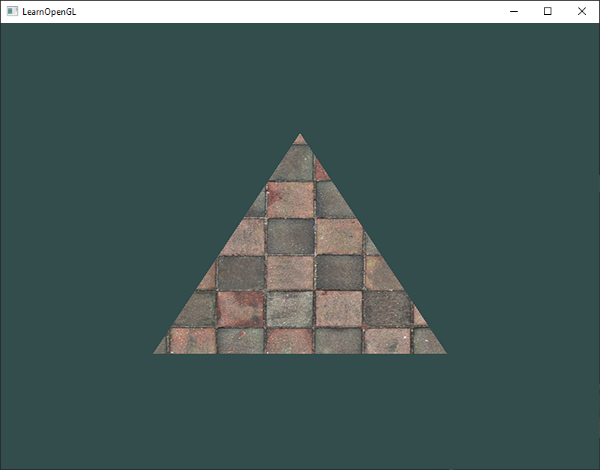

# Dokular (Textures) 🧱

Önceki bölümlerde renkli üçgenler çizdik ve tepe noktalarına renkler atayarak harika geçişler elde ettik. Fakat gerçek bir oyunda veya 3B sahnede her bir nesnenin rengarenk poligonlardan oluşması yerine, **gerçekçi ahşap, tuğla, kumaş veya metal yüzeylere** sahip olmasını isteriz. 

Her bir pikseli teker teker kodla renklendirmek imkansız olacağına göre, sanatçıların çizdiği iki boyutlu resimleri geometrilerimizin üzerine bir hediye paketi kağıdı gibi giydiririz. İşte 3B nesnelerimizin üzerine giydirdiğimiz bu 2B resimlere **Doku (Texture)** denir.

---

## Doku Koordinatları ve UV Haritalama

Bir dokuyu üçgenimizin veya dörtgenimizin üzerine nasıl yerleştireceğimizi OpenGL'e anlatmak için **Doku Koordinatlarını (Texture Coordinates)** kullanırız.

Doku koordinatları `x` ve `y` eksenleri yerine genellikle `s` ve `t` (ya da **U** ve **V**) eksenleriyle anılır. Bu koordinatlar piksellerin boyutundan bağımsız olarak **0.0** ile **1.0** arasındadır:
* Sol alt köşe: `(0.0, 0.0)`
* Sağ üst köşe: `(1.0, 1.0)`


Bir üçgenin köşelerine bu koordinatları atadığımızda, OpenGL üçgenin içindeki her bir piksel için dokudan hangi rengi alacağını otomatik olarak hesaplar. Bu işleme **Doku Örnekleme (Texture Sampling)** denir.

---

## Doku Sarma Yöntemleri (Texture Wrapping)

Peki doku koordinatlarını `0.0` ile `1.0` aralığının dışına (örneğin `2.0` veya `5.0`) çıkarırsak ne olur? 

OpenGL'in bu duruma nasıl tepki vereceğini **Doku Sarma (Texture Wrapping)** ayarlarıyla belirleriz:

* **`GL_REPEAT`:** Varsayılan davranıştır. Resim sonsuza kadar kendini tekrar eder (fayans gibi döşenir).
* **`GL_MIRRORED_REPEAT`:** Resim her tekrarda ayna gibi simetrik olarak ters döner.
* **`GL_CLAMP_TO_EDGE`:** 0 ile 1 arasındaki kenar pikselleri dışarı doğru sonsuza kadar uzatılır.
* **`GL_CLAMP_TO_BORDER`:** 0 ile 1 dışındaki alanlar belirlediğimiz sabit bir çerçeve rengiyle doldurulur.



Bu ayarları `glTexParameteri` fonksiyonu ile hem yatay (`GL_TEXTURE_WRAP_S`) hem de dikey (`GL_TEXTURE_WRAP_T`) eksen için ayrı ayrı yapılandırabiliriz:

```cpp
glTexParameteri(GL_TEXTURE_2D, GL_TEXTURE_WRAP_S, GL_MIRRORED_REPEAT);
glTexParameteri(GL_TEXTURE_2D, GL_TEXTURE_WRAP_T, GL_MIRRORED_REPEAT);
```

---

## Doku Filtreleme (Texture Filtering)

Doku piksellerine grafik dünyasında **Texel** denir. 3B dünyada bir nesneye çok yaklaştığınızda (dokuyu büyüttüğünüzde) veya çok uzaklaştığınızda (dokuyu küçülttüğünüzde), ekrandaki pikseller ile dokudaki texel'lar birebir örtüşmez. 

OpenGL'in bu durumda renkleri nasıl seçeceğini **Doku Filtreleme** belirler:

* **`GL_NEAREST` (En Yakın Komşu):** Piksel merkezine en yakın olan texel'ın rengini doğrudan alır. Piksel piksel, retro ve keskin hatlı bir görünüm oluşturur (Minecraft tarzı).
* **`GL_LINEAR` (Bilineer İnterpolasyon):** En yakın 4 komşu texel'ın ağırlıklı ortalamasını alarak pürüzsüz ve yumuşak bir geçiş sağlar.


```cpp
// Küçültme (MIN) ve büyütme (MAG) durumları için filtre belirleme:
glTexParameteri(GL_TEXTURE_2D, GL_TEXTURE_MIN_FILTER, GL_NEAREST);
glTexParameteri(GL_TEXTURE_2D, GL_TEXTURE_MAG_FILTER, GL_LINEAR);
```

---

## Mipmap'ler: Performans ve Görüntü Kalitesi

Diyelim ki sahnemizde uzakta duran yüzlerce küçük nesne var ve her birinde devasa 4K dokular kullanılmış. Bu durum hem aşırı bellek bant genişliği harcar hem de uzaktaki piksellerde titremelere (*moiré artifact*) sebep olur.

Bu sorunu çözmek için **Mipmap** adı verilen harika bir yöntem kullanılır:
* Mipmap, orijinal resmin her adımda yarı yarıya küçültülmüş bir dizi kopyasından oluşur (1024x1024 -> 512x512 -> 256x256 -> ... -> 1x1).
* Nesne kameraya yaklaştıkça yüksek çözünürlüklü kopya, uzaklaştıkça ise düşük çözünürlüklü küçük kopya devreye girer.


OpenGL bu mipmap zincirini bizim için tek bir fonksiyonla otomatik olarak oluşturur:
```cpp
glGenerateMipmap(GL_TEXTURE_2D);
```

Mipmap seviyeleri arasında gezinirken `GL_LINEAR_MIPMAP_LINEAR` filtresini seçmek, hem seviye içi pürüzsüzleştirme hem de mipmap katmanları arasında görünmez bir geçiş sağlar.

---

## Resimleri Yüklemek: `stb_image.h`

Disk üzerindeki `.jpg` ve `.png` dosyalarını belleğe yüklemek için C/C++ dünyasının en popüler, hafif ve tek başlıklı (*single-header*) kütüphanesi olan **`stb_image.h`** kütüphanesini kullanırız.

Kütüphaneyi [stb GitHub reposundan](https://github.com/nothings/stb/blob/master/stb_image.h) indirip projenize ekleyin. Bir kaynak dosyasında şu tanımla aktif edin:

```cpp
#define STB_IMAGE_IMPLEMENTATION
#include "stb_image.h"
```

Artık bir resmi tek satırla bayt dizisine dönüştürebiliriz:

```cpp
int width, height, nrChannels;
unsigned char *data = stbi_load("container.jpg", &width, &height, &nrChannels, 0);
```

---

## OpenGL'de Doku Üretmek

VBO'larda olduğu gibi, dokular da kimlik numaraları (ID) üzerinden yönetilir:

```cpp
unsigned int texture;
glGenTextures(1, &texture);
glBindTexture(GL_TEXTURE_2D, texture);

// Doku sarma ve filtreleme ayarları
glTexParameteri(GL_TEXTURE_2D, GL_TEXTURE_WRAP_S, GL_REPEAT);	
glTexParameteri(GL_TEXTURE_2D, GL_TEXTURE_WRAP_T, GL_REPEAT);
glTexParameteri(GL_TEXTURE_2D, GL_TEXTURE_MIN_FILTER, GL_LINEAR_MIPMAP_LINEAR);
glTexParameteri(GL_TEXTURE_2D, GL_TEXTURE_MAG_FILTER, GL_LINEAR);

// Veriyi GPU'ya yükle ve Mipmap oluştur
if (data)
{
    glTexImage2D(GL_TEXTURE_2D, 0, GL_RGB, width, height, 0, GL_RGB, GL_UNSIGNED_BYTE, data);
    glGenerateMipmap(GL_TEXTURE_2D);
}
else
{
    std::cout << "Doku yukleme basarisiz!" << std::endl;
}
stbi_image_free(data); // RAM'deki geçici resmi temizle
```

---

## Dokuları Uygulamak

Dörtgenimizin tepe noktalarına artık hem konum, hem renk, hem de **doku koordinatlarını (s, t)** ekliyoruz:

```cpp
float vertices[] = {
    // Konumlar          // Renkler          // Doku Koordinatları
     0.5f,  0.5f, 0.0f,   1.0f, 0.0f, 0.0f,   1.0f, 1.0f,   // Sağ üst
     0.5f, -0.5f, 0.0f,   0.0f, 1.0f, 0.0f,   1.0f, 0.0f,   // Sağ alt
    -0.5f, -0.5f, 0.0f,   0.0f, 0.0f, 1.0f,   0.0f, 0.0f,   // Sol alt
    -0.5f,  0.5f, 0.0f,   1.0f, 1.0f, 0.0f,   0.0f, 1.0f    // Sol üst
};
```

Artık her tepe noktamız **8 adet float** büyüklüğündedir:
* Konum (0): Adım `8 * sizeof(float)`, Öteleme `0`
* Renk (1): Adım `8 * sizeof(float)`, Öteleme `3 * sizeof(float)`
* Doku (2): Adım `8 * sizeof(float)`, Öteleme `6 * sizeof(float)`

Fragment Shader'ımızda dokuyu örneklemek için dahili **`sampler2D`** tipini ve **`texture()`** fonksiyonunu kullanırız:

```glsl
#version 330 core
out vec4 FragColor;

in vec3 ourColor;
in vec2 TexCoord;

uniform sampler2D ourTexture;

void main()
{
    FragColor = texture(ourTexture, TexCoord);
}
```

Kodu çalıştırdığınızda ahşap bir sandık yüzeyinin başarıyla çizildiğini göreceksiniz:



---

## Doku Birimleri (Texture Units) ve İki Dokuyu Harmanlama 🎭

Peki aynı nesne üzerinde **birden fazla doku** kullanmak (örneğin ahşap bir sandığın üzerine gülen yüz çıkartması yapıştırmak) istersek ne yaparız?

OpenGL bize en az 16 adet **Doku Birimi (Texture Unit)** sunar (`GL_TEXTURE0` ile `GL_TEXTURE15` arası). Her bir birime ayrı bir doku bağlayabiliriz:

```cpp
// 1. Dokuyu Texture 0'a bağla
glActiveTexture(GL_TEXTURE0);
glBindTexture(GL_TEXTURE_2D, texture1);

// 2. Dokuyu Texture 1'e bağla
glActiveTexture(GL_TEXTURE1);
glBindTexture(GL_TEXTURE_2D, texture2);
```

Fragment Shader'da bu iki dokuyu `mix()` fonksiyonu ile harmanlarız:

```glsl
#version 330 core
out vec4 FragColor;

in vec2 TexCoord;

uniform sampler2D texture1;
uniform sampler2D texture2;

void main()
{
    // %80 sandık, %20 gülen yüz karışımı:
    FragColor = mix(texture(texture1, TexCoord), texture(texture2, TexCoord), 0.2);
}
```

Ve işte sonuç! Ahşap sandığımızın üzerinde parlayan neşeli bir yüz:


---

## Alıştırmalar 🏋️

1. Gülen yüzün baktığı yönü ters çevirin (sadece gülen yüz ters baksın, sandık değil!).
2. Farklı doku sarma yöntemlerini (`GL_CLAMP_TO_EDGE`, `GL_REPEAT`) deneyerek sandık kenarlarındaki davranışları gözlemleyin.
3. Klavyeden **Yukarı/Aşağı Ok** tuşlarına basıldığında `mix()` oranını artıran ve azaltan bir `uniform` değişkeni bağlayın!

---

Sırada nesnelerimizi uzayda döndüreceğimiz, ölçekleyeceğimiz ve hareket ettireceğimiz **Bölüm 7: "Dönüşümler (Transformations)"** var!

👉 **[Sonraki Bölüm: Dönüşümler (Transformations)](07-donusumler.md)**
