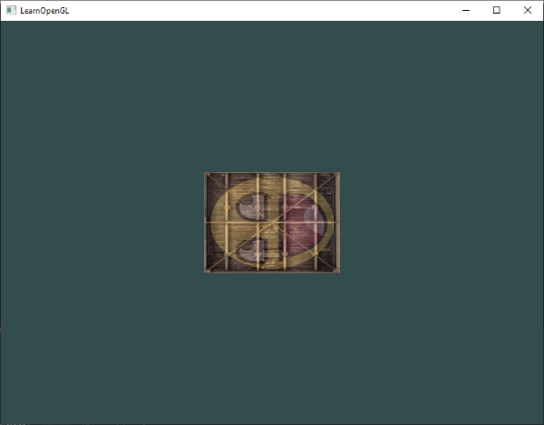

# Dönüşümler (Transformations) 🔄

Şimdiye kadar sahnemize statik nesneler ekledik, onları renklendirdik ve üzerlerine dokular giydirdik. Ancak gerçek bir 3B dünyada nesnelerin **hareket etmesini, kendi ekseni etrafında dönmesini, büyümesini ya da küçülmesini** isteriz.

Bütün bu hareketleri her bir tepe noktasının koordinatlarını elle tek tek değiştirerek yapmak hem imkansız hem de hesaplama açısından bir felaket olurdu. Bunun yerine grafik dünyasının en güçlü matematiksel silahını kullanırız: **Matris Dönüşümleri (Matrix Transformations)**.

Bu bölümde temel vektör ve matris matematiğini kavrayacak, C++ dünyasının en popüler matematik kütüphanesi olan **GLM**'i projemize dahil edecek ve nesnelerimizi uzayda dans ettireceğiz!

---

## Vektör Matematiği Hatırlatması

Bir vektör, uzayda bir **yönü (direction)** ve bir **büyüklüğü (magnitude / uzunluk)** temsil eder:

* **Skaler Çarpım (Dot Product):** İki vektör arasındaki açıyı bulmak için kullanılır. Formülü: $\vec{v} \cdot \vec{k} = |\vec{v}| \cdot |\vec{k}| \cdot \cos(\theta)$. Eğer iki vektör birbirine dik ise skaler çarpımları `0` olur. Işıklandırma hesaplamalarının kalbinde bu formül yatar!
* **Vektörel Çarpım (Cross Product):** Sadece 3B uzayda geçerlidir. İki vektöre de **tamamen dik olan üçüncü bir vektör** üretir. Kameramızın sağ ve yukarı eksenlerini hesaplarken bu işlemi kullanacağız.

---

## Matrisler: Dönüşümlerin Gücü

Bir matris, sayılardan oluşan dikdörtgen bir tablodur. Bilgisayar grafiklerinde genellikle **4x4 boyutunda matrisler** kullanırız.

Neden 3x3 değil de 4x4? Çünkü 3B uzayda öteleme (*translation*) işlemi afin bir dönüşümdür ve 3x3 matrislerle ifade edilemez. Bu yüzden 4. bir boyut olan **Homojen Koordinatı ($w$)** ekleriz. Eğer $w = 1.0$ ise bir konumu, $w = 0.0$ ise bir yön vektörünü temsil eder.

### 1. Birim Matris (Identity Matrix)
Hiçbir değişiklik yapmayan etkisiz elemandır:

$$\begin{bmatrix} 1 & 0 & 0 & 0 \\ 0 & 1 & 0 & 0 \\ 0 & 0 & 1 & 0 \\ 0 & 0 & 0 & 1 \end{bmatrix}$$

### 2. Ölçekleme (Scaling)
Bir nesneyi x, y ve z eksenlerinde büyütüp küçültmek için köşegen elemanları çarparız:

$$\begin{bmatrix} S_x & 0 & 0 & 0 \\ 0 & S_y & 0 & 0 \\ 0 & 0 & S_z & 0 \\ 0 & 0 & 0 & 1 \end{bmatrix}$$

### 3. Öteleme (Translation)
Nesneyi uzayda bir noktadan diğerine taşır:

$$\begin{bmatrix} 1 & 0 & 0 & T_x \\ 0 & 1 & 0 & T_y \\ 0 & 0 & 1 & T_z \\ 0 & 0 & 0 & 1 \end{bmatrix}$$

### 4. Döndürme (Rotation)
Bir nesneyi belirli bir eksen etrafında $\theta$ açısı kadar döndürmek için trigonometrik fonksiyonlar ($\sin, \cos$) kullanılır:


---

## Matris Çarpımı ve Dönüşüm Sırası (Çok Önemli!) ⚠️

Matrislerin en kritik özelliği **değişme özelliğinin olmamasıdır** ($A \cdot B \neq B \cdot A$). Yani dönüşümleri uygulama sıranız hayati önem taşır!

Grafik dünyasında standart kural şudur:
$$\text{Nihai Vektör} = \text{Öteleme} \times \text{Döndürme} \times \text{Ölçekleme} \times \text{Orijinal Vektör}$$

Matrisler sağdan sola doğru çarpılır! Eğer önce öteleyip sonra döndürürseniz, nesne kendi etrafında değil, dünyanın merkezi etrafında döner!

---

## GLM Kütüphanesini Projemize Dahil Etme

Tüm bu matris matematiğini sıfırdan elle kodlamak yerine, grafik dünyasının altın standardı olan **GLM (OpenGL Mathematics)** kütüphanesini kullanırız. GLM, GLSL dilinin tüm sözdizimini ve fonksiyonlarını C++ tarafında birebir sunan tek başlıklı (*header-only*) bir kütüphanedir.

[GLM GitHub sayfasından](https://github.com/g-truc/glm) kütüphaneyi indirin ve `glm` klasörünü projenizin `include` dizinine kopyalayın.

Kullanmak için şu başlıkları eklemeniz yeterlidir:

```cpp
#include <glm/glm.hpp>
#include <glm/gtc/matrix_transform.hpp>
#include <glm/gtc/type_ptr.hpp>
```

---

## Dönüşüm Matrisi Oluşturma

Hadi sandığımızı yarı yarıya küçültelim (`0.5`) ve z ekseni etrafında 90 derece döndürelim:

```cpp
// 1. Birim matris ile başla
glm::mat4 trans = glm::mat4(1.0f);

// 2. Döndürme uygula (90 derece, Z ekseni etrafında)
trans = glm::rotate(trans, glm::radians(90.0f), glm::vec3(0.0, 0.0, 1.0));

// 3. Ölçekleme uygula (0.5 oranında)
trans = glm::scale(trans, glm::vec3(0.5, 0.5, 0.5));
```

### Matrisi Shader'a Gönderme
Vertex Shader'ımızda bir matris uniform'u tanımlayalım:

```glsl
#version 330 core
layout (location = 0) in vec3 aPos;
layout (location = 1) in vec2 aTexCoord;

out vec2 TexCoord;

uniform mat4 transform; // Dönüşüm matrisimiz

void main()
{
    gl_Position = transform * vec4(aPos, 1.0f);
    TexCoord = aTexCoord;
}
```

C++ tarafında render döngümüzün içinde bu matrisi GPU'ya aktarırız:

```cpp
unsigned int transformLoc = glGetUniformLocation(ourShader.ID, "transform");
glUniformMatrix4fv(transformLoc, 1, GL_FALSE, glm::value_ptr(trans));
```

* `glUniformMatrix4fv`: Matris gönderirken kullanılır. `1` matris adedini, `GL_FALSE` matrisin transpozunu almak istemediğimizi, `glm::value_ptr` ise matrisin ham bellek işaretçisini temsil eder.

---

## Sandığımızı Döndürüyoruz! (Animasyon) 🎬

Gelin sandığımızı zamana bağlı olarak sürekli döndürelim:

```cpp
// Render döngüsü içinde:
glm::mat4 trans = glm::mat4(1.0f);
trans = glm::translate(trans, glm::vec3(0.5f, -0.5f, 0.0f)); // Sağ alta kaydır
trans = glm::rotate(trans, (float)glfwGetTime(), glm::vec3(0.0f, 0.0f, 1.0f)); // Sürekli döndür

glUniformMatrix4fv(transformLoc, 1, GL_FALSE, glm::value_ptr(trans));
glBindVertexArray(VAO);
glDrawElements(GL_TRIANGLES, 6, GL_UNSIGNED_INT, 0);
```

Sonuç olarak sandığımız ekranda kendi etrafında akıcı bir şekilde dönmeye başlayacaktır:



---

## Alıştırmalar 🏋️

1. Matris çarpım sırasını değiştirin (önce öteleme, sonra döndürme yerine önce döndürme, sonra öteleme yapın) ve ekranda oluşan farkı gözlemleyin.
2. Render döngüsü içinde aynı VAO'yu kullanarak sahneye **ikinci bir sandık** daha çizin; fakat bu ikinci sandık sol üst köşede dursun ve zamanla büyüyüp küçülsün (`sin` fonksiyonu kullanarak)!

---

Sırada 2 boyutlu düzlemden çıkıp gerçek 3 boyutlu derinliğe adım atacağımız **Bölüm 8: "Koordinat Sistemleri (Coordinate Systems)"** var!

👉 **[Sonraki Bölüm: Koordinat Sistemleri](08-koordinat-sistemleri.md)**
