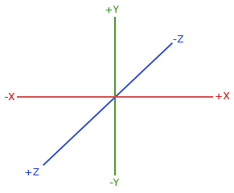
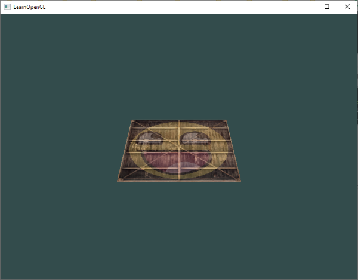
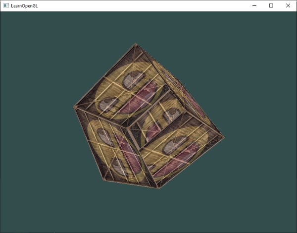
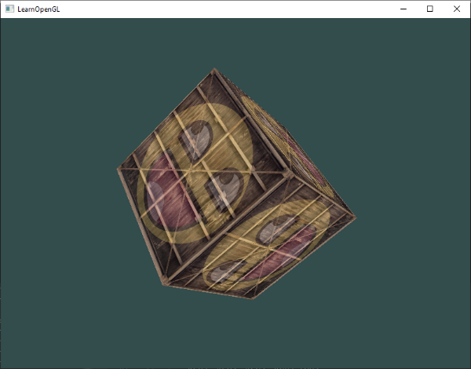
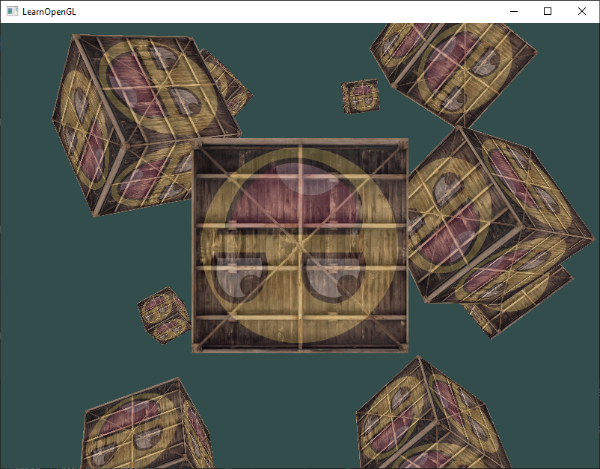

# Koordinat Sistemleri (Coordinate Systems) 🌐

Önceki bölümde, tepe noktalarını (*vertex*) matrisler yardımıyla nasıl dönüştüreceğimizi ve 2B bir sandığı ekranda nasıl döndüreceğimizi öğrendik. Ancak OpenGL gerçekte **3 boyutlu** bir dünyada çalışır. 

Peki, tanımladığımız 3 boyutlu koordinatlar en nihayetinde monitörümüzün **2 boyutlu düz piksellerine** nasıl dönüşüyor?

OpenGL, her bir köşe noktasını Vertex Shader aşamasından sonra **Normalleştirilmiş Cihaz Koordinatlarına (NDC - Normalized Device Coordinates)**, yani $[-1.0, 1.0]$ aralığına sıkıştırılmış olarak bekler. İşte 3B uzaydaki bir nesneyi alıp, kameranın açısına göre döndürüp, perspektif kazandırıp bu aralığa oturtma sürecine **Koordinat Sistemleri Hattı (Pipeline)** denir.

Bu bölümde 3B grafiklerin kalbi olan **MVP (Model - View - Projection)** matrislerini öğrenecek, Z-Buffer (derinlik testi) kavramını kavrayacak ve sahnemizde dönen rengarenk 3B küpler oluşturacağız!

---

## Büyük Resim: Koordinat Uzayları 🗺️

Koordinatları bir uzaydan diğerine dönüştürmek için birkaç kritik matris kullanırız. En önemlileri şunlardır:

1. **Yerel Uzay (Local Space / Object Space)**
2. **Dünya Uzayı (World Space)**
3. **Görünüm Uzayı (View Space / Camera Space)**
4. **Kırpma Uzayı (Clip Space)**
5. **Ekran Uzayı (Screen Space)**

Bütün bu dönüşüm zincirini şu şema özetler:


Gelin bu adımları teker teker inceleyelim:

### 1. Yerel Uzay (Local Space)
Yerel uzay, nesnenizin kendi özel koordinat sistemidir; yani nesnenin "doğduğu" yerdir. Blender veya Maya gibi bir 3B modelleme yazılımında bir küp çizdiğinizi hayal edin. Küpün merkezi genellikle $(0,0,0)$ noktasındadır. Modelinizin tüm köşeleri bu merkeze göre tanımlanır. Şimdiye kadar yazdığımız tüm tepe noktası koordinatları aslında yerel uzaydaydı.

### 2. Dünya Uzayı (World Space)
Eğer sahnenize eklediğiniz her nesneyi doğrudan yerel koordinatlarıyla çizdirseydiniz, bütün evler, ağaçlar ve karakterler $(0,0,0)$ noktasında üst üste binerdi! 
İşte **Dünya Uzayı**, tüm bu nesneleri ortak ve devasa bir sanal evrende konumlandırdığımız uzaydır. Nesnelerinizi yerel uzaydan dünya uzayına taşımak için **Model Matrisi (Model Matrix)** kullanılır (öteleme, döndürme ve ölçekleme işlemleri).

### 3. Görünüm Uzayı (View Space / Kamera)
Görünüm uzayı, sahnedeki tüm nesnelerin **kameranın gözünden** nasıl göründüğünü temsil eder. Nesneleri dünya koordinatlarından kameranın baktığı açıya dönüştürmek için **Görünüm Matrisi (View Matrix)** kullanılır. 

!!! tip "Kamera mı Hareket Ediyor, Dünya mı?"
    OpenGL'de aslında fiziksel bir "kamera" nesnesi yoktur! Kamerayı ileri hareket ettirmek yerine, tüm dünyayı geriye doğru iteriz. Kamerayı sağa çevirmek yerine, dünyayı sola çeviririz. Görünüm matrisi tam olarak bu simülasyonu yapar.

### 4. Kırpma Uzayı (Clip Space)
Vertex Shader'ın sonunda OpenGL, tüm koordinatların belirli bir aralıkta (genellikle $-1.0$ ile $1.0$ arasında) olmasını ister. Bu aralığın dışında kalan her köşe noktası **kırpılır (clipped)** ve ekrana çizilmez. Koordinatları görünüm uzayından kırpma uzayına dönüştürmek için **İzdüşüm Matrisi (Projection Matrix)** kullanılır.

İzdüşüm matrisi ayrıca koordinatlara bir **Perspektif Bölme (Perspective Division)** hazırlar; yani köşe noktasının $x, y, z$ bileşenleri homojen koordinat olan $w$ bileşenine bölünür ($\frac{x}{w}, \frac{y}{w}, \frac{z}{w}$).

### 5. Ekran Uzayı (Screen Space)
Kırpma uzayındaki koordinatlar artık Normalleştirilmiş Cihaz Koordinatlarındadır (NDC). Son adımda OpenGL, `glViewport` fonksiyonuyla belirlediğimiz ekran çözünürlüğünü kullanarak bu aralığı piksellere (örneğin 800x600) haritalar ve Rasterizer aşamasına gönderir.

---

## İzdüşüm Türleri: Ortografik vs Perspektif 📐

Grafik dünyasında iki temel izdüşüm yöntemi kullanılır:

### 1. Ortografik İzdüşüm (Orthographic Projection)
Ortografik izdüşümde, paralel olan çizgiler sonsuza kadar paralel kalır. Uzaktaki nesneler ile yakındaki nesneler **aynı boyutta** görünür. Hiçbir derinlik küçülmesi yoktur:


Ortografik izdüşüm genellikle 2B oyunlarda, mimari CAD çizimlerinde ve izometrik strateji oyunlarında tercih edilir. GLM ile ortografik matris şöyle oluşturulur:

```cpp
glm::mat4 proj = glm::ortho(0.0f, 800.0f, 0.0f, 600.0f, 0.1f, 100.0f);
```

### 2. Perspektif İzdüşüm (Perspective Projection)
Gerçek dünyada gözlerimizin veya fotoğraf makinelerinin gördüğü dünyadır. Bir tren rayına baktığınızda, raylar ufukta tek bir noktada birleşiyormuş gibi görünür; uzaktaki nesneler daha **küçük** görünür:


Perspektif izdüşüm, görüş alanını bir **kesik piramit (frustum)** olarak tanımlar. Bu piramidin tepe açısına **Görüş Açısı (Field of View - FOV)** denir:


GLM'de perspektif matrisi oluşturmak son derece kolaydır:

```cpp
glm::mat4 proj = glm::perspective(glm::radians(45.0f), (float)width / (float)height, 0.1f, 100.0f);
```

* **1. Parametre:** Görüş açısı (FOV - derece cinsinden radyana çevrilir, genelde 45°).
* **2. Parametre:** En-boy oranı (Aspect Ratio - ekran genişliği / yüksekliği).
* **3. Parametre:** Yakın kırpma düzlemi (Near plane - örn. 0.1f).
* **4. Parametre:** Uzak kırpma düzlemi (Far plane - örn. 100.0f). Bu mesafeden uzaktaki nesneler çizilmez.

---

## Sağ El Kuralı (Right-Handed System) 🖐️

OpenGL kural olarak **Sağ El Koordinat Sistemini** kullanır:

* **+X ekseni:** Sağ yönü gösterir.
* **+Y ekseni:** Yukarı yönü gösterir.
* **+Z ekseni:** Ekrandan dışarıya, **doğrudan size doğru** bakar!



Bu nedenle ekranda "içeriye / derine" doğru gitmek istiyorsanız, **negatif Z ekseni (-Z)** yönünde ilerlemelisiniz!

---

## Hepsini Bir Araya Getirme: MVP Matrisi 🚀

Bir tepe noktasının yerel uzaydan ekrana ulaşma formülü şudur:

$$V_{clip} = M_{proj} \times M_{view} \times M_{model} \times V_{local}$$

!!! warning "Çarpım Sırasına Dikkat!"
    Matrisler sağdan sola okunduğu için sırayla: Önce Model, sonra View, en son Projection matrisi uygulanır!

### Shader Tarafı
Vertex Shader'ımıza bu 3 matrisi uniform olarak ekleyelim:

```glsl
#version 330 core
layout (location = 0) in vec3 aPos;
layout (location = 1) in vec2 aTexCoord;

out vec2 TexCoord;

uniform mat4 model;
uniform mat4 view;
uniform mat4 projection;

void main()
{
    gl_Position = projection * view * model * vec4(aPos, 1.0);
    TexCoord = aTexCoord;
}
```

### C++ Tarafı
Render döngüsü içerisinde bu matrisleri hesaplayıp GPU'ya gönderelim:

```cpp
// 1. Model Matrisi: Nesneyi yere yatırıyoruz (-55 derece X ekseni)
glm::mat4 model = glm::mat4(1.0f);
model = glm::rotate(model, glm::radians(-55.0f), glm::vec3(1.0f, 0.0f, 0.0f));

// 2. View Matrisi: Kamerayı 3 birim geriye çekiyoruz (dünyayı -3 Z yönünde itiyoruz)
glm::mat4 view = glm::mat4(1.0f);
view = glm::translate(view, glm::vec3(0.0f, 0.0f, -3.0f));

// 3. Projection Matrisi: 45 derecelik perspektif frustum
glm::mat4 projection;
projection = glm::perspective(glm::radians(45.0f), 800.0f / 600.0f, 0.1f, 100.0f);

// Shader'a gönder:
int modelLoc = glGetUniformLocation(ourShader.ID, "model");
glUniformMatrix4fv(modelLoc, 1, GL_FALSE, glm::value_ptr(model));

int viewLoc = glGetUniformLocation(ourShader.ID, "view");
glUniformMatrix4fv(viewLoc, 1, GL_FALSE, glm::value_ptr(view));

int projLoc = glGetUniformLocation(ourShader.ID, "projection");
glUniformMatrix4fv(projLoc, 1, GL_FALSE, glm::value_ptr(projection));
```

Sonuç olarak 2B düzlemimiz 3B uzayda derinlik kazanmış bir zemin gibi görünecektir:



---

## Daha Fazla 3B: Gerçek Bir Küp Çizmek! 📦

2B düzlemler bir yere kadar heyecan verici. Hadi bunu gerçek bir **3B Küpe** dönüştürelim!

Bir küpün 6 yüzü vardır ve her yüz 2 üçgenden oluşur ($6 \times 2 = 12$ üçgen). Toplamda $12 \times 3 = 36$ köşe noktasına (*vertex*) ihtiyacımız var:

```cpp
float vertices[] = {
    -0.5f, -0.5f, -0.5f,  0.0f, 0.0f,
     0.5f, -0.5f, -0.5f,  1.0f, 0.0f,
     0.5f,  0.5f, -0.5f,  1.0f, 1.0f,
     0.5f,  0.5f, -0.5f,  1.0f, 1.0f,
    -0.5f,  0.5f, -0.5f,  0.0f, 1.0f,
    -0.5f, -0.5f, -0.5f,  0.0f, 0.0f,

    -0.5f, -0.5f,  0.5f,  0.0f, 0.0f,
     0.5f, -0.5f,  0.5f,  1.0f, 0.0f,
     0.5f,  0.5f,  0.5f,  1.0f, 1.0f,
     0.5f,  0.5f,  0.5f,  1.0f, 1.0f,
    -0.5f,  0.5f,  0.5f,  0.0f, 1.0f,
    -0.5f, -0.5f,  0.5f,  0.0f, 0.0f,

    -0.5f,  0.5f,  0.5f,  1.0f, 0.0f,
    -0.5f,  0.5f, -0.5f,  1.0f, 1.0f,
    -0.5f, -0.5f, -0.5f,  0.0f, 1.0f,
    -0.5f, -0.5f, -0.5f,  0.0f, 1.0f,
    -0.5f, -0.5f,  0.5f,  0.0f, 0.0f,
    -0.5f,  0.5f,  0.5f,  1.0f, 0.0f,

     0.5f,  0.5f,  0.5f,  1.0f, 0.0f,
     0.5f,  0.5f, -0.5f,  1.0f, 1.0f,
     0.5f, -0.5f, -0.5f,  0.0f, 1.0f,
     0.5f, -0.5f, -0.5f,  0.0f, 1.0f,
     0.5f, -0.5f,  0.5f,  0.0f, 0.0f,
     0.5f,  0.5f,  0.5f,  1.0f, 0.0f,

    -0.5f, -0.5f, -0.5f,  0.0f, 1.0f,
     0.5f, -0.5f, -0.5f,  1.0f, 1.0f,
     0.5f, -0.5f,  0.5f,  1.0f, 0.0f,
     0.5f, -0.5f,  0.5f,  1.0f, 0.0f,
    -0.5f, -0.5f,  0.5f,  0.0f, 0.0f,
    -0.5f, -0.5f, -0.5f,  0.0f, 1.0f,

    -0.5f,  0.5f, -0.5f,  0.0f, 1.0f,
     0.5f,  0.5f, -0.5f,  1.0f, 1.0f,
     0.5f,  0.5f,  0.5f,  1.0f, 0.0f,
     0.5f,  0.5f,  0.5f,  1.0f, 0.0f,
    -0.5f,  0.5f,  0.5f,  0.0f, 0.0f,
    -0.5f,  0.5f, -0.5f,  0.0f, 1.0f
};
```

Küpümüzü çizdirmek için `glDrawArrays` fonksiyonunu çağırırız:

```cpp
glDrawArrays(GL_TRIANGLES, 0, 36);
```

Küpü zamana bağlı döndürelim:

```cpp
model = glm::rotate(model, (float)glfwGetTime() * glm::radians(50.0f), glm::vec3(0.5f, 1.0f, 0.0f));
```

Projeyi çalıştırdığınızda çok tuhaf bir görüntüyle karşılaşırsınız:



Küpün arka yüzeyleri ön yüzeylerinin üzerini örtüyor gibi görünür! Neden?

---

## Z-Buffer ve Derinlik Testi (Depth Testing) 🛡️

OpenGL varsayılan olarak bir üçgenin diğer üçgenin arkasında mı yoksa önünde mi olduğunu kontrol etmez; sadece **en son çizilen üçgeni** ekran tampon belleğinin üzerine boyar (Buna ressam algoritması - *Painter's Algorithm* denir).

Bu problemi çözmek için OpenGL **Z-Buffer (Derinlik Tamponu)** kullanır. Z-Buffer, her bir pikselin kameraya olan derinliğini saklar. Yeni bir parça (*fragment*) çizileceği zaman OpenGL:

1. Yeni parçanın derinlik değerini Z-Buffer'daki mevcut değerle karşılaştırır.
2. Eğer yeni parça kameraya **daha yakınsa**, pikseli ekrana boyar ve Z-Buffer'ı günceller.
3. Eğer yeni parça arkada kalıyorsa, onu doğrudan **yok sayar (discard)**!

### Derinlik Testini Açma
Derinlik testini açmak için tek satır yeterlidir:

```cpp
glEnable(GL_DEPTH_TEST);
```

Ayrıca her kare çizilmeden önce sadece renk tamponunu değil, **derinlik tamponunu da temizlemeliyiz**:

```cpp
glClear(GL_COLOR_BUFFER_BIT | GL_DEPTH_BUFFER_BIT);
```

Şimdi küpümüz mükemmel bir şekilde derinlik kazanır ve kusursuz görünür:



---

## Daha Fazla Küp! (10 Tane Dönen Küp) 📦✨

Tek bir küp çizmek yerine sahnemize farklı konumlarda duran **10 adet küp** ekleyelim.

Önce her bir küpün dünya uzayındaki pozisyonlarını tanımlayalım:

```cpp
glm::vec3 cubePositions[] = {
    glm::vec3( 0.0f,  0.0f,  0.0f), 
    glm::vec3( 2.0f,  5.0f, -15.0f), 
    glm::vec3(-1.5f, -2.2f, -2.5f),  
    glm::vec3(-3.8f, -2.0f, -12.3f),  
    glm::vec3( 2.4f, -0.4f, -3.5f),  
    glm::vec3(-1.7f,  3.0f, -7.5f),  
    glm::vec3( 1.3f, -2.0f, -2.5f),  
    glm::vec3( 1.5f,  2.0f, -2.5f), 
    glm::vec3( 1.5f,  0.2f, -1.5f), 
    glm::vec3(-1.3f,  1.0f, -1.5f)  
};
```

Render döngümüzün içinde aynı VAO'yu kullanarak bir for döngüsüyle 10 küpü de çizdirelim:

```cpp
glBindVertexArray(VAO);
for(unsigned int i = 0; i < 10; i++)
{
    glm::mat4 model = glm::mat4(1.0f);
    model = glm::translate(model, cubePositions[i]);
    float angle = 20.0f * i; 
    model = glm::rotate(model, glm::radians(angle), glm::vec3(1.0f, 0.3f, 0.5f));
    ourShader.setMat4("model", model);

    glDrawArrays(GL_TRIANGLES, 0, 36);
}
```

Sonuç muazzamdır:



---

## Alıştırmalar 🏋️

1. `glm::perspective` fonksiyonundaki FOV (Görüş Açısı) değerini `10.0f` ve `120.0f` gibi uç değerlerle değiştirin. Sahnenin nasıl dramatik şekilde değiştiğini gözlemleyin.
2. View matrisiyle oynayın: Kamerayı Z ekseni yerine X veya Y ekseninde hareket ettirerek sahneye farklı açılardan bakın.
3. Sadece model matrisini kullanarak her 3. küpün (1. küp dahil: `i % 3 == 0`) zamana bağlı olarak kendi ekseni etrafında dönmesini sağlayın, diğer küpler ise statik kalsın!

---

Tebrikler! 2 boyutlu pencerelerden çıkıp tamamen 3 boyutlu bir koordinat evrenine adım attınız! 

Ancak şu anda sahnede serbestçe dolaşamıyoruz. Klavyemiz ve faremizle bir video oyunu gibi sahnenin içinde özgürce gezinebileceğimiz bir **Kamera Sistemi** kurma vakti geldi!

👉 **[Sonraki Bölüm: Kamera (Camera)](09-kamera.md)**
