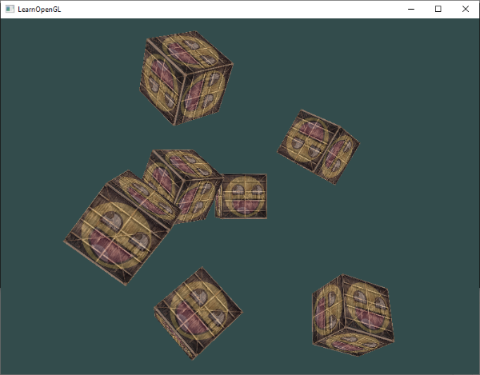
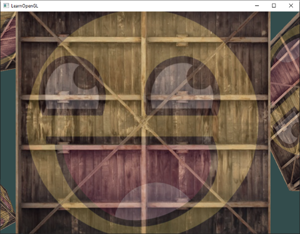
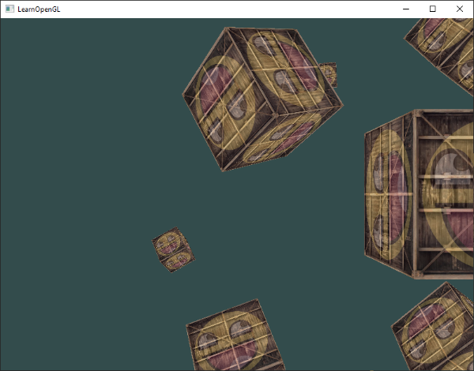

# Kamera (Camera) 🎥

Önceki bölümlerde, 3B bir koordinat sistemini nasıl kuracağımızı, Z-Buffer ile derinlik testini ve sahneye çok sayıda küp yerleştirmeyi öğrendik. Sahneyi geriye çekmek için Görünüm Matrisini (*View Matrix*) kullandık. 

Ancak şu ana kadar kameramız statikti. Gerçek bir 3B video oyununda olduğu gibi **klavyemizle sahnede serbestçe yürüyebilmek, faremizle etrafa bakabilmek ve tekerlekle yakınlaşabilmek (zoom)** istemez miydiniz?

Bu bölümde grafik programlamanın en zevkli konularından birine giriyoruz: **Serbest Kamera Sistemi (Free-look Camera)**. Kameranın arkasındaki vektör matematiğini (Gram-Schmidt, Euler Açıları, LookAt Matrisi) adım adım çözecek ve ilerleyen bölümlerde de kullanacağımız modüler ve profesyonel bir `Camera` sınıfı inşa edeceğiz!

---

## Görünüm / Kamera Uzayı Nedir? 📐

Kamera uzayından bahsettiğimizde, sahnedeki tüm tepe noktalarının **kameranın bakış açısına ve konumuna göre** dönüştürülmesini kastederiz. 

Bir kamera koordinat sistemini eksiksiz olarak tanımlamak için **3 birbirine dik eksene** ve **1 konum vektörüne** ihtiyacımız vardır:


Gelin bu 4 bileşeni adım adım inşa edelim:

### 1. Kamera Konumu (Camera Position)
Kamera konumu, dünya uzayında kameramızın durduğu noktayı gösteren bir vektördür:

```cpp
glm::vec3 cameraPos = glm::vec3(0.0f, 0.0f, 3.0f);
```

!!! note "Z Ekseni Hatırlatması"
    OpenGL sağ el koordinat sistemini kullandığı için +Z ekseni ekrandan bize doğru bakar. Kamerayı `+3` Z konumuna koymak, sahnedeki nesnelerden 3 birim geriye çekilmek demektir.

### 2. Kamera Yönü (Camera Direction)
Kamera yönü, kameranın nereye baktığını temsil eder. Kameramızın sahnemizin merkezine, yani $(0,0,0)$ noktasına baktığını varsayalım. 

İki noktanın farkını alırsak, birinden diğerine işaret eden yön vektörünü elde ederiz. Ancak dikkat: OpenGL'de kamera koordinat sisteminin **pozitif Z ekseni**, kameranın baktığı yönün **tam tersini (arkasını)** gösterir! Bu yüzden hedef noktadan kameranın konumunu çıkartmak yerine, kamera konumundan hedefi çıkartırız:

```cpp
glm::vec3 cameraTarget = glm::vec3(0.0f, 0.0f, 0.0f);
glm::vec3 cameraDirection = glm::normalize(cameraPos - cameraTarget);
```

### 3. Sağ Eksen (Right Axis)
Kameramızın yerel **+X eksenini**, yani sağı gösteren vektörü bulmak istiyoruz. 

Bunu bulmak için harika bir matematiksel hile kullanırız: Dünya uzayında her zaman "yukarıyı" gösteren bir geçici vektör tanımlarız: $(0, 1, 0)$. Ardından bu yukarı vektörü ile biraz önce bulduğumuz kamera yön vektörünün **Vektörel Çarpımını (Cross Product)** alırız! İki vektörün vektörel çarpımı, her iki vektöre de tamamen dik olan üçüncü bir vektör üretir:

```cpp
glm::vec3 up = glm::vec3(0.0f, 1.0f, 0.0f); 
glm::vec3 cameraRight = glm::normalize(glm::cross(up, cameraDirection));
```

### 4. Yukarı Ekseni (Up Axis)
Artık elimizde kameranın sağ vektörü (+X) ve yön vektörü (+Z) var. Kameranın yerel **+Y eksenini (yukarı eksenini)** bulmak çocuk oyuncağıdır: Yön vektörü ile sağ vektörün vektörel çarpımını alırız:

```cpp
glm::vec3 cameraUp = glm::cross(cameraDirection, cameraRight);
```


Matematikte birbirine dik eksenler türetme sürecine **Gram-Schmidt İşlemi** denir. Tebrikler, kendi kamera koordinat sisteminizi sıfırdan oluşturdunuz!

---

## LookAt Matrisi 👁️

Lineer cebirin en harika yanlarından biri şudur: Eğer 3 dik eksen ve bir konum vektörü biliyorsanız, bunları doğrudan bir matrise yerleştirerek herhangi bir uzaya geçiş matrisi oluşturabilirsiniz!

$$LookAt = \begin{bmatrix} R_x & R_y & R_z & 0 \\ U_x & U_y & U_z & 0 \\ D_x & D_y & D_z & 0 \\ 0 & 0 & 0 & 1 \end{bmatrix} \times \begin{bmatrix} 1 & 0 & 0 & -P_x \\ 0 & 1 & 0 & -P_y \\ 0 & 0 & 1 & -P_z \\ 0 & 0 & 0 & 1 \end{bmatrix}$$

Burada:
* $R$: Sağ vektör (*Right*)
* $U$: Yukarı vektörü (*Up*)
* $D$: Yön vektörü (*Direction*)
* $P$: Kamera konumu (*Position*)

Bu matrise **LookAt Matrisi** denir. Neyse ki GLM bunu bizim için tek bir fonksiyonda halleder:

```cpp
glm::mat4 view = glm::lookAt(
    glm::vec3(0.0f, 0.0f, 3.0f),  // Kamera Konumu
    glm::vec3(0.0f, 0.0f, 0.0f),  // Baktığı Nokta (Hedef)
    glm::vec3(0.0f, 1.0f, 0.0f)   // Dünya Yukarı Vektörü
);
```

### Sahne Etrafında Dönen Kamera (Hızlandırılmış Test)
Gelin kameramızı sahnenin merkezindeki küpün etrafında 360 derece dairesel döndürelim:

```cpp
const float radius = 10.0f;
float camX = sin(glfwGetTime()) * radius;
float camZ = cos(glfwGetTime()) * radius;
glm::mat4 view = glm::lookAt(glm::vec3(camX, 0.0f, camZ), glm::vec3(0.0f, 0.0f, 0.0f), glm::vec3(0.0f, 1.0f, 0.0f));
```



---

## Klavyeyle Serbest Gezinme (WASD) 🕹️

Daire çizmek eğlenceli olsa da bir video oyununda kamerayı kendimiz kontrol etmek isteriz! 

Öncelikle kamera sistemimiz için temel vektörleri tanımlayalım:

```cpp
glm::vec3 cameraPos   = glm::vec3(0.0f, 0.0f,  3.0f);
glm::vec3 cameraFront = glm::vec3(0.0f, 0.0f, -1.0f);
glm::vec3 cameraUp    = glm::vec3(0.0f, 1.0f,  0.0f);
```

Render döngümüzde View matrisini bu vektörlerle güncelleyelim:

```cpp
glm::mat4 view = glm::lookAt(cameraPos, cameraPos + cameraFront, cameraUp);
```

Şimdi GLFW klavye girdi fonksiyonumuzu (`processInput`) güncelleyelim:

```cpp
void processInput(GLFWwindow *window)
{
    float cameraSpeed = 0.05f; // Şimdilik sabit bir hız
    if (glfwGetKey(window, GLFW_KEY_W) == GLFW_PRESS)
        cameraPos += cameraSpeed * cameraFront;
    if (glfwGetKey(window, GLFW_KEY_S) == GLFW_PRESS)
        cameraPos -= cameraSpeed * cameraFront;
    if (glfwGetKey(window, GLFW_KEY_A) == GLFW_PRESS)
        cameraPos -= glm::normalize(glm::cross(cameraFront, cameraUp)) * cameraSpeed;
    if (glfwGetKey(window, GLFW_KEY_D) == GLFW_PRESS)
        cameraPos += glm::normalize(glm::cross(cameraFront, cameraUp)) * cameraSpeed;
}
```

* **W ve S:** Kamerayı baktığı yönde (`cameraFront`) ileri veya geri hareket ettirir.
* **A ve D:** Kameranın sağına dik olan vektörü (sağ vektörü) hesaplar ve yana doğru (*strafe*) kaydırır. Normalleştirme (`glm::normalize`), çapraz yürürken hızın iki katına çıkmasını engeller!

---

## Hareket Hızı ve Delta Time (Kritik Kavram!) ⏱️

Şu ana kadar sabit bir hareket hızı (`0.05f`) kullandık. Ancak bu çok tehlikelidir! 

Güçlü bir bilgisayarda oyun 144 FPS çalışırken kamera ışık hızında gider; eski bir laptopta 30 FPS çalışırken kamera neredeyse hiç kıpırdamaz. Hareketi **donanımdan ve kare hızından (FPS) bağımsız** kılmak zorundayız.

Bunun çözümü grafik dünyasının altın standardı olan **Delta Time ($\Delta t$)** kavramıdır:

```cpp
float deltaTime = 0.0f; // Son kare ile şu anki kare arasındaki süre
float lastFrame = 0.0f; // Son karenin zaman damgası

// Render döngüsünün en başında:
float currentFrame = glfwGetTime();
deltaTime = currentFrame - lastFrame;
lastFrame = currentFrame;

// Hız hesaplamasında deltaTime kullanımı:
float cameraSpeed = 2.5f * deltaTime;
```

Artık kameranız saniyede tam olarak 2.5 birim hareket edecektir; ister 10 FPS ister 500 FPS alın, hareket hızı herkes için birebir aynı olacaktır!

---

## Fare ile Etrafa Bakış: Euler Açıları 🖱️

Klavyeyle yürümek güzel, ama faremizi çevirdiğimizde kameramızın da dönmesini istiyoruz.

Bunun için 18. yüzyılda İsviçreli matematikçi Leonhard Euler tarafından formüle edilen **Euler Açılarını** kullanırız:


1. **Pitch (Eğim):** Başınızı yukarı ve aşağı eğme açısıdır (X ekseni etrafında dönüş).
2. **Yaw (Yalpalanma):** Başınızı sağa ve sola çevirme açısıdır (Y ekseni etrafında dönüş).
3. **Roll (Yuvarlanma):** Başınızı omuzlarınıza doğru yana yatırma açısıdır (Z ekseni etrafında dönüş - uçak simülasyonlarında kullanılır, birinci şahıs oyunlarında genelde sabit tutulur).


Trigonometri sayesinde Pitch ve Yaw açılarından yeni bir `cameraFront` 3B yön vektörü üretebiliriz:

```cpp
glm::vec3 direction;
direction.x = cos(glm::radians(yaw)) * cos(glm::radians(pitch));
direction.y = sin(glm::radians(pitch));
direction.z = sin(glm::radians(yaw)) * cos(glm::radians(pitch));
cameraFront = glm::normalize(direction);
```

### Fare Girdisini Yakalama (Mouse Callback)
GLFW'dan farenin ekrandaki hareketini yakalamak için önce imleci pencereye kitlemeli ve gizlemeliyiz:

```cpp
glfwSetInputMode(window, GLFW_CURSOR, GLFW_CURSOR_DISABLED);
```

Ardından farenin her hareketinde çağrılacak bir geri çağırma (*callback*) fonksiyonu tanımlarız:



```cpp
float lastX = 400, lastY = 300;
float yaw = -90.0f; // -90 derece ile başlarız çünkü 0 derece +X eksenine bakar, biz -Z'ye bakmak istiyoruz!
float pitch = 0.0f;
bool firstMouse = true;

void mouse_callback(GLFWwindow* window, double xpos, double ypos)
{
    if (firstMouse)
    {
        lastX = xpos;
        lastY = ypos;
        firstMouse = false;
    }

    float xoffset = xpos - lastX;
    float yoffset = lastY - ypos; // Ters çevrildi çünkü Y koordinatları yukarıdan aşağıya artar
    lastX = xpos;
    lastY = ypos;

    const float sensitivity = 0.1f;
    xoffset *= sensitivity;
    yoffset *= sensitivity;

    yaw   += xoffset;
    pitch += yoffset;

    // Pitch açısını sınırla (boynumuzun kırılmasını engelliyoruz!)
    if (pitch > 89.0f)
        pitch = 89.0f;
    if (pitch < -89.0f)
        pitch = -89.0f;

    glm::vec3 direction;
    direction.x = cos(glm::radians(yaw)) * cos(glm::radians(pitch));
    direction.y = sin(glm::radians(pitch));
    direction.z = sin(glm::radians(yaw)) * cos(glm::radians(pitch));
    cameraFront = glm::normalize(direction);
}
```

Son olarak bu fonksiyonu GLFW'ya tanıtırız:

```cpp
glfwSetCursorPosCallback(window, mouse_callback);
```

---

## Yakınlaştırma (Zoom / FOV) 🔭

Fare tekerleğini çevirdiğimizde dürbünle bakar gibi yakınlaşmak çok kolaydır: Perspektif matrisindeki **FOV (Field of View)** değerini küçültürüz!

```cpp
float fov = 45.0f;

void scroll_callback(GLFWwindow* window, double xoffset, double yoffset)
{
    fov -= (float)yoffset;
    if (fov < 1.0f)
        fov = 1.0f;
    if (fov > 45.0f)
        fov = 45.0f;
}
```

Render döngüsünde projeksiyon matrisimizi bu `fov` değişkeniyle güncelleriz:

```cpp
glm::mat4 projection = glm::perspective(glm::radians(fov), 800.0f / 600.0f, 0.1f, 100.0f);
```

---

## Modüler Kamera Sınıfı (`camera.h`) 📦

Her yeni derste tüm bu fare ve klavye kodlarını sıfırdan yazmak yerine, endüstri standardı modüler bir C++ sınıfı oluşturalım.

Bu dosyayı projenizin `includes/learnopengl/camera.h` konumuna kaydedin:

```cpp
#ifndef CAMERA_H
#define CAMERA_H

#include <glad/glad.h>
#include <glm/glm.hpp>
#include <glm/gtc/matrix_transform.hpp>

enum Camera_Movement {
    FORWARD,
    BACKWARD,
    LEFT,
    RIGHT
};

// Varsayılan kamera değerleri
const float YAW         = -90.0f;
const float PITCH       =  0.0f;
const float SPEED       =  2.5f;
const float SENSITIVITY =  0.1f;
const float ZOOM        =  45.0f;

class Camera
{
public:
    // Kamera Nitelikleri
    glm::vec3 Position;
    glm::vec3 Front;
    glm::vec3 Up;
    glm::vec3 Right;
    glm::vec3 WorldUp;
    // Euler Açıları
    float Yaw;
    float Pitch;
    // Kamera Seçenekleri
    float MovementSpeed;
    float MouseSensitivity;
    float Zoom;

    // Vektörlerle yapıcı fonksiyon
    Camera(glm::vec3 position = glm::vec3(0.0f, 0.0f, 0.0f), glm::vec3 up = glm::vec3(0.0f, 1.0f, 0.0f), float yaw = YAW, float pitch = PITCH) 
        : Front(glm::vec3(0.0f, 0.0f, -1.0f)), MovementSpeed(SPEED), MouseSensitivity(SENSITIVITY), Zoom(ZOOM)
    {
        Position = position;
        WorldUp = up;
        Yaw = yaw;
        Pitch = pitch;
        updateCameraVectors();
    }

    // View matrisini döndürür
    glm::mat4 GetViewMatrix()
    {
        return glm::lookAt(Position, Position + Front, Up);
    }

    // Klavye girdilerini işler
    void ProcessKeyboard(Camera_Movement direction, float deltaTime)
    {
        float velocity = MovementSpeed * deltaTime;
        if (direction == FORWARD)
            Position += Front * velocity;
        if (direction == BACKWARD)
            Position -= Front * velocity;
        if (direction == LEFT)
            Position -= Right * velocity;
        if (direction == RIGHT)
            Position += Right * velocity;
    }

    // Fare hareketini işler
    void ProcessMouseMovement(float xoffset, float yoffset, GLboolean constrainPitch = true)
    {
        xoffset *= MouseSensitivity;
        yoffset *= MouseSensitivity;

        Yaw   += xoffset;
        Pitch += yoffset;

        if (constrainPitch)
        {
            if (Pitch > 89.0f)
                Pitch = 89.0f;
            if (Pitch < -89.0f)
                Pitch = -89.0f;
        }

        updateCameraVectors();
    }

    // Fare tekerleğini işler
    void ProcessMouseScroll(float yoffset)
    {
        Zoom -= (float)yoffset;
        if (Zoom < 1.0f)
            Zoom = 1.0f;
        if (Zoom > 45.0f)
            Zoom = 45.0f;
    }

private:
    // Euler açılarından kamera eksenlerini günceller
    void updateCameraVectors()
    {
        glm::vec3 front;
        front.x = cos(glm::radians(Yaw)) * cos(glm::radians(Pitch));
        front.y = sin(glm::radians(Pitch));
        front.z = sin(glm::radians(Yaw)) * cos(glm::radians(Pitch));
        Front = glm::normalize(front);
        Right = glm::normalize(glm::cross(Front, WorldUp));
        Up    = glm::normalize(glm::cross(Right, Front));
    }
};
#endif
```



Artık ana programınızda tek bir `Camera camera(glm::vec3(0.0f, 0.0f, 3.0f));` nesnesiyle tüm 3B sahnelerinizde yağ gibi kayan profesyonel bir kamera deneyimi yaşayabilirsiniz!

---

## Alıştırmalar 🏋️

1. **Gerçek Bir FPS Kamerası Yapın:** Şu anki kameramız baktığı yöne doğru uçar (eğer göğe bakıp W'ya basarsanız yukarı uçarsınız). Kameranın sadece yer düzleminde ($y=0$ kalarak) yürümesini sağlayın; böylece gerçek bir FPS karakteri gibi zemin üzerinde yürüyebilsin.
2. **Kendi LookAt Matrisinizi Yazın:** `glm::lookAt` fonksiyonunu kullanmak yerine, yukarıdaki matris formülünü kullanarak kendi özel `calculate_lookAtMatrix(glm::vec3 position, glm::vec3 target, glm::vec3 worldUp)` fonksiyonunuzu yazın ve GLM fonksiyonuyla birebir aynı sonucu verdiğini doğrulayın!

---

Şimdiye kadar bir pencere açtık, üçgenler ve dokular çizdik, matrislerle uzayda dönüşümler yaptık ve kendi serbest kameramızı oluşturduk!

Tüm bu öğrendiklerimizi pekiştirmek, grafik terimler sözlüğünü incelemek ve bir sonraki devasa aşama olan **Aydınlatma (Lighting)** dünyasına hazırlanmak için **Bölüm 10: "Özet ve İnceleme"** sayfasına geçelim!

👉 **[Sonraki Bölüm: Başlarken Modülü Özeti ve Sözlük](10-ozet.md)**
