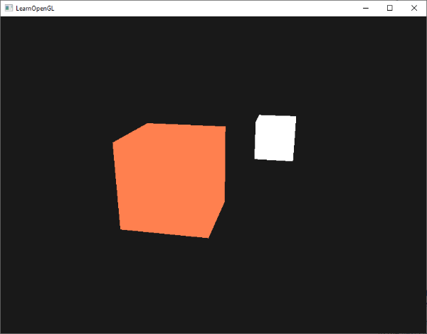

# Renkler (Colors) 🎨

Önceki modülde sahnemize dokular ekledik, onları 3B uzayda hareket ettirdik ve kendi kameramızla etrafta dolaştık. Ancak dünyamız henüz **aydınlatılmamıştı**. Sahnedeki her nesne, üzerine hiç ışık düşmüyormuş gibi kendi ham renkleriyle çiziliyordu.

Gerçek dünyayı inandırıcı ve zengin kılan en önemli olgu **ışıktır**. Bir odadaki elmanın kırmızı görünmesi, masanın gölgesinin yere düşmesi, metal bir kovanın üzerinde parlayan ışık noktası... Bilgisayar grafiklerinde gerçekçiliğe giden yol ışıklandırma simülasyonlarından geçer!

Bu bölümde ışık ve rengin fiziksel doğasını kavrayacak ve sonraki aydınlatma bölümlerinde temel alacağımız bir **aydınlatma test sahnesi (Lighting Scene)** kuracağız.

---

## Renk ve Işığın Doğası 🌈

Gerçek dünyada gördüğümüz renkler, nesnelerin kendi iç renkleri değildir; nesnelerin **yansıttığı ışık dalga boylarıdır**!

Beyaz bir ışık (örneğin güneş ışığı), görünür spektrumdaki tüm renklerin birleşimidir. Güneş ışığı kırmızı bir oyuncağın üzerine vurduğunda, oyuncak kırmızı dalga boyu dışındaki neredeyse tüm renkleri emer (*absorbe eder*) ve sadece **kırmızı** ışığı gözümüze geri yansıtır:


Aynı oyuncağın üzerine saf **yeşil** bir ışık tutarsanız ne olur? Oyuncak yeşil ışığı da emecek ve geriye hiçbir şey yansıtamayacaktır. Sonuç olarak oyuncak gözümüze **siyah** görünecektir!

---

## Bilgisayar Grafiklerinde Renk Matematiği 💻

Dijital dünyada renkleri Kırmızı, Yeşil ve Mavi (**RGB**) kanallarının $[0.0, 1.0]$ arasındaki kombinasyonları olarak ifade ederiz:

```cpp
glm::vec3 lightColor(1.0f, 1.0f, 1.0f); // Saf Beyaz Işık
glm::vec3 toyColor(1.0f, 0.5f, 0.31f);  // Mercan Rengi Oyuncak
```

Işığın bir nesneye çarpıp yansıyan nihai rengini hesaplamak için, **ışığın rengi ile nesnenin rengini bileşen bazında çarparız**:

```cpp
glm::vec3 result = lightColor * toyColor; // = (1.0 * 1.0, 1.0 * 0.5, 1.0 * 0.31) = (1.0f, 0.5f, 0.31f)
```

Eğer ışığımız beyaz değil de örneğin soluk yeşil bir ışık olsaydı:

```cpp
glm::vec3 lightColor(0.0f, 1.0f, 0.0f); // Yeşil Işık
glm::vec3 toyColor(1.0f, 0.5f, 0.31f);  // Mercan Rengi
glm::vec3 result = lightColor * toyColor; // = (0.0f, 0.5f, 0.0f) -> Koyu Yeşil görünür!
```

Gördüğünüz gibi, nesnenin rengi doğrudan üzerine düşen ışığın rengi tarafından şekillendirilir.

---

## Bir Aydınlatma Sahnesi Kurulumu 🏗️

Aydınlatmayı görselleştirmek için sahnemize 2 nesne yerleştireceğiz:
1. **Işıklandırılacak Nesne:** Sahnemizin ortasında duran 3B bir küp.
2. **Işık Kaynağı (Lamba):** Işığın nereden geldiğini görebilmemiz için ışığın konumunda duran küçük, parlak beyaz bir küp.



### İki Farklı VAO
Her iki nesne de birer küp olduğu için aynı 36 tepe noktası verisini paylaşabilirler. Ancak yapılandırmaları farklı olacağı için iki ayrı **VAO (Vertex Array Object)** tanımlarız:

```cpp
// 1. Işıklandırılacak Küp için VAO
unsigned int cubeVAO;
glGenVertexArrays(1, &cubeVAO);
glBindVertexArray(cubeVAO);

glBindBuffer(GL_ARRAY_BUFFER, VBO);
glVertexAttribPointer(0, 3, GL_FLOAT, GL_FALSE, 3 * sizeof(float), (void*)0);
glEnableVertexAttribArray(0);

// 2. Işık Kaynağı (Lamba) için VAO
unsigned int lightCubeVAO;
glGenVertexArrays(1, &lightCubeVAO);
glBindVertexArray(lightCubeVAO);

// Aynı VBO'yu bağlıyoruz!
glBindBuffer(GL_ARRAY_BUFFER, VBO);
glVertexAttribPointer(0, 3, GL_FLOAT, GL_FALSE, 3 * sizeof(float), (void*)0);
glEnableVertexAttribArray(0);
```

### İki Farklı Shader
Lamba küpümüz ışığın kendisi olduğu için kendi ışığından etkilenmemeli, her zaman parlak beyaz çizilmelidir. Bu yüzden iki ayrı shader programı kullanırız:

#### 1. Nesne Shader'ı (Fragment)
```glsl
#version 330 core
out vec4 FragColor;

uniform vec3 objectColor;
uniform vec3 lightColor;

void main()
{
    FragColor = vec4(lightColor * objectColor, 1.0);
}
```

#### 2. Lamba Shader'ı (Fragment)
```glsl
#version 330 core
out vec4 FragColor;

void main()
{
    FragColor = vec4(1.0); // Her zaman saf beyaz
}
```

---

## Render Döngüsünde Çizim 🔄

Render döngümüzde önce nesnemizi, ardından ışık küpümüzü çizeriz:

```cpp
// 1. Işıklandırılacak Küpü Çiz
lightingShader.use();
lightingShader.setVec3("objectColor", 1.0f, 0.5f, 0.31f);
lightingShader.setVec3("lightColor",  1.0f, 1.0f, 1.0f);

lightingShader.setMat4("projection", projection);
lightingShader.setMat4("view", view);
glm::mat4 model = glm::mat4(1.0f);
lightingShader.setMat4("model", model);

glBindVertexArray(cubeVAO);
glDrawArrays(GL_TRIANGLES, 0, 36);

// 2. Lamba Küpünü Çiz
lightCubeShader.use();
lightCubeShader.setMat4("projection", projection);
lightCubeShader.setMat4("view", view);
model = glm::mat4(1.0f);
model = glm::translate(model, lightPos); // Işık kaynağının konumu
model = glm::scale(model, glm::vec3(0.2f)); // Lambayı biraz küçültüyoruz
lightCubeShader.setMat4("model", model);

glBindVertexArray(lightCubeVAO);
glDrawArrays(GL_TRIANGLES, 0, 36);
```

Artık sahnemizde bir nesnemiz ve bir ışık kaynağımız var! Ancak şu an küpümüz düz bir renkle kaplı; ışığın açısına göre gölgelenmiyor.

Sırada bilgisayar grafiklerinin en meşhur aydınlatma algoritması olan **Phong Aydınlatma Modelini** kodlayacağımız **Bölüm 2: "Temel Aydınlatma"** var!

👉 **[Sonraki Bölüm: Temel Aydınlatma (Basic Lighting)](02-temel-aydinlatma.md)**
