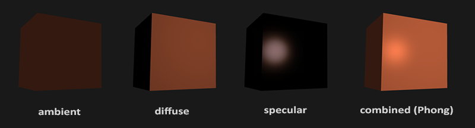
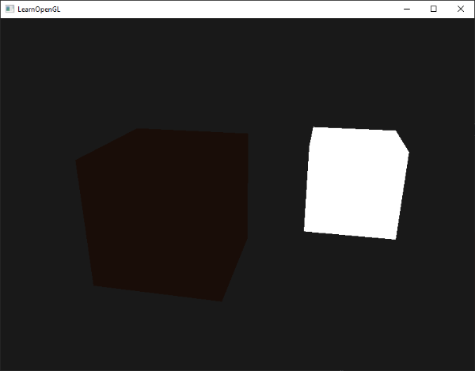
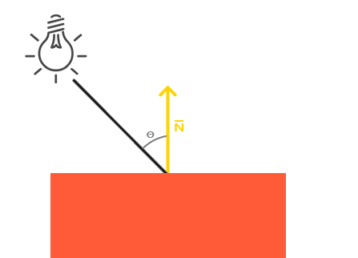
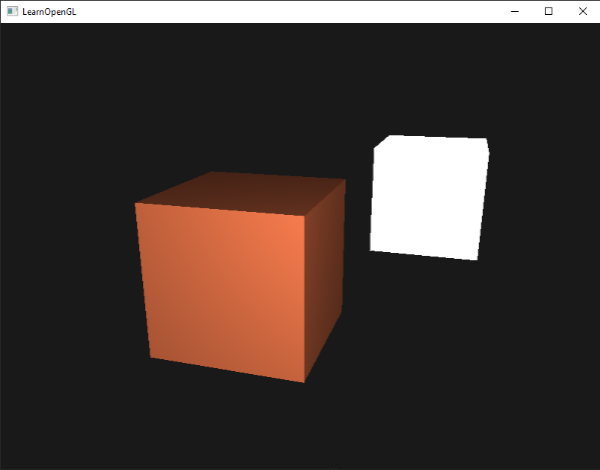
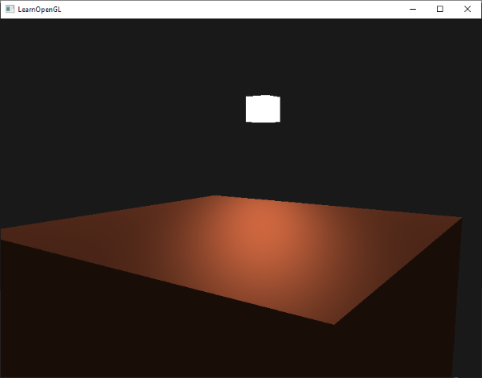
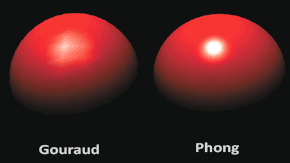

# Temel Aydınlatma (Basic Lighting) 💡

Gerçek dünyada ışık inanılmaz derecede karmaşık ve zengindir. Işık bir yüzeye çarptığında atomlarla etkileşir, saçılır, emilir ve binlerce farklı yüzeyden sonsuz kere sekerek gözümüze ulaşır. 

Tüm bu kuantum ve foton fiziğini gerçek zamanlı olarak (saniyede 60+ kare) simüle etmek günümüz grafik donanımları için bile imkansızdır. Bu yüzden grafik programlamada gerçekliği taklit eden **Yaklaşık Modeller (Approximations)** kullanırız.

Bu modellerin en popüleri ve modern grafik dünyasının temel taşı, 1975 yılında Bui Tuong Phong tarafından geliştirilen **Phong Aydınlatma Modelidir (Phong Lighting Model)**.

Phong modeli ışığı 3 bağımsız bileşene ayırır:
1. **Ortam Işığı (Ambient Lighting):** Işığın havadan veya diğer nesnelerden sekerek oluşturduğu ve zifiri karanlığı engelleyen genel aydınlatma.
2. **Yaygın Işık (Diffuse Lighting):** Işığın yüzeye geliş açısına göre oluşturduğu yönlü parlaklık ve gölgeler.
3. **Aynasal Parlama (Specular Lighting):** Işığın doğrudan kameraya yansımasıyla oluşan parlak beyaz nokta veya parıltı.



Gelin bu üç bileşeni adım adım kodlayalım!

---

## 1. Ortam Işığı (Ambient Lighting) 🌘

Zifiri karanlık bir odada bile bir pencereden giren ışık duvara, tavana ve mobilyalara çarparak odanın her köşesini az da olsa aydınlatır. 

Bunu simüle etmenin en basit yolu, nesnemize her zaman uygulanan küçük, sabit bir ışık katsayısı eklemektir:



Fragment Shader içerisinde:

```glsl
float ambientStrength = 0.1;
vec3 ambient = ambientStrength * lightColor;

vec3 result = ambient * objectColor;
FragColor = vec4(result, 1.0);
```

Böylece nesnemizin arkada kalan veya ışık görmeyen kısımları tamamen zifiri siyah olmak yerine hafifçe görünür kalır.

---

## 2. Yaygın Işık (Diffuse Lighting) ☀️

Yaygın ışık, nesnenin 3 boyutlu şeklini ve hacmini gözümüze hissettiren en temel bileşendir. Kural basittir: **Işık ışınları bir yüzeye ne kadar dik geliyorsa, o yüzey o kadar parlak olur!**



Işığın bir yüzeye hangi açıyla vurduğunu hesaplamak için iki şeye ihtiyacımız vardır:
1. **Normal Vektörü (Normal Vector):** Yüzeye tamamen dik ($90^\circ$) olan birim vektör.
2. **Işık Yönü Vektörü (Light Direction):** Parçadan ışık kaynağına doğru uzanan yön vektörü.

İki birim vektör arasındaki açının kosinüsünü **Skaler Çarpım (Dot Product)** ile buluruz! Eğer iki vektör aynı yönü gösteriyorsa (ışık yüzeye tam $90^\circ$ dik vuruyorsa) skaler çarpım `1.0` olur; yüzeye teğet geçiyorsa `0.0` olur.

### Tepe Noktalarına Normal Vektörleri Ekleme
Küpümüzün her bir yüzeyinin baktığı yönü gösteren normalleri vertex dizimize ekleyelim:

```cpp
float vertices[] = {
    // Pozisyonlar          // Normal Vektörleri
    -0.5f, -0.5f, -0.5f,  0.0f,  0.0f, -1.0f,
     0.5f, -0.5f, -0.5f,  0.0f,  0.0f, -1.0f, 
     0.5f,  0.5f, -0.5f,  0.0f,  0.0f, -1.0f, 
     // ... diğer 36 köşe noktası
};
```

Vertex Shader'da 1. nitelik (*attribute*) olarak normalleri karşılayıp Fragment Shader'a aktarırız:

```glsl
#version 330 core
layout (location = 0) in vec3 aPos;
layout (location = 1) in vec3 aNormal;

out vec3 FragPos;
out vec3 Normal;

uniform mat4 model;
uniform mat4 view;
uniform mat4 projection;

void main()
{
    FragPos = vec3(model * vec4(aPos, 1.0)); // Dünya uzayındaki piksel konumu
    Normal = aNormal;
    
    gl_Position = projection * view * vec4(FragPos, 1.0);
}
```

### Normal Matrisi (Normal Matrix) ⚠️
Nesnemize ölçekleme (*scaling*) uyguladığımızda, normaller diklik özelliğini kaybedip bükülebilir:


Bunu engellemek için normalleri doğrudan `model` matrisiyle çarpmak yerine, model matrisinin **tersinin transpozunu (Normal Matrix)** alarak çarparız:

```glsl
Normal = mat3(transpose(inverse(model))) * aNormal;
```

### Yaygın Işığı Hesaplama
Artık Fragment Shader'ımızda yaygın rengi hesaplayabiliriz:

```glsl
vec3 norm = normalize(Normal);
vec3 lightDir = normalize(lightPos - FragPos);

// max(..., 0.0) açının 90 dereceden büyük (arka yüzey) olduğunda negatif olmasını engeller
float diff = max(dot(norm, lightDir), 0.0);
vec3 diffuse = diff * lightColor;
```

Sonuç olarak küpümüz inanılmaz bir derinlik ve hacim kazanır:



---

## 3. Aynasal Parlama (Specular Lighting) ✨

Tıpkı yaygın ışık gibi aynasal ışık da ışığın geliş açısına bağlıdır; ancak ek olarak **kameranın (gözlemcinin) nerede durduğuna** da bağlıdır. 

Işık ışını yüzeye çarpıp bir ayna gibi yansıdığında, eğer gözümüz bu yansıyan ışının tam karşısındaysa gözümüzü kamaştıran parlak beyaz bir nokta görürüz:


Bunu hesaplamak için:
1. Işık ışınının normal etrafındaki yansıma vektörünü buluruz: `reflect(-lightDir, norm)`.
2. Kameranın bakış yönü ile yansıma vektörünün skaler çarpımını alırız.
3. Parlaklığın yayılımını kontrol etmek için bu değeri bir **Parlama Üssü (Shininess)** kuvvetine yükseltiriz:


Üs ne kadar yüksekse (örn. 32, 64, 256), parlama o kadar küçük ve keskin olur (metal ve cilalı yüzeyler gibi).

```glsl
float specularStrength = 0.5;
vec3 viewDir = normalize(viewPos - FragPos);
vec3 reflectDir = reflect(-lightDir, norm);  

float spec = pow(max(dot(viewDir, reflectDir), 0.0), 32);
vec3 specular = specularStrength * spec * lightColor;  
```



---

## Phong Modelinin Birleşimi 🎨

Üç bileşeni topladığımızda nihai Phong aydınlatma formülünü elde ederiz:

```glsl
#version 330 core
out vec4 FragColor;

in vec3 Normal;  
in vec3 FragPos;  
  
uniform vec3 lightPos; 
uniform vec3 viewPos; 
uniform vec3 lightColor;
uniform vec3 objectColor;

void main()
{
    // 1. Ortam (Ambient)
    float ambientStrength = 0.1;
    vec3 ambient = ambientStrength * lightColor;
  	
    // 2. Yaygın (Diffuse)
    vec3 norm = normalize(Normal);
    vec3 lightDir = normalize(lightPos - FragPos);
    float diff = max(dot(norm, lightDir), 0.0);
    vec3 diffuse = diff * lightColor;
    
    // 3. Aynasal (Specular)
    float specularStrength = 0.5;
    vec3 viewDir = normalize(viewPos - FragPos);
    vec3 reflectDir = reflect(-lightDir, norm);  
    float spec = pow(max(dot(viewDir, reflectDir), 0.0), 32);
    vec3 specular = specularStrength * spec * lightColor;  
        
    vec3 result = (ambient + diffuse + specular) * objectColor;
    FragColor = vec4(result, 1.0);
}
```

---

## Phong vs Gouraud Shading 🥊

Geçmişte GPU'lar çok yavaş olduğu için aydınlatma hesaplamaları Fragment Shader yerine **Vertex Shader**'da yapılırdı (Buna mucidi Henri Gouraud'ya ithafen **Gouraud Shading** denir).



Gouraud Shading daha hızlı olsa da pikseller arasındaki renkler doğrusal enterpolasyonla birleştirildiği için köşeli ve gerçek dışı görünür. Modern donanımlarda standart olarak **Phong Shading (Per-Fragment Lighting)** kullanılır.

---

## Alıştırmalar 🏋️

1. Işık kaynağını (`lightPos`) zamana bağlı olarak (`sin(glfwGetTime())`) küpün etrafında döndürün ve gölgelerin nasıl hareket ettiğini izleyin.
2. Farklı parlama (*shininess*) değerleri (2, 8, 32, 128, 256) deneyerek yüzeyin plastikten metale dönüşümünü gözlemleyin.
3. Phong aydınlatmasını Vertex Shader içinde hesaplayarak kendi Gouraud Shading implementasyonunuzu yazın ve farkı görün.

---

Harika! Artık sahnemiz ışık ve gölgelerle capcanlı. Ancak dünyadaki tüm nesneler aynı şekilde parlamaz; ahşap bir masa ile parlak bir elmasın ışığa tepkisi çok farklıdır.

Sırada nesnelere fiziksel malzeme özellikleri kazandıracağımız **Bölüm 3: "Malzemeler (Materials)"** var!

👉 **[Sonraki Bölüm: Malzemeler (Materials)](03-malzemeler.md)**
