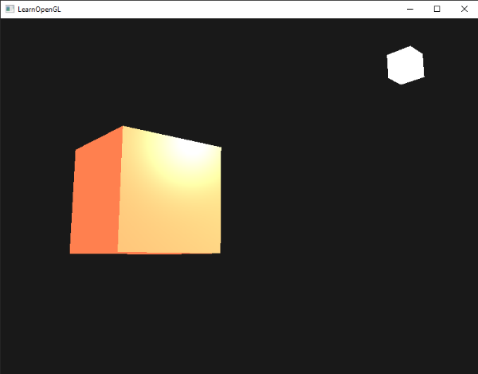
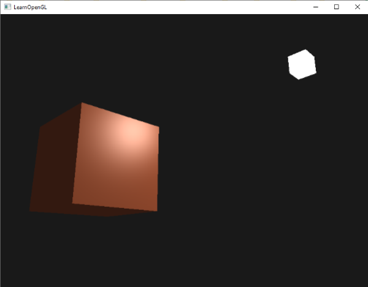
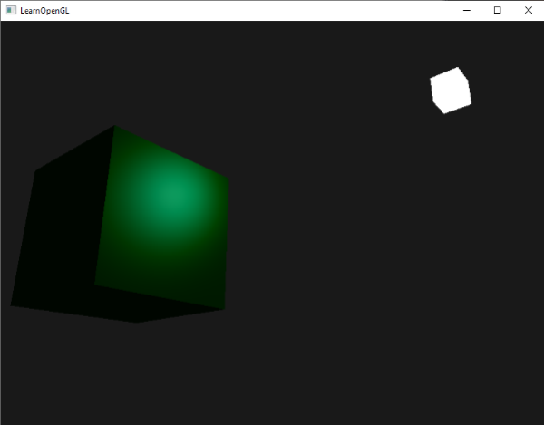

# Malzemeler (Materials) 💎

Gerçek dünyada tek bir "renk" yoktur; **malzemeler** vardır!

Bir ahşap kutu, çelik bir tava, yeşil bir zümrüt ya da kauçuk bir top... Hepsi ışık altında tamamen farklı davranır. Ahşap yüzeyler ışığı yumuşakça yayarken neredeyse hiç ayna parlaması üretmez; çelik bir tava ise ışığın geliş açısına göre göz kamaştırıcı keskin parıltılar yansıtır.

Önceki bölümde oluşturduğumuz Phong modelini nesnelerin fiziksel yüzey özellikleriyle zenginleştirmek için **Malzeme (Material)** ve **Işık (Light)** özelliklerini GLSL `struct` yapıları altında birleştireceğiz!

---

## Malzeme Yapısı (Material Struct) 🧱

Bir malzemenin Phong bileşenlerinin her birine verdiği tepkiyi 4 değişkenle modelleriz:

```glsl
struct Material {
    vec3 ambient;   // Ortam ışığında yansıttığı renk (genelde nesne rengiyle aynıdır)
    vec3 diffuse;   // Yaygın ışıkta yansıttığı renk
    vec3 specular;  // Aynasal parlamada yansıttığı renk (örneğin metallerde parlama nesnenin rengindedir, plastikte beyazdır)
    float shininess; // Aynasal parıltının keskinliği / yarıçapı
};

uniform Material material;
```

* `ambient`: Nesnenin gölgede kalan kısımlarında hangi rengi yansıttığını belirler.
* `diffuse`: Işığın dik vurduğu kısımlardaki temel yüzey rengidir.
* `specular`: Yüzeyin ürettiği parıltının rengidir.
* `shininess`: Parlaklık katsayısıdır ($2, 8, 32, 128$).

---

## Işık Özellikleri Yapısı (Light Struct) 💡

Işık sadece "ışık rengi" ve "konum"dan ibaret değildir; ışığın da Phong modelinin üç bileşenine özel şiddetleri (*intensity*) vardır:

```glsl
struct Light {
    vec3 position;

    vec3 ambient;  // Ortam ışığı şiddeti (genelde karanlık, örn. vec3(0.2))
    vec3 diffuse;  // Yaygın ışık şiddeti (genelde ışığın ana rengi, örn. vec3(0.5))
    vec3 specular; // Aynasal parlama şiddeti (genelde tam parlak, örn. vec3(1.0))
};

uniform Light light;
```

---

## Shader Kodunun Güncellenmesi 🛠️

Artık Fragment Shader'ımızda aydınlatma hesaplaması çok daha temiz ve fiziksel olarak anlamlı hale gelir:

```glsl
#version 330 core
out vec4 FragColor;

struct Material {
    vec3 ambient;
    vec3 diffuse;
    vec3 specular;
    float shininess;
}; 

struct Light {
    vec3 position;
    vec3 ambient;
    vec3 diffuse;
    vec3 specular;
};

in vec3 FragPos;  
in vec3 Normal;  
  
uniform vec3 viewPos;
uniform Material material;
uniform Light light;

void main()
{
    // 1. Ortam (Ambient)
    vec3 ambient = light.ambient * material.ambient;
  	
    // 2. Yaygın (Diffuse)
    vec3 norm = normalize(Normal);
    vec3 lightDir = normalize(light.position - FragPos);
    float diff = max(dot(norm, lightDir), 0.0);
    vec3 diffuse = light.diffuse * (diff * material.diffuse);
    
    // 3. Aynasal (Specular)
    vec3 viewDir = normalize(viewPos - FragPos);
    vec3 reflectDir = reflect(-lightDir, norm);  
    float spec = pow(max(dot(viewDir, reflectDir), 0.0), material.shininess);
    vec3 specular = light.specular * (spec * material.specular);  
        
    vec3 result = ambient + diffuse + specular;
    FragColor = vec4(result, 1.0);
}
```



---

## C++ Tarafında Malzeme Ayarları ⚙️

GLSL struct uniform'larına C++ içerisinden erişmek için nokta (`.`) sözdizimini kullanırız:

```cpp
lightingShader.use();
lightingShader.setVec3("material.ambient",  1.0f, 0.5f, 0.31f);
lightingShader.setVec3("material.diffuse",  1.0f, 0.5f, 0.31f);
lightingShader.setVec3("material.specular", 0.5f, 0.5f, 0.5f);
lightingShader.setFloat("material.shininess", 32.0f);

// Işık parametreleri
lightingShader.setVec3("light.ambient",  0.2f, 0.2f, 0.2f);
lightingShader.setVec3("light.diffuse",  0.5f, 0.5f, 0.5f); // Çok parlak olmasın
lightingShader.setVec3("light.specular", 1.0f, 1.0f, 1.0f); // Tam parlak beyaz yansıma
lightingShader.setVec3("light.position", lightPos);
```



---

## Dinamik Işık Renkleri (Görsel Şölen) 🌈

Işık rengini zamana bağlı olarak sürekli değiştirelim:

```cpp
glm::vec3 lightColor;
lightColor.x = sin(glfwGetTime() * 2.0f);
lightColor.y = sin(glfwGetTime() * 0.7f);
lightColor.z = sin(glfwGetTime() * 1.3f);

glm::vec3 diffuseColor = lightColor   * glm::vec3(0.5f); 
glm::vec3 ambientColor = diffuseColor * glm::vec3(0.2f); 

lightingShader.setVec3("light.ambient", ambientColor);
lightingShader.setVec3("light.diffuse", diffuseColor);
```

Sonuç olarak sahnemiz rengarenk bir diskotek gibi ışıldamaya başlayacaktır:



---

## Gerçek Dünya Malzeme Tablosu 📋

Grafik mühendisleri yıllar boyunca gerçek dünya nesnelerinin ortam, yaygın ve aynasal değerlerini ölçerek standart tablolar oluşturmuşlardır:

| Malzeme | Ortam (*Ambient*) | Yaygın (*Diffuse*) | Aynasal (*Specular*) | Parlaklık (*Shininess*) |
| :--- | :--- | :--- | :--- | :--- |
| **Zümrüt (Emerald)** | `0.0215, 0.1745, 0.0215` | `0.07568, 0.61424, 0.07568` | `0.633, 0.7278, 0.633` | `0.6 * 128` |
| **Altın (Gold)** | `0.24725, 0.1995, 0.0745` | `0.75164, 0.60648, 0.22648` | `0.62828, 0.5558, 0.366` | `0.4 * 128` |
| **Gümüş (Silver)** | `0.19225, 0.19225, 0.19225` | `0.50754, 0.50754, 0.50754` | `0.50827, 0.50827, 0.50827` | `0.4 * 128` |
| **Krom (Chrome)** | `0.25, 0.25, 0.25` | `0.4, 0.4, 0.4` | `0.77459, 0.77459, 0.77459` | `0.6 * 128` |
| **Bakır (Copper)** | `0.19125, 0.0735, 0.0225` | `0.7038, 0.27048, 0.0828` | `0.25677, 0.13762, 0.086` | `0.1 * 128` |
| **Kauçuk (Cyan Rubber)**| `0.0, 0.05, 0.05` | `0.4, 0.5, 0.5` | `0.04, 0.7, 0.7` | `0.078 * 128` |

Bu değerleri C++ kodunuzda `material` uniform'una vererek sahnenizdeki küpü anında saf altına veya zümrüte dönüştürebilirsiniz!


---

## Alıştırmalar 🏋️

1. Yukarıdaki tablodan **Altın** ve **Zümrüt** malzemelerini koda aktarın ve ekrandaki küpün nasıl dönüştüğünü inceleyin.
2. Sahneye 2 farklı küp koyup birini altın, diğerini gümüş malzeme ile çizdirin.

---

Ancak fark ettiyseniz şu an tüm küp tek bir malzemeden oluşuyor. Gerçekte ise örneğin ahşap bir sandığın köşelerinde **çelik vidalar ve metal şeritler** bulunur; yani sandığın gövdesi mat ahşapken, vidaları metalik parlamalıdır!

İşte tek bir nesnenin farklı bölgelerine farklı malzeme özellikleri kazandırmak için **Bölüm 4: "Işık Haritaları (Lighting Maps)"** imdadımıza yetişiyor!

👉 **[Sonraki Bölüm: Işık Haritaları (Lighting Maps)](04-isik-haritalari.md)**
