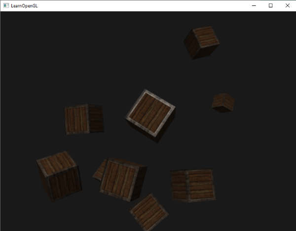
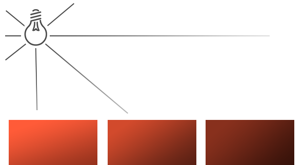
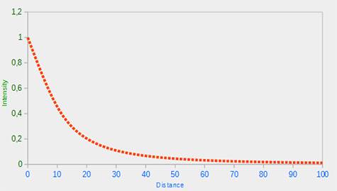

# Işık Kaynakları (Light Casters) 🔦

Şimdiye kadar kullandığımız tek ışık türü, uzayda tek bir noktadan her yöne eşit yayılan basit bir ışık kaynağıydı. 

Ancak gerçek dünyada birden fazla ışık türü bulunur:
* Milyonlarca kilometre uzaktan gelen ve tüm ışınları birbirine paralel olan **Güneş**,
* Bir odanın tavanındaki ampul ya da bir kamp ateşi (**Noktasal Işık**),
* Bir madencinin kaskına takılı ya da bir el fenerinden çıkan dar açılı koni (**Spot Işık**)...

Bu bölümde grafik programlamanın 3 temel ışık kaynağı türünü inceleyecek, ışığın mesafeyle azalmasını sağlayan **Zayıflama (Attenuation)** formülünü kodlayacak ve yumuşak kenarlı gerçekçi bir **El Feneri** inşa edeceğiz!

---

## 1. Yönlü Işık (Directional Light / Güneş) ☀️

Işık kaynağı nesnelerden inanılmaz derecede uzakta olduğunda (Güneş gibi), ışık kaynağından çıkan tüm ışınlar birbirine **neredeyse tamamen paralel** ulaşır.


Böylesi bir ışık kaynağının dünya uzayında bir **konumu yoktur**; sadece bir **yönü (direction)** vardır!

```glsl
struct DirLight {
    vec3 direction; // Işığın gittiği yön (örn: vec3(-0.2f, -1.0f, -0.3f))
  
    vec3 ambient;
    vec3 diffuse;
    vec3 specular;
};
uniform DirLight dirLight;
```

Fragment Shader'da ışık yönünü hesaplamak için çıkarma işlemi yapmamıza gerek kalmaz; yönü doğrudan ters çevirip kullanırız:

```glsl
vec3 lightDir = normalize(-dirLight.direction);
```



---

## 2. Noktasal Işık (Point Light / Ampul) 💡

Noktasal ışık, 3B uzayda belirli bir koordinata sahip olan ve her yöne doğru küresel olarak ışık saçan bir kaynaktır (örneğin bir lamba veya meşale).



Noktasal ışığın en kritik özelliği, **ışık kaynağından uzaklaştıkça ışık şiddetinin azalmasıdır**. Buna grafik dünyasında **Zayıflama (Attenuation)** denir.

### Zayıflama Formülü (Attenuation)
Fizikte ışığın şiddeti mesafenin karesiyle ters orantılıdır ($1/d^2$). Ancak oyunlarda ve gerçek zamanlı grafiklerde bu formülü daha kontrollü kılmak için 3 katsayılı standart bir formül kullanılır:

$$F_{att} = \frac{1.0}{K_c + K_l \cdot d + K_q \cdot d^2}$$

Burada:
* $d$: Piksel ile ışık kaynağı arasındaki mesafedir (`length(light.position - FragPos)`).
* $K_c$ (*Constant* - Sabit Katsayı): Paydanın asla 1'den küçük olmamasını sağlar (genelde `1.0`).
* $K_l$ (*Linear* - Doğrusal Katsayı): Işığın orta mesafelerde yumuşakça azalmasını sağlar.
* $K_q$ (*Quadratic* - Karesel Katsayı): Uzak mesafelerde ışığın hızla sönmesini sağlar.



### Standart Zayıflama Değerleri Tablosu
Farklı mesafeler için endüstride test edilmiş standart katsayılar şunlardır:

| Mesafe | Sabit ($K_c$) | Doğrusal ($K_l$) | Karesel ($K_q$) |
| :--- | :--- | :--- | :--- |
| **7 metre** | `1.0` | `0.7` | `1.8` |
| **20 metre** | `1.0` | `0.22` | `0.20` |
| **50 metre** | `1.0` | `0.09` | `0.032` |
| **100 metre** | `1.0` | `0.045` | `0.0075` |
| **3250 metre** | `1.0` | `0.0014` | `0.000007` |

### Fragment Shader'da Uygulama:
```glsl
float distance    = length(light.position - FragPos);
float attenuation = 1.0 / (light.constant + light.linear * distance + 
                    light.quadratic * (distance * distance));    

ambient  *= attenuation; 
diffuse  *= attenuation;
specular *= attenuation;
```


---

## 3. Spot Işık (Spotlight / El Feneri) 🔦

Spot ışık, belirli bir konumdan belirli bir koni doğrultusunda ışık saçan kaynaktır (el feneri, araba farı veya sahne spotları gibi).


Spot ışığı tanımlamak için:
* `position`: Işığın konumu (örn. kameramızın konumu).
* `direction`: Işığın baktığı yön (örn. kameramızın baktığı yön `cameraFront`).
* `cutOff`: Işık konisinin yarıçap açısının kosinüsü ($\phi$).


```glsl
vec3 lightDir = normalize(light.position - FragPos);
// Işık yönü ile piksel arasındaki açının kosinüsü:
float theta = dot(lightDir, normalize(-light.direction));

if(theta > light.cutOff) // Kosinüs değeri büyükse açı daha küçüktür (koninin içindedir)!
{       
    // Phong aydınlatmasını uygula...
}
else
{
    // Koninin dışındaysa sadece çok hafif ortam ışığı çiz:
    FragColor = vec4(light.ambient * texture(material.diffuse, TexCoords).rgb, 1.0);
}
```

Ancak bu haliyle ışık konisinin sınırları bıçakla kesilmiş gibi sert ve yapay görünür:


---

## Yumuşak Kenarlı El Feneri (Smooth / Soft Edges) 🌟

Gerçek bir el fenerinin kenarları karanlığa doğru kademeli olarak yumuşar. Bunu sağlamak için bir **İç Koni ($\phi$)** ve bir **Dış Koni ($\gamma$)** tanımlarız:


İki koni arasındaki yumuşak geçiş şiddeti formülü:

$$I = \frac{\theta - \gamma}{\epsilon}$$

Burada $\epsilon = \phi - \gamma$'dır.

Fragment Shader'da:

```glsl
float theta     = dot(lightDir, normalize(-light.direction));
float epsilon   = light.cutOff - light.outerCutOff;
float intensity = clamp((theta - light.outerCutOff) / epsilon, 0.0, 1.0);

// Yaygın ve Aynasal bileşenleri intensity ile çarp:
diffuse  *= intensity;
specular *= intensity;
```


---

## Alıştırmalar 🏋️

1. Işık kaynağını kameranıza bağlayarak (`light.position = camera.Position; light.direction = camera.Front;`) gerçek bir birinci şahıs korku oyunu el feneri yapın!
2. El fenerini klavyeden bir tuşla (örneğin `F` tuşu) açıp kapatılabilen hale getirin.

---

Artık yönlü ışıkları, mesafeyle zayıflayan noktasal ışıkları ve yumuşak kenarlı el fenerlerini biliyorsunuz!

Peki, aynı sahnede hem gökyüzündeki Güneş, hem duvardaki 4 farklı meşale, hem de karakterimizin elindeki el feneri **aynı anda** bulunursa ne yapacağız?

Bütün bu ışıkları tek bir nihai Shader mimarisinde birleştireceğimiz **Bölüm 6: "Çoklu Işık Kaynakları (Multiple Lights)"** sayfasına geçelim!

👉 **[Sonraki Bölüm: Çoklu Işıklar (Multiple Lights)](06-coklu-isiklar.md)**
