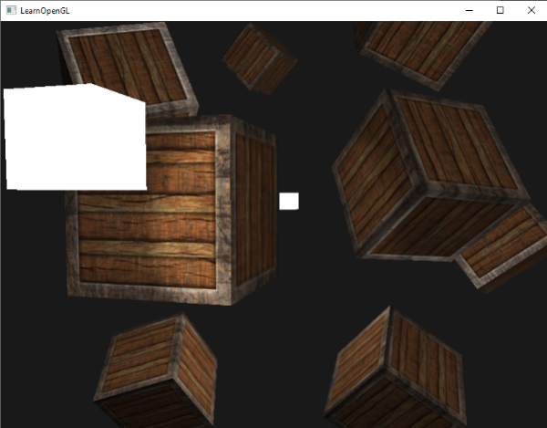

# Çoklu Işık Kaynakları (Multiple Lights) 💡🔦☀️

Önceki bölümlerde Phong aydınlatma modelini, malzeme özelliklerini, ışık haritalarını ve 3 temel ışık kaynağı türünü (Yönlü, Noktasal ve Spot) tek tek öğrendik.

Ancak gerçek bir video oyununda ya da görsel simülasyonda bu ışıklar **asla tek başına bulunmaz**! 

Tipik bir sahnede:
1. Gökyüzünde tüm sahneyi aydınlatan **1 adet Güneş (Yönlü Işık)**,
2. Odanın dört köşesinde farklı renklerde parlayan **4 adet Meşale / Lamba (Noktasal Işık)**,
3. Ve oyuncunun elinde etrafı taradığı **1 adet El Feneri (Spot Işık)** bulunur.

Peki GPU'nun tüm bu ışıkların yaydığı fotonları tek bir piksel üzerinde hesaplayıp birleştirmesini nasıl sağlarız?

Bu bölümde grafik programlamanın zirve noktalarından biri olan **Çoklu Işık İşlem Hattını** kuracağız!



---

## Modüler Shader Mimarisi 📐

Tüm bu ışık hesaplamalarını tek bir devasa `main` fonksiyonunun içine yazmak kodu okunamaz bir spagettiye dönüştürür. Bunun yerine GLSL'in **özel fonksiyon (custom function)** desteğini kullanarak her ışık türü için ayrı bir hesaplama fonksiyonu yazarız:

```glsl
#version 330 core
out vec4 FragColor;

struct DirLight {
    vec3 direction;
    vec3 ambient;
    vec3 diffuse;
    vec3 specular;
};

struct PointLight {
    vec3 position;
    
    float constant;
    float linear;
    float quadratic;
	
    vec3 ambient;
    vec3 diffuse;
    vec3 specular;
};

struct SpotLight {
    vec3 position;
    vec3 direction;
    float cutOff;
    float outerCutOff;
  
    float constant;
    float linear;
    float quadratic;
  
    vec3 ambient;
    vec3 diffuse;
    vec3 specular;       
};

#define NR_POINT_LIGHTS 4

in vec3 FragPos;
in vec3 Normal;
in vec2 TexCoords;

uniform vec3 viewPos;
uniform DirLight dirLight;
uniform PointLight pointLights[NR_POINT_LIGHTS];
uniform SpotLight spotLight;
uniform Material material;

// Fonksiyon prototipleri
vec3 CalcDirLight(DirLight light, vec3 normal, vec3 viewDir);
vec3 CalcPointLight(PointLight light, vec3 normal, vec3 fragPos, vec3 viewDir);
vec3 CalcSpotLight(SpotLight light, vec3 normal, vec3 fragPos, vec3 viewDir);
```

---

## 1. Yönlü Işık Fonksiyonu (CalcDirLight)

```glsl
vec3 CalcDirLight(DirLight light, vec3 normal, vec3 viewDir)
{
    vec3 lightDir = normalize(-light.direction);
    
    // Yaygın (Diffuse)
    float diff = max(dot(normal, lightDir), 0.0);
    
    // Aynasal (Specular)
    vec3 reflectDir = reflect(-lightDir, normal);
    float spec = pow(max(dot(viewDir, reflectDir), 0.0), material.shininess);
    
    // Bileşenleri hesapla
    vec3 ambient  = light.ambient  * vec3(texture(material.diffuse, TexCoords));
    vec3 diffuse  = light.diffuse  * diff * vec3(texture(material.diffuse, TexCoords));
    vec3 specular = light.specular * spec * vec3(texture(material.specular, TexCoords));
    
    return (ambient + diffuse + specular);
}
```

---

## 2. Noktasal Işık Fonksiyonu (CalcPointLight)

```glsl
vec3 CalcPointLight(PointLight light, vec3 normal, vec3 fragPos, vec3 viewDir)
{
    vec3 lightDir = normalize(light.position - fragPos);
    
    // Yaygın
    float diff = max(dot(normal, lightDir), 0.0);
    
    // Aynasal
    vec3 reflectDir = reflect(-lightDir, normal);
    float spec = pow(max(dot(viewDir, reflectDir), 0.0), material.shininess);
    
    // Zayıflama (Attenuation)
    float distance    = length(light.position - fragPos);
    float attenuation = 1.0 / (light.constant + light.linear * distance + 
  			     light.quadratic * (distance * distance));    
    
    vec3 ambient  = light.ambient  * vec3(texture(material.diffuse, TexCoords));
    vec3 diffuse  = light.diffuse  * diff * vec3(texture(material.diffuse, TexCoords));
    vec3 specular = light.specular * spec * vec3(texture(material.specular, TexCoords));
    
    ambient  *= attenuation;
    diffuse  *= attenuation;
    specular *= attenuation;
    
    return (ambient + diffuse + specular);
}
```

---

## 3. Spot Işık Fonksiyonu (CalcSpotLight)

```glsl
vec3 CalcSpotLight(SpotLight light, vec3 normal, vec3 fragPos, vec3 viewDir)
{
    vec3 lightDir = normalize(light.position - fragPos);
    
    // Yaygın
    float diff = max(dot(normal, lightDir), 0.0);
    
    // Aynasal
    vec3 reflectDir = reflect(-lightDir, normal);
    float spec = pow(max(dot(viewDir, reflectDir), 0.0), material.shininess);
    
    // Zayıflama
    float distance = length(light.position - fragPos);
    float attenuation = 1.0 / (light.constant + light.linear * distance + light.quadratic * (distance * distance));    
    
    // Spot yumuşak kenar (Soft edge intensity)
    float theta     = dot(lightDir, normalize(-light.direction)); 
    float epsilon   = light.cutOff - light.outerCutOff;
    float intensity = clamp((theta - light.outerCutOff) / epsilon, 0.0, 1.0);
    
    vec3 ambient  = light.ambient  * vec3(texture(material.diffuse, TexCoords));
    vec3 diffuse  = light.diffuse  * diff * vec3(texture(material.diffuse, TexCoords));
    vec3 specular = light.specular * spec * vec3(texture(material.specular, TexCoords));
    
    ambient  *= attenuation * intensity;
    diffuse  *= attenuation * intensity;
    specular *= attenuation * intensity;
    
    return (ambient + diffuse + specular);
}
```

---

## Hepsini `main` İçinde Birleştirme 🚀

Artık `main` fonksiyonumuz bir şiir kadar sade ve güçlüdür:

```glsl
void main()
{
    vec3 norm = normalize(Normal);
    vec3 viewDir = normalize(viewPos - FragPos);
    
    // 1. Aşama: Yönlü Işık
    vec3 result = CalcDirLight(dirLight, norm, viewDir);
    
    // 2. Aşama: Noktasal Işıklar (4 adet)
    for(int i = 0; i < NR_POINT_LIGHTS; i++)
        result += CalcPointLight(pointLights[i], norm, FragPos, viewDir);    
    
    // 3. Aşama: Spot Işık (El feneri)
    result += CalcSpotLight(spotLight, norm, FragPos, viewDir);    
    
    FragColor = vec4(result, 1.0);
}
```

---

## Atmosfer Oluşturma: Sanatçının Gücü 🎭

Işıkların renk ve şiddetlerini değiştirerek aynı sahneyi tamamen farklı duygulara büründürebilirsiniz:


* **Çöl Güneşi:** Yüksek yoğunluklu sarı-turuncu yönlü ışık, az sayıda ortam ışığı.
* **Gece / Ay Işığı:** Koyu mavi yönlü ışık, soluk yeşil fener ışığı.
* **Korku / Dehşet:** Sıfır yönlü ışık, titrek kırmızı bir noktasal ışık ve oyuncunun dar açılı el feneri!

---

## Alıştırmalar 🏋️

1. Dört noktasal ışığı da farklı renklere (kırmızı, yeşil, mavi, sarı) boyayın ve küplerin üzerinde renklerin nasıl harmanlandığını gözlemleyin.
2. Noktasal ışıklardan birini zamana bağlı olarak sahnenin etrafında hareket ettirin.

---

İşte bu! Bilgisayar grafiklerinin en temel aydınlatma mekaniklerini eksiksiz tamamladınız. 

Öğrendiğimiz tüm kavramları pekiştirmek ve bu modülü taçlandırmak için **Bölüm 7: "Aydınlatma Modülü Özeti"** sayfasına geçelim!

👉 **[Sonraki Bölüm: Aydınlatma Özeti](07-aydinlatma-ozeti.md)**
