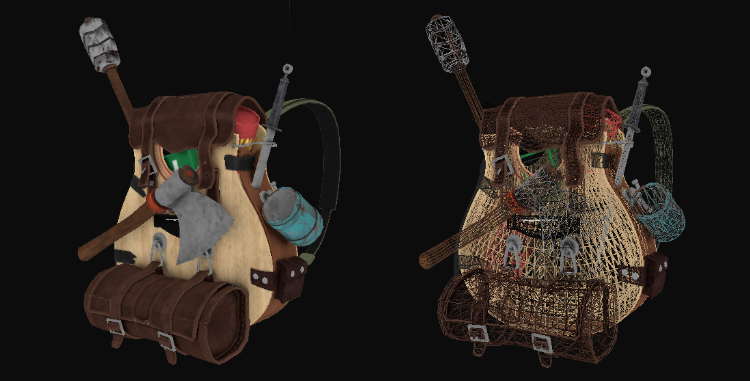

# Model Sınıfı (Model Class) 🎒

Önceki bölümde, bir 3B modelin bağımsız tek bir yüzey parçasını çizebilen `Mesh` sınıfını tamamladık. 

Şimdi ise tüm parçaları bir araya getiren nihai şaheseri inşa edeceğiz: **Model Sınıfı**!

`Model` sınıfı, sabit diskteki bir 3D model dosyasını (`.obj`, `.fbx`, `.gltf`) alır, Assimp aracılığıyla sahneyi parçalarına ayırır, her bir parça için dokuları belleğe yükler ve bir `std::vector<Mesh>` listesi oluşturur. Ana programımızda ise tek bir `ourModel.Draw(ourShader)` çağrısıyla tüm modeli kusursuz bir şekilde ekrana çizer!

---

## Model Sınıfının Tasarımı 🏛️

```cpp
#include <assimp/Importer.hpp>
#include <assimp/scene.h>
#include <assimp/postprocess.h>
#include "mesh.h"

class Model 
{
public:
    // Model Verileri
    std::vector<Mesh> meshes;
    std::string directory;
    std::vector<Texture> textures_loaded; // Yüklenmiş dokuları önbellekte saklar

    // Dosya yolundan modeli yükleyen yapıcı fonksiyon
    Model(std::string path)
    {
        loadModel(path);
    }

    void Draw(Shader &shader)
    {
        for(unsigned int i = 0; i < meshes.size(); i++)
            meshes[i].Draw(shader);
    }

private:
    void loadModel(std::string path);
    void processNode(aiNode *node, const aiScene *scene);
    Mesh processMesh(aiMesh *mesh, const aiScene *scene);
    std::vector<Texture> loadMaterialTextures(aiMaterial *mat, aiTextureType type, std::string typeName);
};
```

---

## 1. Modeli Yükleme: `loadModel()` 📂

```cpp
void Model::loadModel(std::string path)
{
    Assimp::Importer importer;
    const aiScene *scene = importer.ReadFile(path, 
        aiProcess_Triangulate | aiProcess_GenSmoothNormals | aiProcess_FlipUVs | aiProcess_CalcTangentSpace);

    if(!scene || scene->mFlags & AI_SCENE_FLAGS_INCOMPLETE || !scene->mRootNode) 
    {
        std::cout << "HATA::ASSIMP::" << importer.GetErrorString() << std::endl;
        return;
    }
    directory = path.substr(0, path.find_last_of('/'));

    // Kök düğümden başlayarak tüm hiyerarşiyi özyinelemeli (recursive) tara
    processNode(scene->mRootNode, scene);
}
```

---

## 2. Düğümleri Gezme: `processNode()` 🌳

Assimp modelleri bir ağaç yapısında (*scene graph*) saklar. Her düğüm alt düğümlere ve mesh indekslerine sahiptir:

```cpp
void Model::processNode(aiNode *node, const aiScene *scene)
{
    // Düğümdeki tüm mesh'leri işle
    for(unsigned int i = 0; i < node->mNumMeshes; i++)
    {
        aiMesh *mesh = scene->mMeshes[node->mMeshes[i]]; 
        meshes.push_back(processMesh(mesh, scene));			
    }
    // Alt düğümleri özyinelemeli olarak tara
    for(unsigned int i = 0; i < node->mNumChildren; i++)
    {
        processNode(node->mChildren[i], scene);
    }
}
```

---

## 3. Geometriyi Çıkarma: `processMesh()` ⚙️

Bu fonksiyon `aiMesh` nesnesindeki C tarzı ham dizileri okur ve bizim temiz C++ `Mesh` nesnemize dönüştürür:

```cpp
Mesh Model::processMesh(aiMesh *mesh, const aiScene *scene)
{
    std::vector<Vertex> vertices;
    std::vector<unsigned int> indices;
    std::vector<Texture> textures;

    // 1. Tepe Noktaları (Vertices)
    for(unsigned int i = 0; i < mesh->mNumVertices; i++)
    {
        Vertex vertex;
        // Pozisyon
        vertex.Position = glm::vec3(mesh->mVertices[i].x, mesh->mVertices[i].y, mesh->mVertices[i].z);
        // Normal
        if (mesh->HasNormals())
            vertex.Normal = glm::vec3(mesh->mNormals[i].x, mesh->mNormals[i].y, mesh->mNormals[i].z);
        // Doku Koordinatı
        if(mesh->mTextureCoords[0])
            vertex.TexCoords = glm::vec2(mesh->mTextureCoords[0][i].x, mesh->mTextureCoords[0][i].y);
        else
            vertex.TexCoords = glm::vec2(0.0f, 0.0f);

        vertices.push_back(vertex);
    }

    // 2. Yüzey İndisleri (Indices)
    for(unsigned int i = 0; i < mesh->mNumFaces; i++)
    {
        aiFace face = mesh->mFaces[i];
        for(unsigned int j = 0; j < face.mNumIndices; j++)
            indices.push_back(face.mIndices[j]);
    }

    // 3. Malzeme Dokuları (Materials)
    if(mesh->mMaterialIndex >= 0)
    {
        aiMaterial *material = scene->mMaterials[mesh->mMaterialIndex];
        // Diffuse haritaları
        std::vector<Texture> diffuseMaps = loadMaterialTextures(material, 
                                            aiTextureType_DIFFUSE, "texture_diffuse");
        textures.insert(textures.end(), diffuseMaps.begin(), diffuseMaps.end());
        // Specular haritaları
        std::vector<Texture> specularMaps = loadMaterialTextures(material, 
                                            aiTextureType_SPECULAR, "texture_specular");
        textures.insert(textures.end(), specularMaps.begin(), specularMaps.end());
    }

    return Mesh(vertices, indices, textures);
}
```

---

## 4. Doku Önbelleği (Büyük Performans Optimizasyonu!) ⚡

Bir 3B modeldeki onlarca farklı mesh genellikle **aynı doku dosyasını** paylaşır. Eğer aynı dokuyu her mesh için diskten tekrar tekrar okuyup VRAM'e yüklerseniz bellek kısa sürede taşar ve yükleme dakikalar sürer!

Bunu engellemek için `textures_loaded` listesini kontrol ederiz:

```cpp
std::vector<Texture> Model::loadMaterialTextures(aiMaterial *mat, aiTextureType type, std::string typeName)
{
    std::vector<Texture> textures;
    for(unsigned int i = 0; i < mat->GetTextureCount(type); i++)
    {
        aiString str;
        mat->GetTexture(type, i, &str);
        bool skip = false;
        
        // Daha önce yüklendi mi kontrol et:
        for(unsigned int j = 0; j < textures_loaded.size(); j++)
        {
            if(std::strcmp(textures_loaded[j].path.data(), str.C_Str()) == 0)
            {
                textures.push_back(textures_loaded[j]);
                skip = true; 
                break;
            }
        }
        if(!skip)
        {   // Henüz yüklenmediyse diskten yükle
            Texture texture;
            texture.id = TextureFromFile(str.C_Str(), directory);
            texture.type = typeName;
            texture.path = str.C_Str();
            textures.push_back(texture);
            textures_loaded.push_back(texture); // Önbelleğe ekle
        }
    }
    return textures;
}
```

---

## Sonuç: Gerçek Bir 3B Modeli Sahneye Çizme! 🎉

Artık ana programımızda tek satırla dilediğimiz 3B modeli sahneye ekleyebiliriz:

```cpp
// Render döngüsünden önce modeli yükle:
Model ourModel("resources/objects/backpack/backpack.obj");

// Render döngüsü içinde çiz:
ourShader.use();

glm::mat4 model = glm::mat4(1.0f);
model = glm::translate(model, glm::vec3(0.0f, 0.0f, 0.0f)); 
model = glm::scale(model, glm::vec3(1.0f));	
ourShader.setMat4("model", model);

ourModel.Draw(ourShader);
```

Ve işte karşımızda nefes kesici bir 3B model:



Üzerine önceki modülde yazdığımız çoklu ışık kaynaklarını ve Phong gölgelendiricisini eklediğimizde ise stüdyo kalitesinde bir sonuca ulaşırız:


---

## Alıştırmalar 🏋️

1. Modelin etrafında dönen renkli bir noktasal ışık ekleyin.
2. [Sketchfab](https://sketchfab.com) veya [Free3D](https://free3d.com) sitelerinden ücretsiz bir `.obj` modeli indirin ve projenizde başarıyla yükleyin!

---

Tebrikler! Artık gerçek dünyadaki herhangi bir 3B varlığı motorunuza aktarabilecek seviyedesiniz!

Sırada derinlik tamponu numaraları, harmanlama (şeffaflık), yüzey ayıklama ve yansıma haritaları gibi grafik mühendisliğinin derinliklerine ineceğimiz **4. Modül: "İleri Düzey OpenGL (Advanced OpenGL)"** var!
