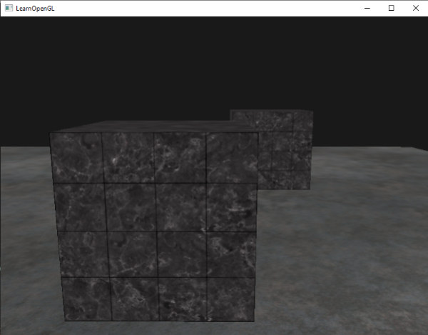
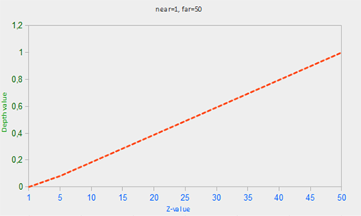
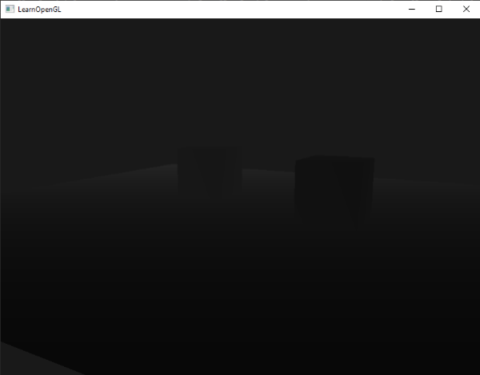

# Derinlik Testi (Depth Testing) 🛡️

1. Modülde Z-Buffer'ı (`GL_DEPTH_TEST`) açmış ve küplerimizin yüzeylerinin birbirinin üzerine binmesini engellemiştik. Ancak derinlik tamponunun arkasındaki matematiksel mekanizmayı ve onunla neler yapabileceğimizi henüz tam olarak keşfetmedik.

Bu bölümde derinlik testinin perde arkasına inecek, test fonksiyonlarını özelleştirecek, derinliğin neden doğrusal olmadığını kavrayacak ve grafik dünyasının en meşhur baş belalarından biri olan **Z-Fighting (Derinlik Çakışması)** problemini nasıl çözeceğimizi öğreneceğiz!

---

## Derinlik Tamponu Nasıl Çalışır? ⚙️

Derinlik tamponu (*Z-Buffer*), tıpkı renk tamponu gibi çalışan ancak renk pikselleri yerine her bir pikselin **$[0.0, 1.0]$ arasındaki derinlik değerini ($z$)** saklayan 16, 24 veya 32 bitlik özel bir tampondur.

Piksel çizilmeden önce OpenGL bir **Derinlik Testi** gerçekleştirir:
* Yeni parçanın derinliği, tampondaki mevcut derinlikle karşılaştırılır.
* Eğer test başarılı olursa parça ekrana boyanır ve tampon güncellenir.
* Başarısız olursa parça doğrudan çöpe atılır (*discard*).

```cpp
glEnable(GL_DEPTH_TEST);
```

### Sadece Okuma Modu (Depth Mask)
Bazen parçaları derinlik testine sokmak ama derinlik tamponuna yazılmasını engellemek isteriz (örneğin şeffaf parçacık efektleri veya gökyüzü çizerken):

```cpp
glDepthMask(GL_FALSE); // Derinlik tamponuna yazmayı devre dışı bırak
// Çizim yap...
glDepthMask(GL_TRUE);  // Tekrar yazmaya izin ver
```

---

## Derinlik Karşılaştırma Fonksiyonları: `glDepthFunc` 🎛️

OpenGL varsayılan olarak `GL_LESS` kuralını kullanır (yeni parça kameraya daha yakınsa çiz). Ancak bunu `glDepthFunc` ile değiştirebilirsiniz:

```cpp
glDepthFunc(GL_LESS);
```

| Fonksiyon | Açıklama |
| :--- | :--- |
| `GL_ALWAYS` | Derinlik testi her zaman başarılı olur (önceki nesnelerin üzerini örter). |
| `GL_NEVER` | Derinlik testi hiçbir zaman geçemez (hiçbir şey çizilmez). |
| `GL_LESS` | Yeni derinlik eskiden küçükse (daha yakınsa) geçer (Varsayılan). |
| `GL_EQUAL` | Yeni derinlik eskisine tam eşitse geçer. |
| `GL_LEQUAL` | Yeni derinlik eskisine küçük veya eşitse geçer (Skybox çiziminde kullanılır!). |
| `GL_GREATER` | Yeni derinlik eskiden büyükse (daha uzaktaysa) geçer. |



---

## Derinlik Değeri Neden Doğrusal Değildir? (Kritik Matematik!) 📐

Mantıken derinlik değerinin mesafeyle doğrusal artması beklenir:



Ancak OpenGL doğrusal olmayan **hiperbolik bir formül ($1/z$)** kullanır:

$$F_{depth} = \frac{\frac{1}{z} - \frac{1}{near}}{\frac{1}{far} - \frac{1}{near}}$$


### Neden?
Çünkü gözümüze çok yakın olan nesnelerdeki derinlik hassasiyeti (milimetrik detaylar), 100 metre uzaktaki bir dağın detayından çok daha kritiktir! $1/z$ formülü sayesinde derinlik tamponunun hassasiyetinin **%90'ı gözümüze en yakın olan ilk 1-2 metreye** ayrılır!

Fragment Shader'da derinliği doğrusal hale getirip görselleştirmek istersek:

```glsl
#version 330 core
out vec4 FragColor;

float near = 0.1; 
float far  = 100.0; 
  
float LinearizeDepth(float depth) 
{
    float z = depth * 2.0 - 1.0; // NDC aralığına çevir [-1, 1]
    return (2.0 * near * far) / (far + near - z * (far - near));	
}

void main()
{             
    float depth = LinearizeDepth(gl_FragCoord.z) / far; // [0, 1] aralığı
    FragColor = vec4(vec3(depth), 1.0);
}
```



---

## Z-Fighting (Derinlik Çakışması) ve Çözümleri 💥

İki düzlem birbirine aşırı yakın olduğunda (örneğin bir masanın üzerindeki kağıt parçası), 24-bitlik Z-tamponu hangi yüzeyin önde olduğunu ayırt edemez. Kamera hareket ettikçe pikseller çılgınca yanıp söner:


### Z-Fighting'i Önlemenin 3 Altın Kuralı:
1. **Nesneleri Asla Tamamen Çakıştırmayın:** Kağıt ile masa arasına `0.001` birimlik küçük bir boşluk bırakın.
2. **Near Düzlemini Mümkün Olduğunca Uzak Tutun:** `near` düzlemini `0.001` yerine `0.1` veya `0.5` yapın. Near düzlemi sıfıra yaklaştıkça hassasiyet çöker!
3. **Daha Yüksek Hassasiyetli Tampon Kullanın:** 16-bit yerine 24-bit veya 32-bit derinlik tamponu tercih edin.

---

Sırada nesnelerin etrafına parlak dış hat çizgileri çizebileceğimiz **Bölüm 2: "Kalıp Testi (Stencil Testing)"** var!

👉 **[Sonraki Bölüm: Kalıp Testi (Stencil Testing)](02-kalip-testi.md)**
