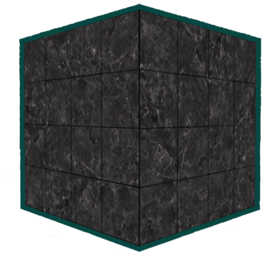
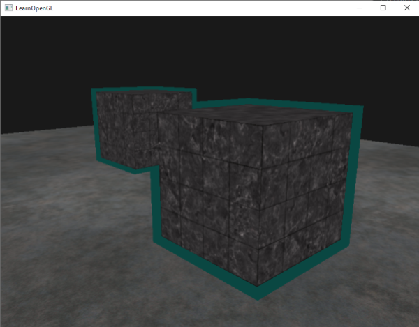

# Kalıp Testi (Stencil Testing) 🎭

Parçalar Fragment Shader'dan çıktıktan sonra Derinlik Testine girmeden hemen önce bir başka filtreden daha geçer: **Kalıp Testi (Stencil Test)**.

Kalıp testi, bir şablon / maske mantığıyla çalışır. Tıpkı sprey boya yaparken duvara bir harf şablonu tutup sadece delik olan yerleri boyamak gibi, ekranda hangi piksellerin çizilip hangilerinin atılacağını 8-bitlik bir **Kalıp Tamponu (Stencil Buffer)** ile kontrol ederiz:


Bu bölümde kalıp testinin mekaniğini çözecek ve video oyunlarında seçilen bir karakterin ya da nesnenin etrafına **parlak neon dış hat çizgisi (Object Outlining)** çizmeyi öğreneceğiz!

---

## Kalıp Fonksiyonları ⚙️

Kalıp testini açmak:
```cpp
glEnable(GL_STENCIL_TEST);
```

Her karenin başında kalıp tamponunu da temizleriz:
```cpp
glClear(GL_COLOR_BUFFER_BIT | GL_DEPTH_BUFFER_BIT | GL_STENCIL_BUFFER_BIT);
```

### 1. `glStencilMask` (Yazma Maskesi)
Tampona yazarken hangi bitlerin değiştirileceğini belirler:
```cpp
glStencilMask(0xFF); // Her bite yazmaya izin ver
glStencilMask(0x00); // Kalıp tamponuna yazmayı tamamen kilitle
```

### 2. `glStencilFunc` (Test Kuralı)
```cpp
glStencilFunc(GL_EQUAL, 1, 0xFF);
```
* `GL_EQUAL`: Karşılaştırma operatörü.
* `1`: Referans değer.
* `0xFF`: Maske.

### 3. `glStencilOp` (Tamponu Güncelleme Kuralı)
Test geçtiğinde veya kaldığında tamponun değerinin ne olacağını belirler:
```cpp
glStencilOp(GL_KEEP, GL_KEEP, GL_REPLACE);
```
* 1. Parametre: Kalıp testi başarısız olursa ne yapılsın? (`GL_KEEP`: Değeri koru).
* 2. Parametre: Kalıp testi geçti ama derinlik testi kaldıysa ne yapılsın?
* 3. Parametre: Hem kalıp hem derinlik testi geçtiyse ne yapılsın? (`GL_REPLACE`: Tampondaki değeri referans değerle değiştir).

---

## Havalı Bir Uygulama: Nesne Dış Hat Çizgisi (Object Outlining) ✨

Strateji oyunlarında (Dota, LoL, Age of Empires) farenizle bir askere tıkladığınızda etrafında renkli bir dış çizgi parlar:



Bunu 2 geçişli render ile kusursuz şekilde yaparız:

1. **1. Geçiş:** Kalıp testini açın, nesneyi normal çizin ve çizilen tüm pikseller için kalıp tamponuna `1` yazın (`glStencilFunc(GL_ALWAYS, 1, 0xFF)`).
2. **2. Geçiş:** Kalıp tamponuna yazmayı kapatın (`glStencilMask(0x00)`).
3. Kalıp fonksiyonunu sadece değerin `1` **olmadığı** yerlere izin verecek şekilde ayarlayın:
   ```cpp
   glStencilFunc(GL_NOTEQUAL, 1, 0xFF);
   ```
4. Derinlik testini kapatın (`glDisable(GL_DEPTH_TEST)`).
5. Nesneyi **%5 daha büyük ölçekleyin** (`scale(1.05f)`) ve tek renkli (örn. parlak sarı) bir shader ile çizin!

Böylece nesnenin orijinal pikselleri `1` olduğu için çizilmez, sadece dışarıya taşan %5'lik çerçeve çizilerek harika bir dış hat oluşturur!



---

Sırada camlar, sarmaşıklar ve şeffaf yüzeylerle çalışacağımız **Bölüm 3: "Harmanlama (Blending)"** var!

👉 **[Sonraki Bölüm: Harmanlama (Blending)](03-harmanlama.md)**
