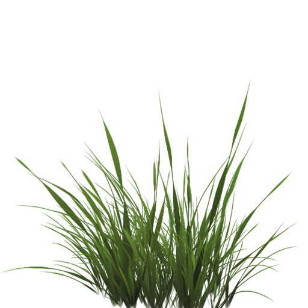
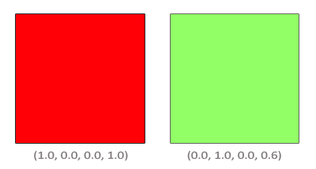
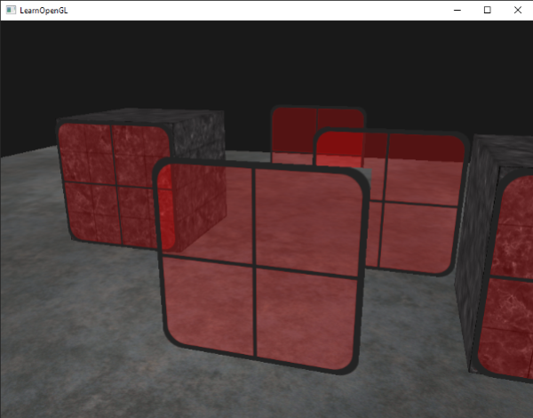
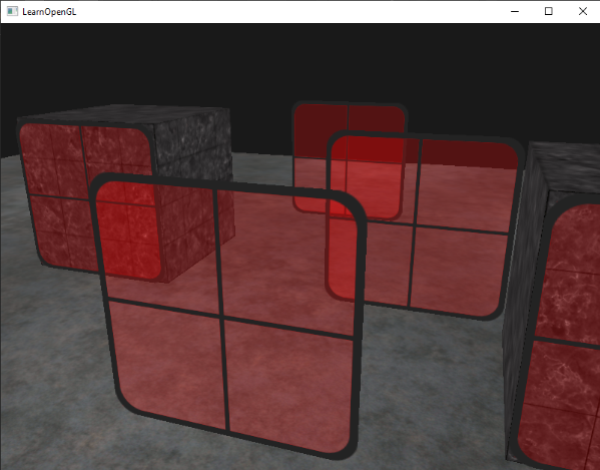

# Harmanlama (Blending / Şeffaflık) 🪟

Bilgisayar grafiklerinde gerçekçiliği artıran en kritik unsurlardan biri **şeffaflıktır (transparency)**. Renkli bir vitray cam, bir araba penceresi ya da bir yangından çıkan duman... 

Şeffaflık, arkasındaki nesnelerin renkleri ile kendi renginin belirli oranlarda birbirine karışması anlamına gelir:


Bu bölümde iki farklı şeffaflık tekniğini öğreneceğiz:
1. **İkili Şeffaflık (Piksel Atma / Discard):** Çimen ve yaprak gibi ya %100 görünür ya da %100 şeffaf olan nesneler.
2. **Yarı Şeffaflık (Blending):** Cam gibi arkasındaki rengi geçiren yüzeyler.

---

## 1. Parça Atma (Discarding Fragments) 🌿

Bir çimen ya da tel örgü dokusunu düşünün. Doku dikdörtgendir ancak çimen yapraklarının dışındaki pikseller tamamen şeffaftır (Alpha = 0.0):



Böylesi nesnelerde şeffaf kısımları doğrudan çöpe atmak en hızlı çözümdür. Fragment Shader içerisinde GLSL `discard` komutunu kullanırız:

```glsl
#version 330 core
out vec4 FragColor;
in vec2 TexCoords;

uniform sampler2D texture1;

void main()
{             
    vec4 texColor = texture(texture1, TexCoords);
    if(texColor.a < 0.1)
        discard; // Bu pikseli hiç çizme, belleğe yazma!
    FragColor = texColor;
}
```


---

## 2. Gerçek Yarı Şeffaflık (Blending) 🥛

Cam gibi yarı şeffaf nesnelerde pikseli atamazsınız; parça rengi ile arka plandaki rengi matematiksel bir formülle harmanlamanız gerekir.

OpenGL'de harmanlamayı açmak:
```cpp
glEnable(GL_BLEND);
```

### Harmanlama Denklemi (Blending Equation)
$$C_{result} = C_{source} \cdot F_{source} + C_{destination} \cdot F_{destination}$$

* $C_{source}$: Şu an çizilmekte olan parçanın rengi (Kaynak).
* $C_{destination}$: Ekranda o pikselde zaten var olan renk (Hedef).
* $F_{source}, F_{destination}$: Ağırlık faktörleri.

Standart şeffaflık için en meşhur fonksiyon:
```cpp
glBlendFunc(GL_SRC_ALPHA, GL_ONE_MINUS_SRC_ALPHA);
```



Örneğin kırmızı bir camın arkasında yeşil bir zemin varsa ve camın Alpha değeri `0.6` ise:
$$C_{result} = (Kırmızı \times 0.6) + (Yeşil \times (1.0 - 0.6)) = (Kırmızı \times 0.6) + (Yeşil \times 0.4)$$

---

## Çok Önemli: Şeffaf Nesneleri Çizme Sırası! ⚠️

Eğer şeffaf nesneleri rastgele sırayla çizerseniz derinlik testi (Z-Buffer) devreye girer ve öndeki cam arkadaki camın çizilmesini tamamen engeller:



### Doğru Çizim Sırası Kuralı:
1. **Önce tüm opak (opak/katı) nesneleri** normal derinlik testiyle çizin.
2. Şeffaf nesneleri **kameraya olan mesafelerine göre büyükten küçüğe (arkadan öne doğru)** sıralayın (`std::map` ya da `std::sort`).
3. Şeffaf nesneleri en uzaktakinden başlayarak kameraya en yakına doğru çizin!

```cpp
std::map<float, glm::vec3> sorted;
for (unsigned int i = 0; i < windows.size(); i++)
{
    float distance = glm::length(camera.Position - windows[i]);
    sorted[distance] = windows[i];
}

// Tersten (en uzaktan en yakına) çiz:
for(std::map<float,glm::vec3>::reverse_iterator it = sorted.rbegin(); it != sorted.rend(); ++it) 
{
    model = glm::mat4(1.0f);
    model = glm::translate(model, it->second);
    shader.setMat4("model", model);
    glDrawArrays(GL_TRIANGLES, 0, 6);
}
```

Sonuç kusursuzdur:



---

Sırada GPU performansını ikiye katlayan **Bölüm 4: "Yüzey Ayıklama (Face Culling)"** var!

👉 **[Sonraki Bölüm: Yüzey Ayıklama (Face Culling)](04-yuzey-ayiklama.md)**
