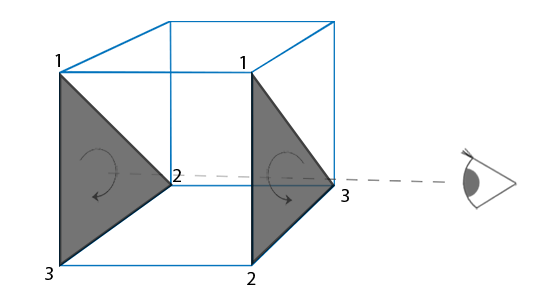

# Yüzey Ayıklama (Face Culling) ✂️

Bir 3B küpü düşünün. Kameranız hangi açıda durursa dursun, aynı anda o küpün **en fazla 3 yüzünü** görebilirsiniz; arkada kalan diğer 3 yüz ise her zaman görünmezdir.

Peki GPU'nun kameraya asla görünmeyen bu arka yüzeyleri teker teker hesaplayıp çizmeye çalışması tam bir işlem gücü israfı değil midir?

İşte kameranın görmediği arka yüzeyleri daha Vertex Shader aşamasındayken tespit edip anında çöpe atan devasa optimizasyon tekniğine **Yüzey Ayıklama (Face Culling)** denir. Yüzey ayıklama sayesinde çizim performansınızı **%50'ye kadar artırabilirsiniz**!

---

## Saat Yönü Kuralı (Winding Order) ⏱️

OpenGL bir üçgenin ön yüz mü yoksa arka yüz mü olduğunu nasıl anlar? Tepe noktalarının tanımlanma sırasına (**Sarma Sırası - Winding Order**) bakarak!

Varsayılan olarak OpenGL kuralı şudur:
* **Saat Yönünün Tersi (CCW - Counter-Clockwise):** **ÖN YÜZ** kabul edilir.
* **Saat Yönü (CW - Clockwise):** **ARKA YÜZ** kabul edilir.


Bir üçgene önden baktığınızda köşe noktaları $1 \rightarrow 2 \rightarrow 3$ saat yönünün tersine dönüyorsa, o üçgenin arkasına geçtiğinizde aynı köşe sıralaması otomatik olarak **saat yönüne (CW)** dönüşür!



---

## Yüzey Ayıklamayı Açma 🚀

Yüzey ayıklamayı açmak tek satırdır:

```cpp
glEnable(GL_CULL_FACE);
```

Varsayılan olarak OpenGL arka yüzeyleri ayıklar. Ayarları özelleştirmek isterseniz:

```cpp
glCullFace(GL_BACK); // Arka yüzeyleri at (GL_FRONT: Ön yüzeyleri at)
glFrontFace(GL_CCW); // Saat yönünün tersini ön yüz kabul et (Varsayılan)
```

!!! warning "Küp Vertex Sıralamasına Dikkat!"
    Yüzey ayıklamayı açtığınızda modelinizde delikler oluşuyorsa veya küpün önü kayboluyorsa, vertex dizinizi yazarken üçgenleri saat yönünün tersi (CCW) kuralına göre tanımlamamışsınız demektir.

---

Sırada modern grafik dünyasının en güçlü silahı olan ve ayna, su, gece görüşü ve bulanıklık gibi post-processing efektlerini yapacağımız **Bölüm 5: "Çerçeve Tamponları (Framebuffers)"** var!

👉 **[Sonraki Bölüm: Çerçeve Tamponları (Framebuffers)](05-cerceve-tamponlari.md)**
