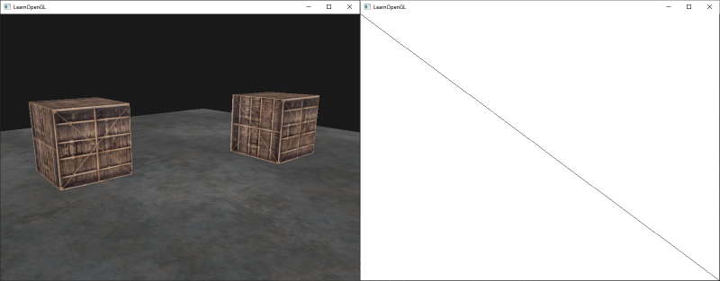
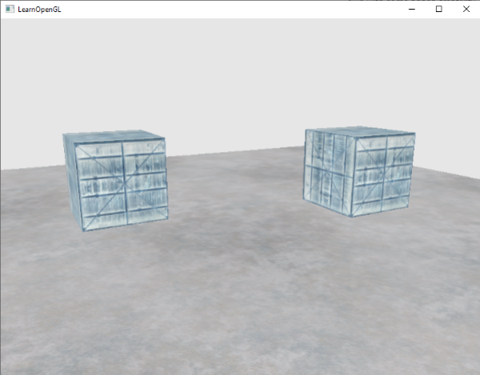
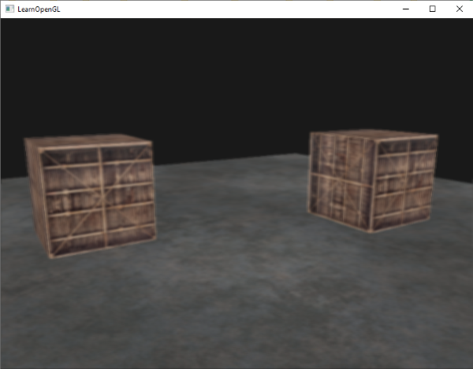
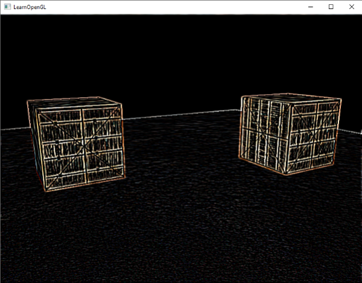

# Çerçeve Tamponları (Framebuffers) 🖼️

Şimdiye kadar sahnemizde çizdiğimiz her şey doğrudan monitörümüzün ekran tamponuna (*default framebuffer*) yazıldı. 

Peki ya sahneyi ekrana çizmek yerine **bir resim dokusunun içine çizseydik**?

İşte kendi özel tamponlarımızı oluşturup çizimi ekran dışındaki bir dokuya yönlendirme işlemine **Ekran Dışı İşleme (Off-screen Rendering)**, bu tampon nesnesine ise **Çerçeve Tamponu (Framebuffer - FBO)** denir.

FBO'lar modern oyun motorlarının kalbidir:
* Gece görüşü, siyah-beyaz film efektleri,
* Bulanıklaştırma (Blur) ve derinlik alanı (Depth of Field),
* Ayna ve güvenlik kamerası ekranları,
* Gölge haritalama (Shadow maps)...

Hepsini FBO'lar sayesinde yaparız!

---

## Bir Çerçeve Tamponu Oluşturma 🏗️

```cpp
unsigned int fbo;
glGenFramebuffers(1, &fbo);
glBindFramebuffer(GL_FRAMEBUFFER, fbo);
```

Bir FBO'nun geçerli olabilmesi için en az 1 ek (*attachment*) gereklidir:

### 1. Renk Eki Olarak Doku Bağlama (Texture Attachment)
Sahnenin çizileceği bir doku oluşturup FBO'ya bağlarız:

```cpp
unsigned int texColorBuffer;
glGenTextures(1, &texColorBuffer);
glBindTexture(GL_TEXTURE_2D, texColorBuffer);
glTexImage2D(GL_TEXTURE_2D, 0, GL_RGB, 800, 600, 0, GL_RGB, GL_UNSIGNED_BYTE, NULL);
glTexParameteri(GL_TEXTURE_2D, GL_TEXTURE_MIN_FILTER, GL_LINEAR);
glTexParameteri(GL_TEXTURE_2D, GL_TEXTURE_MAG_FILTER, GL_LINEAR);

// Dokuyu FBO'ya renk eki olarak bağla:
glFramebufferTexture2D(GL_FRAMEBUFFER, GL_COLOR_ATTACHMENT0, GL_TEXTURE_2D, texColorBuffer, 0);
```

### 2. Derinlik ve Kalıp Eki (Renderbuffer Object - RBO)
Eğer bu dokuyu daha sonra shader'da okumayacaksak sadece derinlik testi için optimize edilmiş bir RBO bağlarız:

```cpp
unsigned int rbo;
glGenRenderbuffers(1, &rbo);
glBindRenderbuffer(GL_RENDERBUFFER, rbo); 
glRenderbufferStorage(GL_RENDERBUFFER, GL_DEPTH24_STENCIL8, 800, 600);  
glFramebufferRenderbuffer(GL_FRAMEBUFFER, GL_DEPTH_STENCIL_ATTACHMENT, GL_RENDERBUFFER, rbo);

// Tamponun eksiksiz olduğunu doğrula:
if(glCheckFramebufferStatus(GL_FRAMEBUFFER) != GL_FRAMEBUFFER_COMPLETE)
    std::cout << "HATA::FRAMEBUFFER:: Tamamlanamadı!" << std::endl;
glBindFramebuffer(GL_FRAMEBUFFER, 0); // Varsayılan ekrana geri dön
```

---

## Render Süreci (2 Aşamalı Çizim) 🔄

1. **Aşama 1:** `glBindFramebuffer(GL_FRAMEBUFFER, fbo);` çağırıp tüm 3B dünyayı bu FBO'nun dokusuna çizin.
2. **Aşama 2:** `glBindFramebuffer(GL_FRAMEBUFFER, 0);` çağırıp varsayılan ekrana dönün. Tüm ekranı kaplayan 2B bir dörtgen (*quad*) çizin ve FBO'nun dokusunu bu dörtgene kaplayın!



---

## Ekran Sonrası Efektler (Post-Processing Şöleni!) 🎬

Sahnenin tamamı artık tek bir 2B dokuda olduğuna göre, Fragment Shader içerisinde piksellerle dilediğimiz gibi oynayabiliriz!

### 1. Renkleri Ters Çevirme (Inversion / Negatif Film)
```glsl
void main()
{
    FragColor = vec4(vec3(1.0 - texture(screenTexture, TexCoords)), 1.0);
}
```


### 2. Gri Tonlama (Grayscale / Siyah-Beyaz)
İnsan gözünün yeşil renge olan hassasiyetini hesaba katan ağırlıklı ortalama:
```glsl
void main()
{
    FragColor = texture(screenTexture, TexCoords);
    float average = 0.2126 * FragColor.r + 0.7152 * FragColor.g + 0.0722 * FragColor.b;
    FragColor = vec4(average, average, average, 1.0);
}
```


### 3. Çekirdek Matrisleri (Kernel Effects)
Bir pikselin rengini etrafındaki 8 komşu pikselle matris çarpımına sokarak harikalar yaratabiliriz:

* **Keskinleştirme (Sharpen):**
  
* **Bulanıklaştırma (Blur):**
  
* **Kenar Tespiti (Sobel Edge Detection):**
  

---

Sırada büyüleyici gökyüzü kutuları (Skybox) ve ayna yansımaları yapacağımız **Bölüm 6: "Küp Haritaları (Cubemaps)"** var!

👉 **[Sonraki Bölüm: Küp Haritaları (Cubemaps)](06-kup-haritalari.md)**
