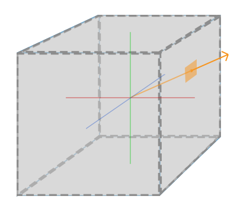
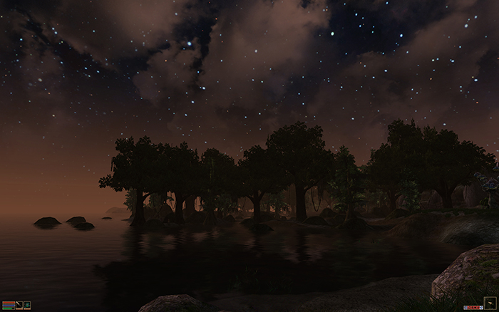
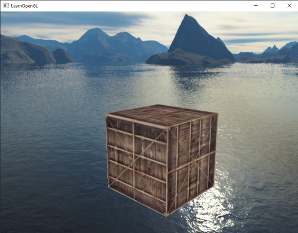
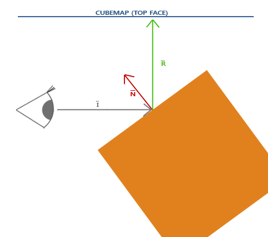
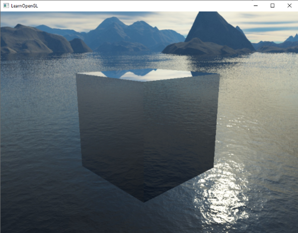
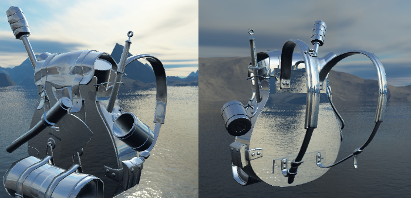

# Küp Haritaları (Cubemaps & Skybox) 🌌

Şimdiye kadar sadece 2 boyutlu dokularla çalıştık. Ancak etrafımızı 360 derece saran devasa bir gökyüzü manzarası (*Skybox*) veya krom bir kürenin etrafındaki dünyayı ayna gibi yansıtması (*Reflection*) için **Küp Haritaları (Cubemaps)** kullanılır.

Bir Küp Haritası, bir küpün 6 yüzüne denk gelen 6 adet bağımsız 2B dokunun tek bir doku nesnesi altında birleştirilmesidir:



Bu dokuları örneklemek için 2B UV koordinatları ($u, v$) yerine, merkezden dışarıya doğru uzanan **3B bir yön vektörü (`vec3`)** kullanırız!

---

## 1. Gökyüzü Kutusu (Skybox) 🌄

Skybox, tüm sahneyi içine alan devasa bir küptür ve oyuncuya sonsuz uzaklıkta bir dağ, gökyüzü ya da uzay manzarası yanılsaması verir:



### Küp Haritası Dokusunu Yükleme:
```cpp
unsigned int loadCubemap(vector<std::string> faces)
{
    unsigned int textureID;
    glGenTextures(1, &textureID);
    glBindTexture(GL_TEXTURE_CUBE_MAP, textureID);

    for (unsigned int i = 0; i < faces.size(); i++)
    {
        unsigned char *data = stbi_load(faces[i].c_str(), &width, &height, &nrChannels, 0);
        glTexImage2D(GL_TEXTURE_CUBE_MAP_POSITIVE_X + i, 
                     0, GL_RGB, width, height, 0, GL_RGB, GL_UNSIGNED_BYTE, data);
        stbi_image_free(data);
    }
    return textureID;
}
```

### Skybox Derinlik Hilesi ($z = 1.0$) ⚡
Skybox'ın her zaman tüm nesnelerin en arkasında kalmasını sağlamak için Vertex Shader'da z bileşenini w bileşenine eşitleriz ($z / w = 1.0$):

```glsl
#version 330 core
layout (location = 0) in vec3 aPos;

out vec3 TexCoords;

uniform mat4 projection;
uniform mat4 view;

void main()
{
    TexCoords = aPos;
    vec4 pos = projection * mat4(mat3(view)) * vec4(aPos, 1.0);
    gl_Position = pos.xyww; // Z değerini daima 1.0 (en uzak) yapar!
}
```

Böylece derinlik fonksiyonunu `glDepthFunc(GL_LEQUAL);` yaptığımızda Skybox sadece diğer nesnelerin çizilmediği boş piksellere çizilir; bu da inanılmaz bir performans kazandırır!



---

## 2. Çevresel Yansıma (Environment Reflection) 🪞

Küp haritalarının en havalı tarafı, nesnelerin üzerine ayna efekti vermektir. 

Kameranın bakış yönü ile yüzey normalinin yansıma vektörünü alır ve bu vektörle gökyüzü küp haritasından örnekleme yaparız:



```glsl
#version 330 core
out vec4 FragColor;

in vec3 Normal;
in vec3 Position;

uniform vec3 cameraPos;
uniform samplerCube skybox;

void main()
{             
    vec3 I = normalize(Position - cameraPos);
    vec3 R = reflect(I, normalize(Normal));
    FragColor = vec4(texture(skybox, R).rgb, 1.0);
}
```

Sonuç: Tamamen ayna kaplı krom bir nesne!




---

## 3. Çevresel Kırılma (Refraction / Cam & Su Efekti) 💎

Işık cam ya da su gibi bir ortama girdiğinde yön değiştirir (Snell Kanunu):


GLSL yerleşik `refract` fonksiyonu ile nesnelerimizi saf elmas veya cama dönüştürebiliriz:

```glsl
float ratio = 1.00 / 1.52; // Hava -> Cam kırılma indisi
vec3 I = normalize(Position - cameraPos);
vec3 R = refract(I, normalize(Normal), ratio);
FragColor = vec4(texture(skybox, R).rgb, 1.0);
```


---

Sırada tampon bellek yönetiminin ileri tekniklerini göreceğimiz **Bölüm 7: "İleri Düzey Veri"** var!

👉 **[Sonraki Bölüm: İleri Düzey Veri](07-ileri-duzey-veri.md)**
