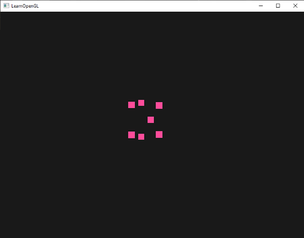
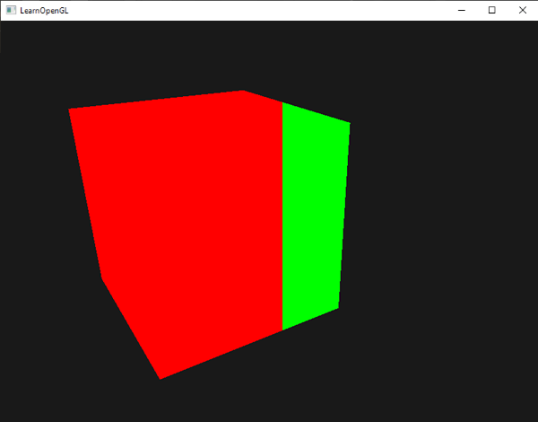
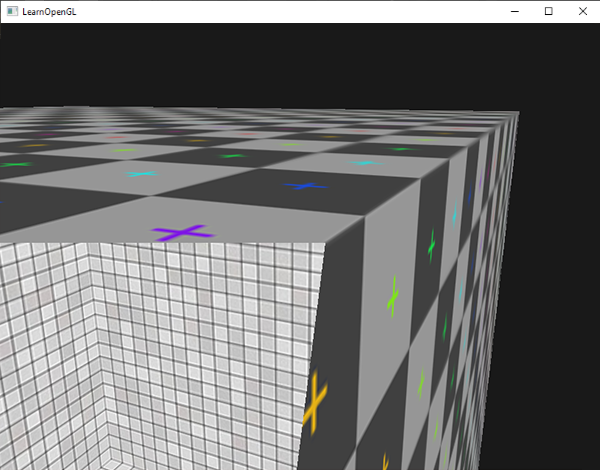
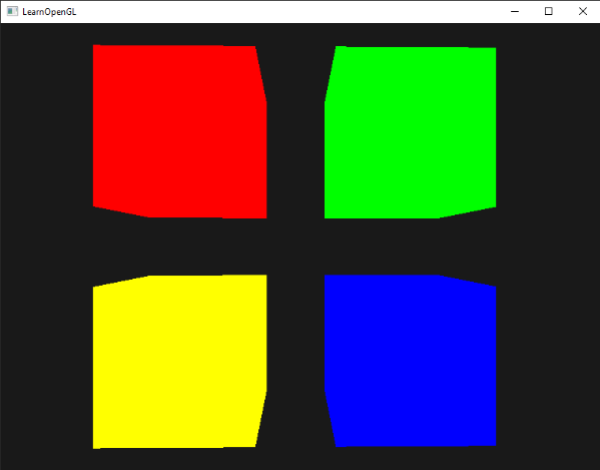
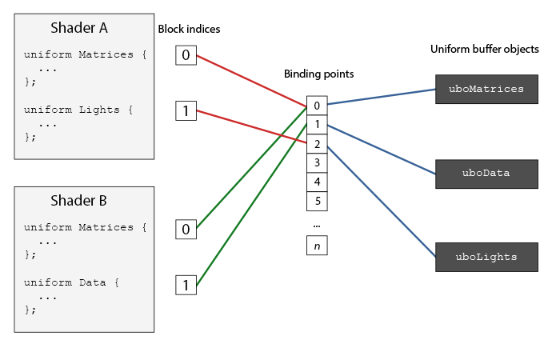

# İleri Düzey GLSL (Advanced GLSL & UBO) ⚡

GLSL, sadece `in` ve `out` değişkenleriyle veri taşımaktan çok daha fazlasını yapabilir. 

Bu bölümde GLSL'in yerleşik özel değişkenlerini, shader evreleri arasında veri paketlemeyi sağlayan **Arayüz Bloklarını (Interface Blocks)** ve sahnedeki onlarca shader'ın tek bir bellek bloğunu paylaşmasını sağlayan **Uniform Tampon Nesnelerini (Uniform Buffer Objects - UBO)** öğreneceğiz!

---

## GLSL Yerleşik Değişkenleri 🛠️

OpenGL, GPU donanımı tarafından otomatik doldurulan özel değişkenler sunar:

1. **`gl_PointSize` (Vertex):** Nokta çizdirirken (`GL_POINTS`) ekrandaki noktanın piksel çapını belirler.
   
2. **`gl_VertexID` (Vertex):** İşlenmekte olan tepe noktasının indeks numarasını saklar.
3. **`gl_FragCoord` (Fragment):** O anki parçanın ekran koordinatlarını ($x, y, z$) verir. Örneğin ekranı ikiye bölüp sol yarısını farklı renkte boyamak için harikadır:
   
4. **`gl_FrontFacing` (Fragment):** Parçanın bir ön yüzey mi yoksa arka yüzey mi olduğunu bildiren bir `bool` değerdir. Küpün içine baktığınızda farklı doku çizmek için kullanılır:
   
5. **`gl_FragDepth` (Fragment):** Parçanın Z-Buffer derinlik değerini shader içinden elle ezmenizi (*override*) sağlar.

---

## Arayüz Blokları (Interface Blocks) 📦

Değişkenleri tek tek `in/out` tanımlamak yerine bir struct gibi blok halinde gönderebiliriz:

```glsl
// Vertex Shader
out VS_OUT
{
    vec3 Normal;
    vec2 TexCoords;
} vs_out;

void main()
{
    vs_out.Normal = aNormal;
    vs_out.TexCoords = aTexCoords;
}
```

Fragment Shader'da aynı bloğu tek hamlede karşılarız:

```glsl
in VS_OUT
{
    vec3 Normal;
    vec2 TexCoords;
} fs_in;
```

---

## Uniform Tampon Nesneleri (Uniform Buffer Objects - UBO) 🗄️

Sahnede 10 farklı shader programınız olduğunu düşünün. Her bir shader `projection` ve `view` matrislerine ihtiyaç duyar. Her karede bu matrisleri 10 shader'a tek tek göndermek GPU veri hattını tıkar!

**UBO**, tüm shader'ların aynı anda erişebileceği ortak bir GPU bellek bloğudur:



### 1. GLSL Tarafında UBO Tanımlama
```glsl
layout (std140) uniform Matrices
{
    mat4 projection;
    mat4 view;
};
```

### 2. C++ Tarafında UBO Oluşturma ve Bağlama
```cpp
unsigned int uboMatrices;
glGenBuffers(1, &uboMatrices);
glBindBuffer(GL_UNIFORM_BUFFER, uboMatrices);
glBufferData(GL_UNIFORM_BUFFER, 2 * sizeof(glm::mat4), NULL, GL_STATIC_DRAW);
glBindBufferRange(GL_UNIFORM_BUFFER, 0, uboMatrices, 0, 2 * sizeof(glm::mat4));

// Matrisleri tek bir seferde UBO'ya kopyala:
glBindBuffer(GL_UNIFORM_BUFFER, uboMatrices);
glBufferSubData(GL_UNIFORM_BUFFER, 0, sizeof(glm::mat4), glm::value_ptr(projection));
glBufferSubData(GL_UNIFORM_BUFFER, sizeof(glm::mat4), sizeof(glm::mat4), glm::value_ptr(view));
```



Artık tüm shader'larınız matrisleri anında ve otomatik olarak ortak bellekten okuyacaktır!

---

Sırada çalışma anında yeni geometriler üretebilen ve nesneleri havaya uçurabileceğimiz **Bölüm 9: "Geometri Shader"** var!

👉 **[Sonraki Bölüm: Geometri Shader](09-geometri-shader.md)**
