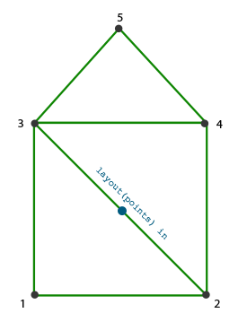
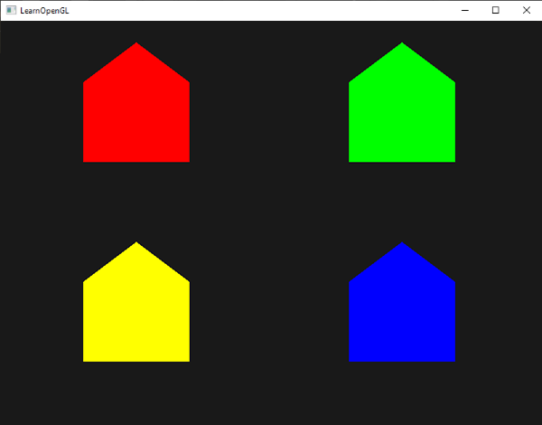

# Geometri Shader (Geometry Shader) 💥

Grafik İşlem Hattında (Pipeline), **Vertex Shader** ile **Fragment Shader** arasında yer alan isteğe bağlı donanımsal bir evre bulunur: **Geometri Shader**.

Vertex shader tek bir tepe noktasını işlerken, Geometri shader bir **primitifin tamamını** (tüm bir üçgeni veya çizgiyi) girdi olarak alır. En büyüleyici yanı ise: **Çalışma anında sıfırdan yeni noktalar, çizgiler ve üçgenler üretebilir veya var olanları silebilir!**


Bu bölümde geometri shader'ın gücünü iki muhteşem örnekle göreceğiz:
1. Tek bir noktadan ekranda 3B çatılı evler inşa etmek!
2. Bir 3B modeli yüzey normalleri yönünde havaya uçurmak (**Exploding Effect**)!

---

## Noktadan Ev Üretmek 🏠

GPU'ya sadece 4 adet nokta (`GL_POINTS`) gönderip, Geometri Shader içerisinde her bir noktadan çatılı bir ev inşa edebiliriz:



```glsl
#version 330 core
layout (points) in;
layout (triangle_strip, max_vertices = 5) out;

void build_house(vec4 position)
{    
    gl_Position = position + vec4(-0.2, -0.2, 0.0, 0.0); // 1: Sol alt
    EmitVertex();   
    gl_Position = position + vec4( 0.2, -0.2, 0.0, 0.0); // 2: Sağ alt
    EmitVertex();
    gl_Position = position + vec4(-0.2,  0.2, 0.0, 0.0); // 3: Sol üst
    EmitVertex();
    gl_Position = position + vec4( 0.2,  0.2, 0.0, 0.0); // 4: Sağ üst
    EmitVertex();
    gl_Position = position + vec4( 0.0,  0.4, 0.0, 0.0); // 5: Çatı tepesi
    EmitVertex();
    EndPrimitive();
}

void main() {    
    build_house(gl_in[0].gl_Position);
}
```

Sonuç: Gönderilen 4 noktadan anında rengarenk 4 adet ev üretilir!



---

## Modelleri Havaya Uçurma (Exploding Effect) 💣

Bir modelin patladığını simüle etmek için her bir üçgenin köşe noktalarını, o üçgenin baktığı **yüzey normali yönünde** zamana bağlı olarak dışarıya doğru fırlatırız:


```glsl
vec3 GetNormal()
{
   vec3 a = vec3(gl_in[0].gl_Position) - vec3(gl_in[1].gl_Position);
   vec3 b = vec3(gl_in[2].gl_Position) - vec3(gl_in[1].gl_Position);
   return normalize(cross(a, b));
}

vec4 explode(vec4 position, vec3 normal)
{
    float magnitude = 2.0;
    vec3 direction = normal * ((sin(time) + 1.0) / 2.0) * magnitude; 
    return position + vec4(direction, 0.0);
}

void main() {    
    vec3 normal = GetNormal();
    gl_Position = explode(gl_in[0].gl_Position, normal);
    EmitVertex();
    gl_Position = explode(gl_in[1].gl_Position, normal);
    EmitVertex();
    gl_Position = explode(gl_in[2].gl_Position, normal);
    EmitVertex();
    EndPrimitive();
}
```

Model nefes kesici bir şekilde parçalara ayrılarak uzaya saçılır!

---

## Normalleri Görselleştirme (Debug Aracı) 🔍

Aydınlatma hesaplarında bir hata olduğunda normallerin doğru yönü gösterip göstermediğini kontrol etmek için Geometri Shader ile her bir köşeden dışarıya doğru uzanan parlak sarı çizgiler çizebiliriz:


---

Sırada aynı anda 100.000 nesneyi 60 FPS çizebileceğimiz **Bölüm 10: "Örnekleme (Instancing)"** var!

👉 **[Sonraki Bölüm: Örnekleme (Instancing)](10-ornekleme.md)**
