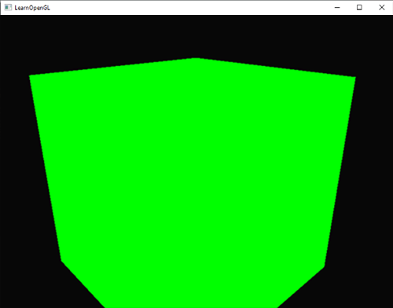
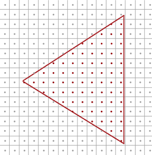
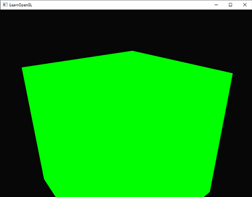
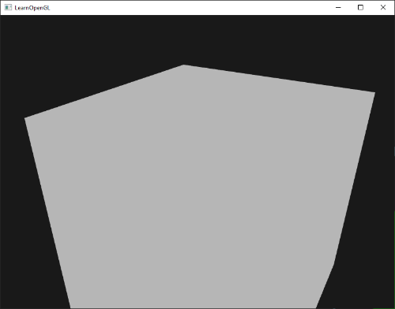

# Kenar Yumuşatma (Anti-Aliasing / MSAA) 🪄

Bilgisayar monitörleri sınırlı sayıda kare piksellerden oluşur. 3B bir üçgenin eğik kenarlarını kare piksellerle çizmeye çalıştığınızda, kenarlarda çirkin merdiven basamakları (*jaggies*) oluşur:




Bu görsel kusuru ortadan kaldırmak için piksellerin kenarlarını yumuşatan **Kenar Yumuşatma (Anti-Aliasing)** algoritmaları kullanılır.

Bu bölümde modern grafik donanımlarının en popüler donanımsal çözümü olan **MSAA (Multi-Sample Anti-Aliasing)** tekniğini inceleyeceğiz!

---

## Çoklu Örnekleme (MSAA) Nasıl Çalışır? 🔍

Klasik rasterizasyonda bir pikselin merkezindeki tek bir nokta üçgenin içindeyse piksel boyanır, dışındaysa boyanmaz:



**MSAA** ise her pikselin içine **4 (veya 8, 16) adet alt-örnekleme noktası (sub-samples)** yerleştirir:


Eğer 4 noktanın 3'ü üçgenin içindeyse, o pikselin rengi %75 üçgen rengi, %25 arka plan rengiyle harmanlanır. Böylece keskin testere dişleri yerini ipek gibi pürüzsüz kenarlara bırakır!



---

## GLFW ile MSAA'yı Açmak ⚡

GLFW'da pencere açmadan önce 4x MSAA tamponu talep etmek tek satırdır:

```cpp
glfwWindowHint(GLFW_SAMPLES, 4);
```

Pencere açıldıktan sonra OpenGL tarafında multisampling'i aktif ederiz:

```cpp
glEnable(GL_MULTISAMPLE);
```

---

## Özel Çerçeve Tamponlarında MSAA (Off-screen MSAA) 🏗️

Eğer FBO ile ekran sonrası efektler (Post-Processing) yapıyorsanız standart dokular çoklu örneklemeyi desteklemez; `GL_TEXTURE_2D_MULTISAMPLE` kullanmanız gerekir:

```cpp
glBindTexture(GL_TEXTURE_2D_MULTISAMPLE, tex);
glTexImage2DMultisample(GL_TEXTURE_2D_MULTISAMPLE, 4, GL_RGB, 800, 600, GL_TRUE);
```

Multisample dokuyu normal ekranda görüntülemek için çözünürlüğü `glBlitFramebuffer` ile normal bir FBO'ya indirgeriz (*Resolve*):

```cpp
glBindFramebuffer(GL_READ_FRAMEBUFFER, multisampledFBO);
glBindFramebuffer(GL_DRAW_FRAMEBUFFER, intermediateFBO);
glBlitFramebuffer(0, 0, 800, 600, 0, 0, 800, 600, GL_COLOR_BUFFER_BIT, GL_NEAREST);
```



---

**TEBRİKLER!** 4. Modül olan **İleri Düzey OpenGL (Advanced OpenGL)** dünyasını 11 bölümüyle birlikte baştan sona fethettiniz!

Sırada gerçek gölgeler, normal haritalama ve Bloom efektlerini öğreneceğimiz **5. Modül: "İleri Düzey Aydınlatma (Advanced Lighting)"** var!
