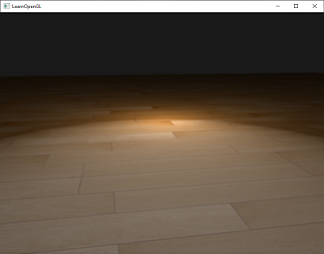
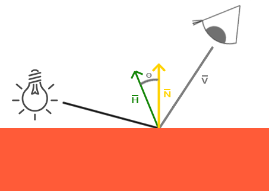
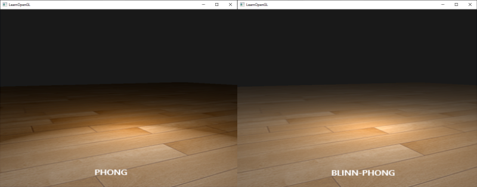

# Gelişmiş Aydınlatma: Blinn-Phong Modeli ✨

2. Modülde öğrendiğimiz standart **Phong Aydınlatma Modeli**, görsel olarak gayet tatmin edici olsa da belirli açılarda fiziksel ve matematiksel bir kusura sahiptir.

Bu bölümde klasik Phong modelinin sınırlarını inceleyecek ve modern oyun motorlarının (özellikle DirectX ve konsol oyunlarının) vazgeçilmez standardı olan **Blinn-Phong Aydınlatma Modelini** kodlayacağız!

---

## Klasik Phong Modelinin Kusuru ⚠️

Klasik Phong modelinde aynasal parlamayı hesaplamak için kameranın bakış yönü ($V$) ile ışığın yansıma vektörü ($R$) arasındaki açıyı kullanıyorduk:

$$specular = (\max(V \cdot R, 0.0))^{shininess}$$

Eğer bakış yönü ile yansıma yönü arasındaki açı $90^\circ$'yi aşarsa, skaler çarpım sıfır veya negatif olur ve parlama **aniden bıçak gibi kesilir**:




Özellikle düşük parlama üssü (*shininess*) değerlerinde bu durum yüzeyde çirkin ve keskin bir halka oluşturur.

---

## Blinn-Phong Çözümü: Yarı-Yol Vektörü (Halfway Vector) 📐

1977 yılında Jim Blinn, bu sorunu çözmek için dâhice bir yöntem geliştirdi: Yansıma vektörü ($R$) yerine, **Işık Yönü ($L$) ile Bakış Yönünün ($V$) tam ortasındaki Yarı-Yol Vektörünü ($H$)** hesaplamak!

$$H = \frac{L + V}{\|L + V\|}$$



Aynasal parlamayı hesaplamak için artık yüzey normali ($N$) ile bu yarı-yol vektörü ($H$) arasındaki skaler çarpımı alırız:

$$specular = (\max(N \cdot H, 0.0))^{shininess}$$

Bakış açısı ne olursa olsun, $N$ ile $H$ arasındaki açı asla yapay bir şekilde $90^\circ$'yi aşıp parlaklığı kesmez!



---

## Fragment Shader'da Uygulama 💻

```glsl
// Blinn-Phong Aynasal Parlama
vec3 lightDir   = normalize(lightPos - FragPos);
vec3 viewDir    = normalize(viewPos - FragPos);
vec3 halfwayDir = normalize(lightDir + viewDir);

float spec = pow(max(dot(Normal, halfwayDir), 0.0), 64.0);
vec3 specular = lightColor * spec;
```

!!! tip "Shininess Değerine Dikkat!"
    $N$ ile $H$ arasındaki açı, $V$ ile $R$ arasındaki açının yaklaşık yarısı kadardır. Bu nedenle klasik Phong ile aynı parlaklık boyutunu elde etmek için Blinn-Phong'da `shininess` değerini **2 ile 4 kat daha büyük** seçmelisiniz (örneğin Phong'da 8 ise Blinn-Phong'da 32).

---

Sırada monitörlerin renkleri bozmasını engelleyeceğimiz **Bölüm 2: "Gama Düzeltmesi (Gamma Correction)"** var!

👉 **[Sonraki Bölüm: Gama Düzeltmesi](02-gama-duzeltmesi.md)**
