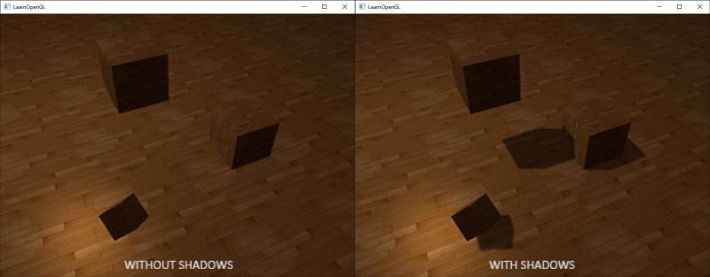
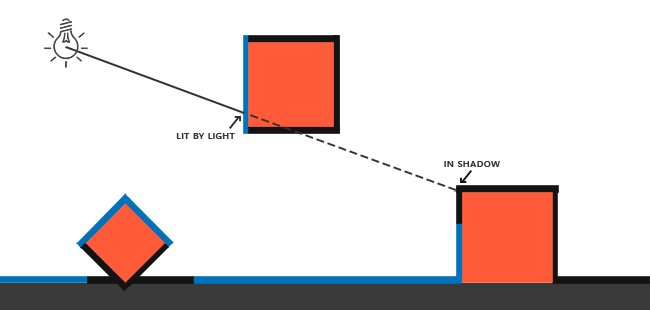
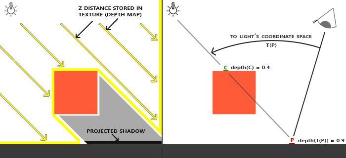
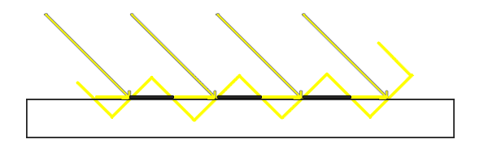

# Gölge Haritalama (Shadow Mapping) 🌑

Gerçek dünyada ışığın olduğu her yerde **gölge** vardır. Gölgeler olmasa nesnelerin havada mı uçtuğu yoksa yere mi bastığı anlaşılmaz:



Gerçek zamanlı grafiklerde gölgeleri simüle etmenin en popüler yöntemi **Gölge Haritalama (Shadow Mapping)** algoritmasıdır.

---

## Gölge Haritalama Mantığı 💡

Mantık dâhice ve basittir: **Işık kaynağının gördüğü hiçbir şey gölgede kalamaz; ışık kaynağının arkasında kalan her şey ise gölgededir!**



Bu algoritma 2 aşamada çalışır:
1. **1. Aşama (Gölge Haritası Çıkarma):** Sahneyi kameranın gözünden değil, **ışık kaynağının gözünden** render ederiz. Renkleri umursamayız; sadece ışığa olan mesafeleri özel bir derinlik dokusuna (**Derinlik Haritası - Depth Map**) kaydederiz!
2. **2. Aşama (Normal Render):** Sahneyi normal kameranın gözünden çizeriz. Her bir piksel için: "Bu pikselin ışığa olan mesafesi, ışığın derinlik haritasında kayıtlı değerden büyük mü?" diye bakarız. Eğer büyükse, arada bir engel vardır; yani piksel **GÖLGEDEDİR**!



---

## 1. Aşama: Derinlik Haritası FBO'su 🏗️

Işığın derinlik değerlerini kaydetmek için sadece derinlik eki olan bir FBO oluştururuz:

```cpp
unsigned int depthMapFBO;
glGenFramebuffers(1, &depthMapFBO);

const unsigned int SHADOW_WIDTH = 1024, SHADOW_HEIGHT = 1024;
unsigned int depthMap;
glGenTextures(1, &depthMap);
glBindTexture(GL_TEXTURE_2D, depthMap);
glTexImage2D(GL_TEXTURE_2D, 0, GL_DEPTH_COMPONENT, 
             SHADOW_WIDTH, SHADOW_HEIGHT, 0, GL_DEPTH_COMPONENT, GL_FLOAT, NULL);
glTexParameteri(GL_TEXTURE_2D, GL_TEXTURE_MIN_FILTER, GL_NEAREST);
glTexParameteri(GL_TEXTURE_2D, GL_TEXTURE_MAG_FILTER, GL_NEAREST);

glBindFramebuffer(GL_FRAMEBUFFER, depthMapFBO);
glFramebufferTexture2D(GL_FRAMEBUFFER, GL_DEPTH_ATTACHMENT, GL_TEXTURE_2D, depthMap, 0);
glDrawBuffer(GL_NONE); // Renk tamponuna ihtiyaç yok!
glReadBuffer(GL_NONE);
glBindFramebuffer(GL_FRAMEBUFFER, 0);
```

---

## 2. Aşama: Gölgeyi Hesaplama (Shadow Calculation) 📐

Fragment Shader'da pikselin gölgede olup olmadığını sorgularız:

```glsl
float ShadowCalculation(vec4 fragPosLightSpace)
{
    // Perspektif bölme
    vec3 projCoords = fragPosLightSpace.xyz / fragPosLightSpace.w;
    // [-1, 1] aralığını [0, 1] doku aralığına çevir
    projCoords = projCoords * 0.5 + 0.5;
    
    float closestDepth = texture(shadowMap, projCoords.xy).r; 
    float currentDepth = projCoords.z;
    
    // Gölge kontrolü:
    float shadow = currentDepth > closestDepth  ? 1.0 : 0.0;
    return shadow;
}
```

### Gölge Kusurları ve Çözümleri:
1. **Shadow Acne (Gölge Sivilceleri):** Çözünürlük kısıtları yüzünden yüzeylerde oluşan zebra çizgileri. Çözüm: **Gölge Sapması (Shadow Bias)** eklemek (`currentDepth - bias > closestDepth`).
   
2. **PCF (Percentage-Closer Filtering):** Kenarları tırtıklı sert gölgeler yerine, komşu 9 pikselin ortalamasını alarak **ipek gibi yumuşak gölgeler (Soft Shadows)** üretmek!
   

---

Sırada ampul gibi noktasal ışıkların 360 derece gölge saçmasını sağlayan **Bölüm 4: "Noktasal Gölgeler (Point Shadows)"** var!

👉 **[Sonraki Bölüm: Noktasal Gölgeler](04-noktasal-golgeler.md)**
