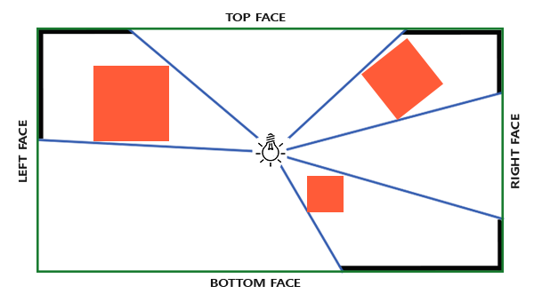
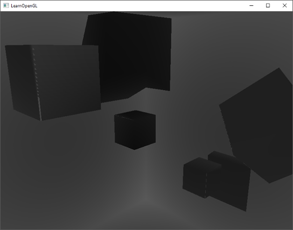
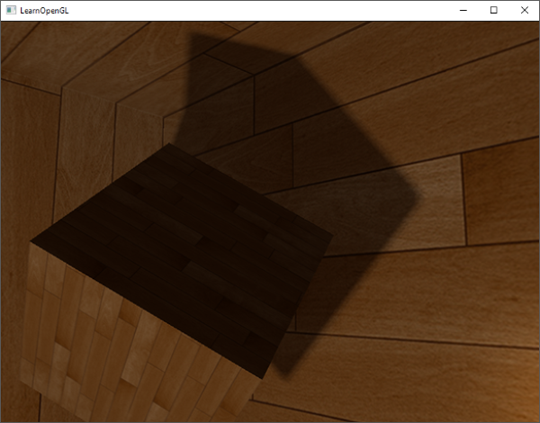

# Noktasal Gölgeler (Point Shadows & Omnidirectional) 💡🌑

Önceki bölümde güneş gibi yönlü ışıklar için 2B derinlik haritası kullandık. 

Ancak bir odanın ortasında asılı duran bir ampul ya da bir el bombası patlaması **her yöne (360 derece küresel)** ışık ve gölge saçar:



Böylesi noktasal ışıklarda tek bir 2D doku yetersiz kalır; gölge haritası olarak **Küp Haritası (Cubemap Depth Map)** kullanmamız gerekir!

---

## Kübik Derinlik Haritası (Depth Cubemap) 📦

FBO'muza standart 2B doku yerine 6 yüzlü bir `GL_TEXTURE_CUBE_MAP` bağlarız:

```cpp
unsigned int depthCubemap;
glGenTextures(1, &depthCubemap);
glBindTexture(GL_TEXTURE_CUBE_MAP, depthCubemap);
for (unsigned int i = 0; i < 6; ++i)
    glTexImage2D(GL_TEXTURE_CUBE_MAP_POSITIVE_X + i, 0, GL_DEPTH_COMPONENT, 
                 SHADOW_WIDTH, SHADOW_HEIGHT, 0, GL_DEPTH_COMPONENT, GL_FLOAT, NULL);
```

---

## Geometri Shader Sihri 🧙‍♂️

Sahneyi 6 kere ayrı ayrı çizmek yerine, **Geometri Shader** kullanarak tek bir çizim çağrısında küpün 6 yüzüne birden derinlik verisi yazdırabiliriz (`gl_Layer = face`):



---

## Yumuşak Noktasal Gölgeler Sonucu 🌟

PCF algoritmasını 3B küp yön vektörleriyle birleştirdiğimizde, odadaki tüm nesnelerin duvarlara vuran büyüleyici gölgelerini elde ederiz:



---

Sırada düz yüzeylere milyonlarca poligon varmış gibi derinlik katan **Bölüm 5: "Normal Haritalama (Normal Mapping)"** var!

👉 **[Sonraki Bölüm: Normal Haritalama](05-normal-haritalama.md)**
