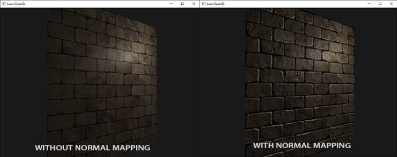
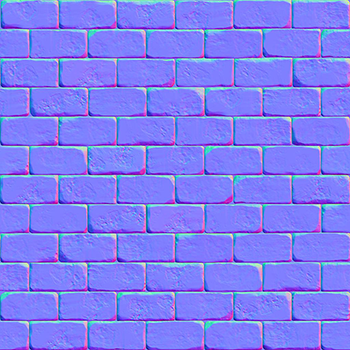
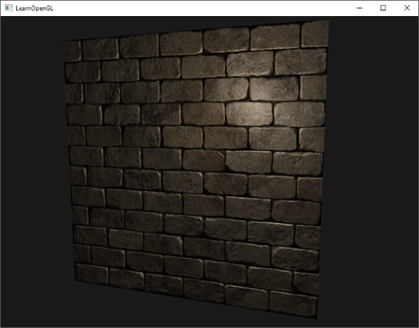

# Normal Haritalama (Normal Mapping / Bump Mapping) 🧱

Bir tuğla duvarı düşünün. Gerçek bir tuğla duvarda tuğlaların arasında harç çukurları, çatlaklar ve taş pürüzleri vardır. 

Bütün bu detayları gerçek 3B üçgenlerle modellemeye çalışırsanız, tek bir duvar için **100.000 poligon** harcamanız gerekir ve oyununuz çöker!

İşte tamamen **düz 2 üçgenlik bir düzleme**, sanki yüz binlerce poligonluk girinti ve çıkıntılara sahipmiş gibi ışık gölgeleri kazandıran teknik **Normal Haritalama (Normal Mapping)** tekniğidir!



---

## Normal Haritaları Nasıl Çalışır? 🎨

Normal haritaları, her pikselin yüzey normal vektörünü ($x, y, z$) bir RGB renk kanalı olarak saklayan özel dokulardır:
* $X$ ekseni (Kırmızı kanal): Sağa/Sola eğim $[-1, 1] \rightarrow [0, 255]$
* $Y$ ekseni (Yeşil kanal): Yukarı/Aşağı eğim $[-1, 1] \rightarrow [0, 255]$
* $Z$ ekseni (Mavi kanal): Yüzeyden dışarıya dik duruş $[0, 1] \rightarrow [128, 255]$

Normaller genellikle yüzeyden dışarı (+Z) baktığı için normal haritaları her zaman **baskın mavi renkte** görünür:



---

## Teğet Uzayı ve TBN Matrisi (Tangent Space) 📐

Eğer bir nesne uzayda dönerse, normal haritasındaki mavi vektörler yanlış yönü gösterir! 

Bunu çözmek için normalleri modelin yüzeyine yapışık özel bir uzayda tanımlarız: **Teğet Uzayı (Tangent Space)**.

Bir yüzeyin teğet uzayını 3 vektör tanımlar:
1. **T (Tangent - Teğet):** Doku $U$ koordinatının arttığı yön.
2. **B (Bitangent - İki Teğet):** Doku $V$ koordinatının arttığı yön.
3. **N (Normal):** Yüzeye dik olan yön.


Bu üç vektör birleşerek meşhur **TBN Matrisini** oluşturur:

$$TBN = \begin{bmatrix} T_x & B_x & N_x \\ T_y & B_y & N_y \\ T_z & B_z & N_z \end{bmatrix}$$

Fragment Shader içerisinde normal haritasından okunan vektörü TBN matrisiyle çarparak dünya uzayına çeviririz:

```glsl
vec3 normal = texture(normalMap, fs_in.TexCoords).rgb;
normal = normalize(normal * 2.0 - 1.0); // [0,1] -> [-1,1]
normal = normalize(fs_in.TBN * normal); 
```

Sonuç tek kelimeyle büyüleyicidir: Tamamen düz bir kare, gözlerinize inanamayacağınız kadar derin ve pürüzlü bir tuğla duvara dönüşür!



---

Sırada tuğlaların birbirinin arkasını fiziksel olarak kapatmasını sağlayan **Bölüm 6: "Paralaks Haritalama"** var!

👉 **[Sonraki Bölüm: Paralaks Haritalama](06-paralaks-haritalama.md)**
