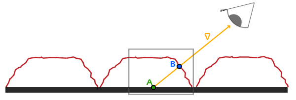

# Paralaks Haritalama (Parallax Mapping)

Normal haritalama yüzeydeki aydınlatma açılarını değiştirir; ancak yüzeye yatık bir açıdan baktığınızda yüzeyin aslında dümdüz bir kağıt gibi olduğunu hemen anlarsınız. Bir çıkıntı diğer bir girintinin önünü kapatamaz (**Self-Occlusion** yoktur).

**Paralaks Haritalama (Parallax Mapping / Displacement Mapping)**, bakış açısına göre **doku koordinatlarını ($UV$) kaydırarak** yüzeyde gerçek bir geometrik derinlik ve katman etkisi oluşturur!

---

## Temel Fikir ve Yükseklik Haritası (Height Map)

Paralaks haritalamada bir **Yükseklik Haritası (Height Map / Depth Map)** kullanılır:
- Siyah ($0.0$): En derin oyuklar,
- Beyaz ($1.0$): En yüksek çıkıntılar.

Bakış yönü $\mathbf{V}$ yüzeye çarptığında, o noktadaki derinlik miktarına göre doku koordinatı bakış doğrultusunda geriye veya ileriye doğru kaydırılır:



$$\vec{P} = \frac{\mathbf{V}_{xy}}{\mathbf{V}_z} \cdot \text{scale}$$

---

## Paralaks Tıkanma Haritalaması (Parallax Occlusion Mapping - POM)

Basit bir kaydırma dik açılarda bozulur. Modern oyunlarda kullanılan en gelişmiş teknik **Parallax Occlusion Mapping (POM)** yöntemidir.

POM, yüzeyin içine doğru adım adım ($N$ katman) ışın fırlatır (Ray Marching). Işının derinliği yükseklik haritasının altına indiği an kesişim noktası iki katman arasında doğrusal olarak enterpole edilir:

```glsl linenums="1" title="parallax_mapping.frag"
vec2 ParallaxMapping(vec2 texCoords, vec3 viewDir)
{ 
    // Açılı bakışta katman sayısını artır
    const float minLayers = 8.0;
    const float maxLayers = 32.0;
    float numLayers = mix(maxLayers, minLayers, max(dot(vec3(0.0, 0.0, 1.0), viewDir), 0.0));  

    float layerDepth = 1.0 / numLayers;
    float currentLayerDepth = 0.0;

    // Bakış doğrultusundaki kayma miktarı
    vec2 P = viewDir.xy * heightScale; 
    vec2 deltaTexCoords = P / numLayers;

    vec2  currentTexCoords     = texCoords;
    float currentDepthMapValue = texture(depthMap, currentTexCoords).r;

    while(currentLayerDepth < currentDepthMapValue)
    {
        currentTexCoords -= deltaTexCoords;
        currentDepthMapValue = texture(depthMap, currentTexCoords).r;  
        currentLayerDepth += layerDepth;  
    }

    // Doğrusal İnterpolasyon (POM)
    vec2 prevTexCoords = currentTexCoords + deltaTexCoords;
    float afterDepth  = currentDepthMapValue - currentLayerDepth;
    float beforeDepth = texture(depthMap, prevTexCoords).r - currentLayerDepth + layerDepth;

    float weight = afterDepth / (afterDepth - beforeDepth);
    vec2 finalTexCoords = prevTexCoords * weight + currentTexCoords * (1.0 - weight);

    return finalTexCoords;
}
```

Sonuç: Taşların kenarları birbirinin üstünü kapatır, duvarlar derin yarıklarla dolu gerçek bir 3B model gibi görünür!
