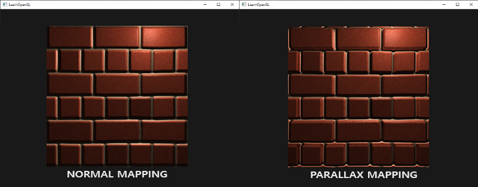
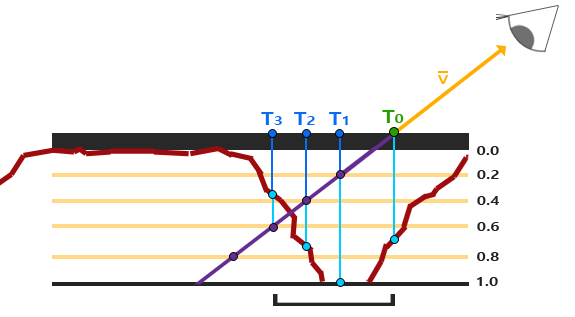
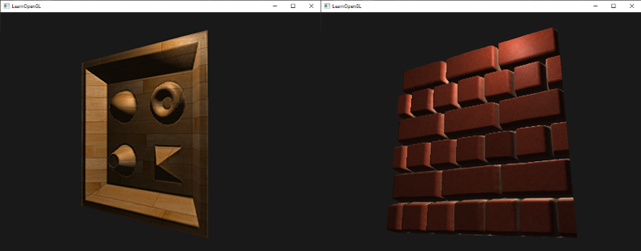

# Paralaks Haritalama (Parallax Mapping) 🏔️

Normal haritalama yüzey ışıklandırmasını değiştirir ancak yüzeyin silüetini ve bakış açısına göre ötelenmesini değiştiremez. Bir tuğla duvara yandan eğik açıyla baktığınızda tuğlaların hâlâ dümdüz bir kağıt gibi olduğunu fark edersiniz.

**Paralaks Haritalama (Parallax Mapping)**, bir **Yükseklik Haritası (Height/Displacement Map)** kullanarak, kameranın bakış açısına göre **doku koordinatlarını kaydırır**! Böylece öndeki tuğla arkadaki çukuru fiziksel olarak kapatır (*occlusion*):

---

## Paralaks Teknikleri 📈

1. **Temel Paralaks Haritalama:** Tek bir yükseklik okumasıyla doku koordinatını kaydırır. Hızlıdır ancak dik açılarda bozulmalar üretir.
2. **Steep Parallax Mapping (Dik Paralaks Haritalama):** Yüzeyi çok sayıda derinlik katmanına böler ve bakış ışınının yükseklik yüzeyini kestiği ilk katmanı adım adım arar:
   
3. **Parallax Occlusion Mapping (POM):** Kesilen iki katman arasında doğrusal enterpolasyon yaparak pürüzsüz ve kusursuz bir derinlik yanılsaması oluşturur!

Sonuç: Tamamen düz bir yüzey, sanki 10 santimetre derinliğinde taş yarıklarıyla doluymuş gibi görünür!

---

Sırada parlak ışıkların sınırlarını kaldıran **Bölüm 7: "Yüksek Dinamik Aralık (HDR)"** var!

👉 **[Sonraki Bölüm: Yüksek Dinamik Aralık (HDR)](07-hdr.md)**
