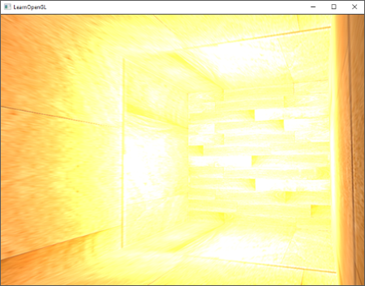
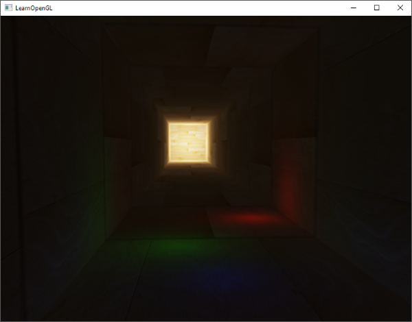
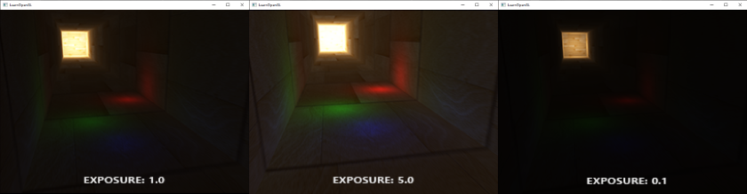

# Yüksek Dinamik Aralık (HDR & Tone Mapping) ☀️🕶️

Varsayılan olarak bir çerçeve tamponunda renk değerleri $[0.0, 1.0]$ arasında sınırlandırılır (*clamped*). 

Ancak gerçek dünyada bir mum ışığı ile Güneş ışığı arasındaki parlaklık farkı 1 milyar kattır! Eğer sahnenize çok güçlü bir ışık koyarsanız, $1.0$'ın üzerindeki tüm parlaklık değerleri beyaza kilitlenir ve tüm detaylar kaybolur:



**HDR (High Dynamic Range)**, renkleri 8-bitlik sınırlı tamponlar yerine **16-bit ya da 32-bit kayan noktalı tamponlarda (Floating Point Framebuffers - `GL_RGBA16F`)** saklayarak $1.0$'dan çok daha büyük parlaklık değerlerini korumamızı sağlar!

---

## Ton Eşleme (Tone Mapping) 🎨

Monitörlerimiz nihayetinde $[0.0, 1.0]$ aralığında renk gösterebilir. HDR ile sakladığımız devasa parlaklık aralığını monitörün gösterebileceği aralığa estetik ve gerçekçi bir şekilde sıkıştırma işlemine **Ton Eşleme (Tone Mapping)** denir.

### 1. Reinhard Ton Eşleme
Geliştiricisi Erik Reinhard'a ithafen adlandırılan en popüler ve zarif formüldür:

$$C_{mapped} = \frac{C}{C + 1.0}$$

```glsl
vec3 hdrColor = texture(hdrBuffer, TexCoords).rgb;
vec3 mapped = hdrColor / (hdrColor + vec3(1.0));
```



### 2. Pozlama (Exposure Tone Mapping)
Tıpkı bir fotoğraf makinesinin diyafram açıklığı gibi, sahnenin pozlama süresini kontrol etmenizi sağlar:

$$C_{mapped} = 1.0 - e^{-C \cdot exposure}$$

```glsl
vec3 mapped = vec3(1.0) - exp(-hdrColor * exposure);
```

Pozlama parametresiyle oynayarak karanlık bir tünelden aydınlık bir güneşe çıktığınızda gözün kamaşmasını ve ışığa alışmasını simüle edebilirsiniz!



---

Sırada ışık kaynaklarının etrafına sihirli bir ışıltı katan **Bölüm 8: "Bloom Efekti"** var!

👉 **[Sonraki Bölüm: Bloom Efekti](08-bloom.md)**
