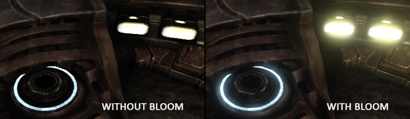
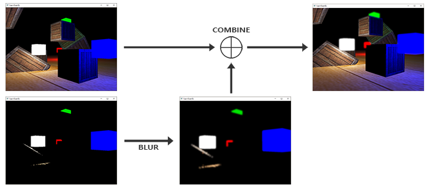
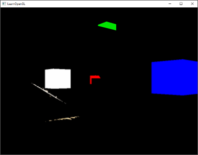
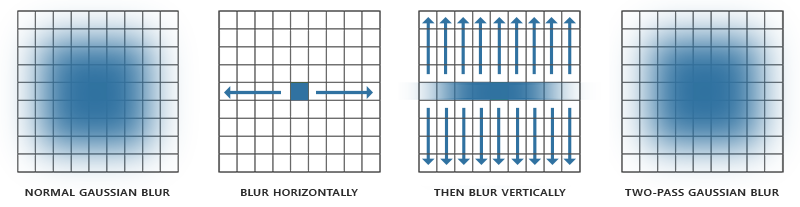
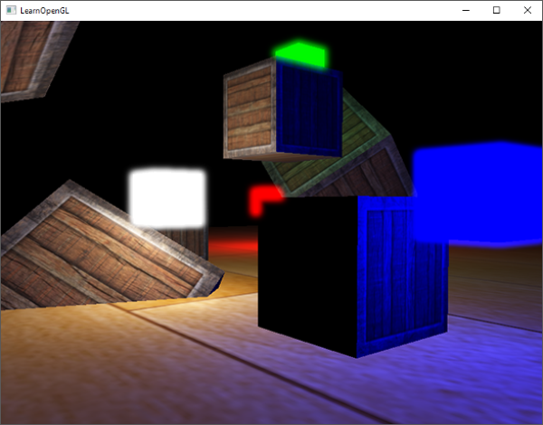

# Bloom Efekti (Işıltı & Parıltı) 🌸✨

Gerçek dünyada çok parlak bir ışık kaynağına (örneğin bir araba farına veya bir lazere) baktığınızda, ışık mercekte kırılarak kaynağın etrafında **büyüleyici bir ışıltı ve parlama halesi (glow)** oluşturur:

Bu efekti oyunlarda simüle etmeye **Bloom** denir. Bloom, HDR ile birleştiğinde sahneye inanılmaz bir atmosfer ve sinematik güç kazandırır!

---

## Bloom Hattı Nasıl Çalışır? (4 Adım) 🛠️

1. **1. Adım: Çoklu Renk Tamponu (MRT - Multiple Render Targets):**
   Sahneyi çizerken tek bir FBO'ya 2 renk eki bağlarız:
   * Ek 0: Sahnenin normal HDR görüntüsü.
   * Ek 1: Sadece parlaklığı $1.0$'ın üzerinde olan pikseller!
   
2. **2. Adım: İki Geçişli Gauss Bulanıklaştırması (Two-Pass Gaussian Blur):**
   Sadece parlak piksellerin olduğu dokuyu önce yatay, sonra dikey olarak bulanıklaştırırız:
   
3. **3. Adım: Harmanlama:**
   Bulanıklaşan parlaklık halesini orijinal HDR görüntüsünün üzerine ekleriz:
   $$Nihai = Orijinal + Bloom$$
4. **4. Adım: Ton Eşleme:**
   Birleşik görüntüyü ton eşleme ve gama düzeltmesiyle ekrana çizeriz!

Sonuç: Neon tabelalar, lazer kılıçları ve patlamalar ekrandan fırlayacak gibi parıldar!

---

Sırada sahnede yüzlerce ışık kaynağını kasmadan render edebileceğimiz **Bölüm 9: "Ertelenmiş Gölgelendirme (Deferred Shading)"** var!

👉 **[Sonraki Bölüm: Ertelenmiş Gölgelendirme](09-ertelenmis-gogelendirme.md)**
