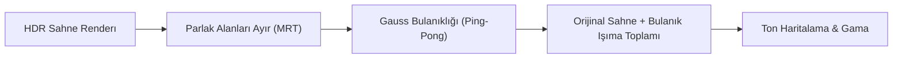

# Bloom (Işıma) Efekti

Gerçek dünyada aşırı parlak bir ışık kaynağına (örneğin yanan bir ampule, güneşe veya lazer ışınına) baktığınızda, ışık merceğin içinde kırılarak ışık kaynağının etrafında büyüleyici bir **ışık halesi / parlama (Glow / Bloom)** oluşturur.

Bloom efekti, oyuncuya sahnedeki nesnelerin gerçekten çok sıcak veya aşırı parlak olduğu hissini aşılar.

---

## Bloom Pipeline Mimarisi

Bloom efekti 4 temel adımdan oluşur:



---

## 1. Çoklu Render Hedefleri (MRT): Parlak Alanları Ayrıştırma

Sahneyi çizerken iki farklı dokuya aynı anda yazarız:
1. `FragColor`: Tüm sahne,
2. `BrightColor`: Yalnızca parlaklığı $1.0$'ı aşan alanlar!

```glsl linenums="1" title="mrt_scene.frag"
layout (location = 0) out vec4 FragColor;
layout (location = 1) out vec4 BrightColor;

void main()
{
    // ... aydınlatma hesapları ...
    FragColor = vec4(result, 1.0);

    // Parlaklık testi
    float brightness = dot(result, vec3(0.2126, 0.7152, 0.0722));
    if(brightness > 1.0)
        BrightColor = vec4(result, 1.0);
    else
        BrightColor = vec4(0.0, 0.0, 0.0, 1.0);
}
```

---

## 2. İki Geçişli Gauss Bulanıklaştırma (Two-Pass Gaussian Blur)

2 boyutlu bir Gauss filtresini tek geçişte uygulamak $O(K^2)$ işlem gerektirir. Ancak Gauss matrisi ayrıştırılabilir (separable) olduğu için:
1. Önce yatayda bulanıklaştırırız ($O(K)$),
2. Sonra dikeyde bulanıklaştırırız ($O(K)$).

İki adet FBO arasında (Ping-Pong tekniği) bu işlemi 5-10 kez tekrarlarız:

```glsl linenums="1" title="blur.frag"
uniform sampler2D image;
uniform bool horizontal;
uniform float weight[5] = float[] (0.227027, 0.316216, 0.070270, 0.016216, 0.000270);

void main()
{             
    vec2 tex_offset = 1.0 / textureSize(image, 0);
    vec3 result = texture(image, TexCoords).rgb * weight[0];

    if(horizontal)
    {
        for(int i = 1; i < 5; ++i)
        {
            result += texture(image, TexCoords + vec2(tex_offset.x * i, 0.0)).rgb * weight[i];
            result += texture(image, TexCoords - vec2(tex_offset.x * i, 0.0)).rgb * weight[i];
        }
    }
    else
    {
        for(int i = 1; i < 5; ++i)
        {
            result += texture(image, TexCoords + vec2(0.0, tex_offset.y * i)).rgb * weight[i];
            result += texture(image, TexCoords - vec2(0.0, tex_offset.y * i)).rgb * weight[i];
        }
    }
    FragColor = vec4(result, 1.0);
}
```

---

## 3. Katmanları Birleştirme (Additive Blending)

Son aşamada orijinal sahne ile bulanıklaştırılmış ışıma katmanını toplarız:

```glsl linenums="1" title="bloom_final.frag"
vec3 hdrColor = texture(scene, TexCoords).rgb;      
vec3 bloomColor = texture(bloomBlur, TexCoords).rgb;
hdrColor += bloomColor; // Toplamsal karışım (Additive)

// Ton haritalama ve gama...
```

Sonuç: Neon lambalar, alevler ve büyülü ışık efektleri ekranınızda adeta parıldayacaktır!
