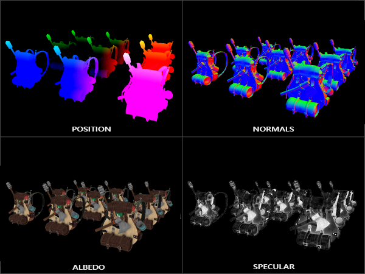

# Ertelenmiş Gölgelendirme (Deferred Shading)

Geleneksel **İleriye Dönük Renderda (Forward Shading)**, sahnedeki her bir nesneyi çizerken sahnedeki her bir ışığı döngüye sokarız. 

Eğer sahnede $N$ adet nesne ve $L$ adet ışık varsa:
$$\text{Karmaşıklık} = O(N \times L)$$

Daha da kötüsü: Bir nesne çizilip aydınlatıldıktan sonra arkasında kalan başka bir nesne tarafından kapatılırsa (Depth Test sonucu ezilirse), o nesne için harcanan tüm aydınlatma hesaplamaları **çöpe gider (Overdraw felaketi)**! Bu yüzden Forward Shading ile sahnede 10-20'den fazla ışık kullanmak performansı mahveder.

**Ertelenmiş Gölgelendirme (Deferred Shading)**, aydınlatma hesaplamalarını sahne geometrisinden tamamen ayırarak sahnede **yüzlerce, hatta binlerce ışığı** 60 FPS hızında çalıştırmamıza imkan tanır!

---

## G-Buffer (Geometri Tamponu) Mimarisi

İşlem iki aşamada yürütülür:



1. **Geometri Geçişi (Geometry Pass):**
   Sahnedeki nesneler çizilir, ancak **hiçbir aydınlatma hesabı yapılmaz**! Yalnızca ekranda gerçekten görünen en öndeki piksellerin geometrik verileri bir dizi dokuya (G-Buffer) kaydedilir:
   - **`gPosition`:** 3B Dünya konumu (`GL_RGBA16F`),
   - **`gNormal`:** Yüzey normalleri (`GL_RGBA16F`),
   - **`gAlbedoSpec`:** RGB difüz rengi ve Alfa kanalında speküler parlaklık (`GL_RGBA`).

2. **Aydınlatma Geçişi (Lighting Pass):**
   Ekranı kaplayan tek bir 2B dikdörtgen (Full-screen quad) çizilir. Fragment shader, G-Buffer dokularını okur ve ışıkları yalnızca **ekranda gerçekten görünen pikseller** için hesaplar!
   $$\text{Karmaşıklık} = O(\text{Ekran Pikselleri} \times L)$$

---

## G-Buffer FBO Kurulumu (C++)

```cpp linenums="1" title="G-Buffer Kurulumu"
unsigned int gBuffer;
glGenFramebuffers(1, &gBuffer);
glBindFramebuffer(GL_FRAMEBUFFER, gBuffer);

unsigned int gPosition, gNormal, gAlbedoSpec;

// 1. Konum Dokusu
glGenTextures(1, &gPosition);
glBindTexture(GL_TEXTURE_2D, gPosition);
glTexImage2D(GL_TEXTURE_2D, 0, GL_RGBA16F, SCR_WIDTH, SCR_HEIGHT, 0, GL_RGBA, GL_FLOAT, NULL);
glFramebufferTexture2D(GL_FRAMEBUFFER, GL_COLOR_ATTACHMENT0, GL_TEXTURE_2D, gPosition, 0);

// 2. Normal Dokusu
glGenTextures(1, &gNormal);
glBindTexture(GL_TEXTURE_2D, gNormal);
glTexImage2D(GL_TEXTURE_2D, 0, GL_RGBA16F, SCR_WIDTH, SCR_HEIGHT, 0, GL_RGBA, GL_FLOAT, NULL);
glFramebufferTexture2D(GL_FRAMEBUFFER, GL_COLOR_ATTACHMENT1, GL_TEXTURE_2D, gNormal, 0);

// 3. Renk + Parlaklık Dokusu
glGenTextures(1, &gAlbedoSpec);
glBindTexture(GL_TEXTURE_2D, gAlbedoSpec);
glTexImage2D(GL_TEXTURE_2D, 0, GL_RGBA, SCR_WIDTH, SCR_HEIGHT, 0, GL_RGBA, GL_UNSIGNED_BYTE, NULL);
glFramebufferTexture2D(GL_FRAMEBUFFER, GL_COLOR_ATTACHMENT2, GL_TEXTURE_2D, gAlbedoSpec, 0);

// Çizim hedeflerini bildir
unsigned int attachments[3] = { GL_COLOR_ATTACHMENT0, GL_COLOR_ATTACHMENT1, GL_COLOR_ATTACHMENT2 };
glDrawBuffers(3, attachments);
```

---

## Aydınlatma Geçişi Fragment Shader'ı

```glsl linenums="1" title="deferred_lighting.frag"
#version 330 core
out vec4 FragColor;
in vec2 TexCoords;

uniform sampler2D gPosition;
uniform sampler2D gNormal;
uniform sampler2D gAlbedoSpec;

struct Light {
    vec3 Position;
    vec3 Color;
    float Linear;
    float Quadratic;
};
const int NR_LIGHTS = 32;
uniform Light lights[NR_LIGHTS];
uniform vec3 viewPos;

void main()
{             
    vec3 FragPos = texture(gPosition, TexCoords).rgb;
    vec3 Normal = texture(gNormal, TexCoords).rgb;
    vec3 Diffuse = texture(gAlbedoSpec, TexCoords).rgb;
    float Specular = texture(gAlbedoSpec, TexCoords).a;
    
    vec3 lighting = Diffuse * 0.1; // Ambient
    vec3 viewDir = normalize(viewPos - FragPos);

    for(int i = 0; i < NR_LIGHTS; ++i)
    {
        // Mesafe zayıflaması (attenuation)
        float distance = length(lights[i].Position - FragPos);
        float attenuation = 1.0 / (1.0 + lights[i].Linear * distance + lights[i].Quadratic * distance * distance);

        // Difüz
        vec3 lightDir = normalize(lights[i].Position - FragPos);
        vec3 diffuse = max(dot(Normal, lightDir), 0.0) * Diffuse * lights[i].Color;

        // Speküler (Blinn-Phong)
        vec3 halfwayDir = normalize(lightDir + viewDir);  
        float spec = pow(max(dot(Normal, halfwayDir), 0.0), 16.0);
        vec3 specular = lights[i].Color * spec * Specular;

        lighting += (diffuse + specular) * attenuation;
    }
    FragColor = vec4(lighting, 1.0);
}
```

> [!WARNING]
> **Deferred Shading Dezavantajları:**
> - Çok fazla bellek ve bant genişliği harcar (G-Buffer dokuları ağırdır).
> - **Şeffaflık (Blending)** doğrudan uygulanamaz (şeffaf nesneler en son Forward Shading ile çizilmelidir).
> - Donanımsal MSAA (Multi-Sample Anti-Aliasing) doğrudan çalışmaz (FXAA veya TAA gibi post-process AA gerektirir).
