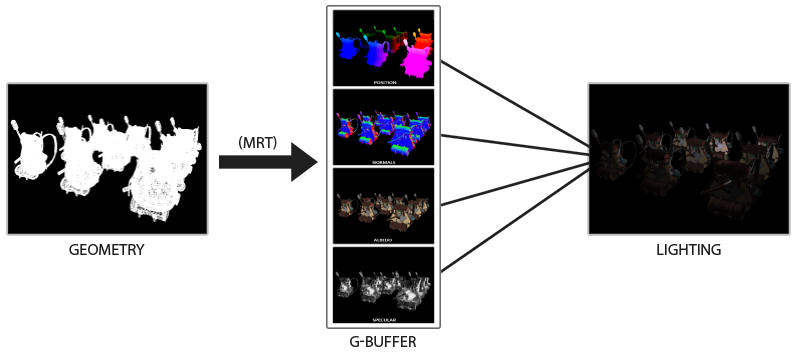
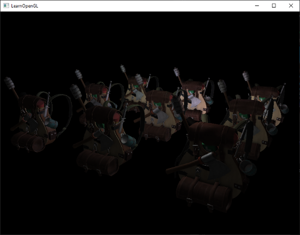

# Ertelenmiş Gölgelendirme (Deferred Shading) ⚡💡

Şimdiye kadar kullandığımız aydınlatma yöntemine **İleri Yönlü Gölgelendirme (Forward Shading)** denir: Her bir nesne çizilirken sahnedeki tüm ışık kaynakları için aydınlatma hesaplanır.

Eğer sahnede $N$ nesne ve $L$ ışık varsa, hesaplama karmaşıklığı:
$$O(N \times L)$$
olur! 1000 nesne ve 100 ışık olduğunda saniyede 100.000 aydınlatma döngüsü çalışır ve GPU kilitlenir!

Çözüm: AAA oyun motorlarının (Unreal Engine, Frostbite) temel taşı olan **Ertelenmiş Gölgelendirme (Deferred Shading)**!

---

## G-Buffer (Geometri Tamponu) Mimarisi 🏛️

Deferred Shading aydınlatma hesaplamasını **erteler** ve işi 2 aşamaya böler:

1. **Geometri Aşaması (Geometry Pass):**
   Sahnedeki tüm modelleri çizeriz fakat **hiç aydınlatma hesaplamayız**! Bunun yerine her bir pikselin verilerini çoklu bir FBO'ya (**G-Buffer**) yazarız:
   * Doku 1: Pikselin Dünya Pozisyonu (`vec3 Position`)
   * Doku 2: Yüzey Normali (`vec3 Normal`)
   * Doku 3: Temel Renk ve Aynasal Katsayı (`vec4 AlbedoSpec`)
   
   

2. **Aydınlatma Aşaması (Lighting Pass):**
   Ekranı kaplayan tek bir 2B kare (*quad*) çizeriz. G-Buffer'dan pozisyon ve normalleri okuyup, sahnede kaç yüz ışık olursa olsun sadece ekranda gerçekten görünen pikseller için aydınlatmayı tek seferde hesaplarız!

Hesaplama karmaşıklığı:
$$O(Piksel \times L)$$
seviyesine iner. Sahneye kaç bin model koyarsanız koyun performans asla etkilenmez!

---

Sırada köşelere ve yarıklara gerçekçi temas gölgeleri katan **Bölüm 10: "SSAO (Ekran Uzayı Ortam Kapatma)"** var!

👉 **[Sonraki Bölüm: SSAO](10-ssao.md)**
