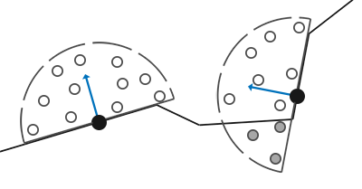

# Ekran Uzayı Ortam Tıkanması (Screen Space Ambient Occlusion - SSAO)

Temel aydınlatmada ortam ışığını (Ambient) sahnenin her yerine eşit dağılan sabit bir renk (`ambient = 0.1 * color`) olarak aldık. Ancak gerçek dünyada duvar dipleri, masa altları, boru kıvrımları ve köşe çatlakları ortam ışığını daha az alır ve buralarda **yumuşak temas gölgeleri** oluşur.

Crytek tarafından *Crysis (2007)* oyunu için geliştirilen **SSAO**, sahne geometrisine ihtiyaç duymadan, yalnızca ekran tamponundaki derinlik ve normalleri kullanarak bu gölgeleri gerçek zamanlı hesaplar!

---

## SSAO Nasıl Çalışır?

Her pikselin etrafında, yüzey normali yönünde sanal bir **yarıküre (hemisphere)** oluştururuz ve bu yarıküre içine rastgele $N$ adet örnek nokta (sample kernel) serperiz:



1. Her bir örnek noktanın derinliğini, o noktaya denk gelen yüzeyin derinlik tamponundaki değeriyle karşılaştırırız.
2. Eğer örnek noktası yüzeyin **arkasında/altında** kalıyorsa, o yön kapalıdır (tıkanmıştır).
3. Yarıküredeki kapalı örneklerin toplam sayısına göre bir **Tıkanma Faktörü (Occlusion Factor - $[0.0, 1.0]$)** hesaplanır.

---

## 64 Noktalı Örnekleme Çekirdeği (C++)

Örnek noktaların yüzeye yakın kısımlarda daha yoğun olması için karesel bir dağılım kullanırız:

```cpp linenums="1" title="SSAO Çekirdeği Oluşturma"
std::vector<glm::vec3> ssaoKernel;
for (unsigned int i = 0; i < 64; ++i)
{
    glm::vec3 sample(
        randomFloats(generator) * 2.0 - 1.0,
        randomFloats(generator) * 2.0 - 1.0,
        randomFloats(generator) // Yalnızca normal yönünde pozitif Z
    );
    sample = glm::normalize(sample);
    sample *= randomFloats(generator);

    // Merkeze yakınlığı artıran ölçekleme
    float scale = float(i) / 64.0;
    scale = lerp(0.1f, 1.0f, scale * scale);
    sample *= scale;
    ssaoKernel.push_back(sample);
}
```

Örneklerin düzenli yapay çizgiler oluşturmasını engellemek için $4 \times 4$ boyutunda rastgele yön vektörleri içeren küçük bir **gürültü dokusu (noise texture)** ile çekirdeği rastgele döndürürüz.

---

## SSAO Fragment Shader'ı

```glsl linenums="1" title="ssao.frag"
#version 330 core
out float FragColor;
in vec2 TexCoords;

uniform sampler2D gPosition;
uniform sampler2D gNormal;
uniform sampler2D texNoise;

uniform vec3 samples[64];
uniform mat4 projection;

const vec2 noiseScale = vec2(800.0/4.0, 600.0/4.0); 

void main()
{
    vec3 fragPos = texture(gPosition, TexCoords).xyz;
    vec3 normal = normalize(texture(gNormal, TexCoords).rgb);
    vec3 randomVec = normalize(texture(texNoise, TexCoords * noiseScale).xyz);

    // Teğet uzay oluştur (Gram-Schmidt)
    vec3 tangent = normalize(randomVec - normal * dot(randomVec, normal));
    vec3 bitangent = cross(normal, tangent);
    mat3 TBN = mat3(tangent, bitangent, normal);

    float occlusion = 0.0;
    for(int i = 0; i < 64; ++i)
    {
        // Örnek noktasını dünya/görüş uzayına al
        vec3 samplePos = TBN * samples[i]; 
        samplePos = fragPos + samplePos * 0.5; // 0.5 yarıçap
        
        // Ekran koordinatlarına projekte et
        vec4 offset = vec4(samplePos, 1.0);
        offset = projection * offset;
        offset.xyz /= offset.w;
        offset.xyz = offset.xyz * 0.5 + 0.5;
        
        float sampleDepth = texture(gPosition, offset.xy).z;
        
        // Aralık kontrolü ve tıkanma hesabı
        float rangeCheck = smoothstep(0.0, 1.0, 0.5 / abs(fragPos.z - sampleDepth));
        occlusion += (sampleDepth >= samplePos.z + 0.025 ? 1.0 : 0.0) * rangeCheck;           
    }
    occlusion = 1.0 - (occlusion / 64.0);
    FragColor = occlusion;
}
```

Son adımda oluşan gürültüyü gidermek için $4 \times 4$ basit bir bulanıklık (blur) filtresi uygulanır. Ortam aydınlatmasını bu faktörle çarptığınızda (`ambient * ssao`), sahnedeki tüm nesnelerin köşe ve çatlakları adeta hayat bulur!
