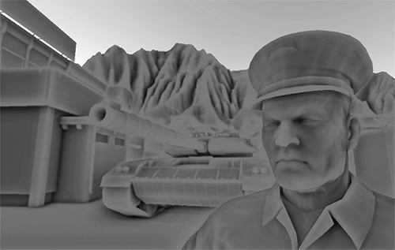
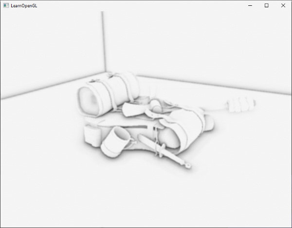
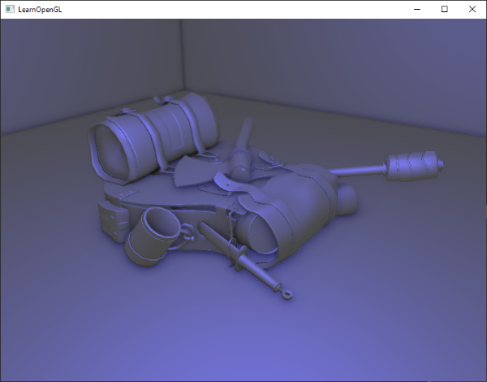

# Ekran Uzayı Ortam Kapatma (SSAO) 🌑🏛️

Phong modelinde ortam ışığını (`ambient`) sahnenin her yerine eşit dağılan sabit bir katsayı olarak almıştık. 

Oysa gerçek dünyada duvarların köşeleri, mobilyaların altı, elbise kıvrımları ve taş çatlakları ortam ışığının girmekte zorlandığı dar alanlardır; buralar her zaman **daha koyu ve gölgelidir**:

2007 yılında efsanevi oyun *Crysis* (Crytek stüdyosu) tarafından grafik dünyasına kazandırılan **SSAO (Screen Space Ambient Occlusion)**, geometriye ihtiyaç duymadan sadece ekrandaki derinlik tamponunu kullanarak gerçek zamanlı ortam gölgeleri üretir!

---

## SSAO Mantığı 🔍

Her bir pikselin etrafında yarım küre (*hemisphere*) şeklinde sanal örnekleme noktaları dağıtırız:

Eğer bu örnekleme noktalarının çoğu komşu nesnelerin arkasında veya içinde kalıyorsa (örneğin iki duvarın birleştiği bir köşe), o pikselin etrafı kapalı demektir ve o piksele **koyu bir temas gölgesi** atanır!

---

## SSAO Hattı ve Sonuç ✨

SSAO algoritması G-Buffer'dan aldığı derinlik ve normallerle ham bir gölge haritası çıkarır, gürültüyü yok etmek için hafif bir bulanıklaştırma uygular ve nihai aydınlatmayla çarpar:

Sahnedeki nesneler bir anda yere oturur, derinlik ve gerçekçilik hissi doruk noktasına ulaşır!

---

**TEBRİKLER!** 5. Modül olan **İleri Düzey Aydınlatma (Advanced Lighting)** dünyasını 10 bölümüyle eksiksiz tamamladınız!
