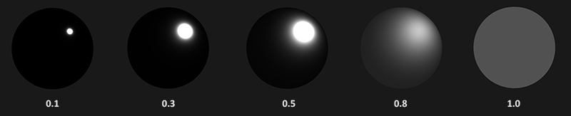
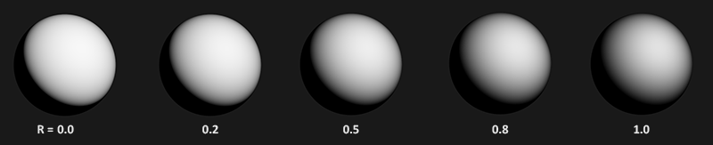

# Fiziksel Tabanlı İşleme: Teori (PBR Theory) 🔬

Son yıllarda AAA video oyunlarında (Unreal Engine, Frostbite, Cyberpunk 2077) ve 3B modelleme yazılımlarında (Blender, Substance Painter) grafik dünyasını tamamen ele geçiren bir terim duyuyoruz: **PBR (Physically Based Rendering - Fiziksel Tabanlı İşleme)**.

PBR, Phong veya Blinn-Phong gibi yaklaşık tahminler yapmak yerine, ışığın ve malzemenin **gerçek fizik kanunlarına (Optik ve Termodinamik)** dayalı olarak simüle edilmesidir. 

Bir PBR malzemesi yaptığınızda en büyük sihir şudur: Malzemeniz ister güneşli bir çölde, ister karanlık bir zindanda, ister neon ışıklı bir şehirde olsun, **her ışıklandırma koşulunda fotogerçekçi ve kusursuz** görünür!

---

## PBR'ın 3 Temel Fizik Kuralı 📜

1. **Mikro Yüzey Teorisi (Microfacet Theory):**
   Mikroskobik ölçekte hiçbir yüzey tamamen pürüzsüz değildir; milyonlarca minik ayna parçacığından (*microfacets*) oluşur. Pürüzlülük (*Roughness*) arttıkça bu parçacıklar ışığı her yöne saçar:
   
   

2. **Enerjinin Korunumu Kanunu (Energy Conservation):**
   Bir yüzeyden yansıyan ışık miktarı, yüzeye çarpan ışıktan **asla daha fazla olamaz**!
   Çarpan ışık ikiye ayrılır:
   * **Aynasal Yansıma ($k_s$):** Doğrudan yüzeyden seken ışık.
   * **Kırılan / Yaygın Işık ($k_d$):** Malzemenin içine girip emilen ya da saçılan ışık.
   $$k_d + k_s = 1.0$$
   Metaller neredeyse tüm kırılan ışığı anında emer; bu yüzden saf metallerde yaygın (*diffuse*) renk yoktur!

3. **Fiziksel Tabanlı BRDF (Cook-Torrance):**
   Yansımayı hesaplayan formül:
   $$f_r = k_d f_{lambert} + k_s f_{cook-torrance}$$

### Cook-Torrance Aynasal Formülünün 3 Bileşeni (D, G, F):
* **D (Normal Dağılım Fonksiyonu - Trowbridge-Reitz GGX):** Mikro yüzeylerin kaçının ışığı kameraya yansıtacak açıda durduğunu hesaplar (Parlama keskinliğini belirler).
* **G (Geometri Fonksiyonu - Smith Schlick-GGX):** Mikro yüzeylerin birbirini kapatıp gölgelemesini (*shadowing*) hesaplar:
  
* **F (Fresnel Denklemi - Fresnel-Schlick):** Işığın yüzeye teğet çarpma açısına göre yansımanın nasıl güçlendiğini hesaplar (Bir göle tepeden bakınca dibini görürsünüz, ama ufka doğru teğet bakınca su ayna gibi gökyüzünü yansıtır!):
  

---

Sırada bu matematiği çalışan bir Fragment Shader'a dönüştüreceğimiz **Bölüm 2: "PBR Aydınlatma"** var!

👉 **[Sonraki Bölüm: PBR Aydınlatma](02-aydinlatma.md)**
