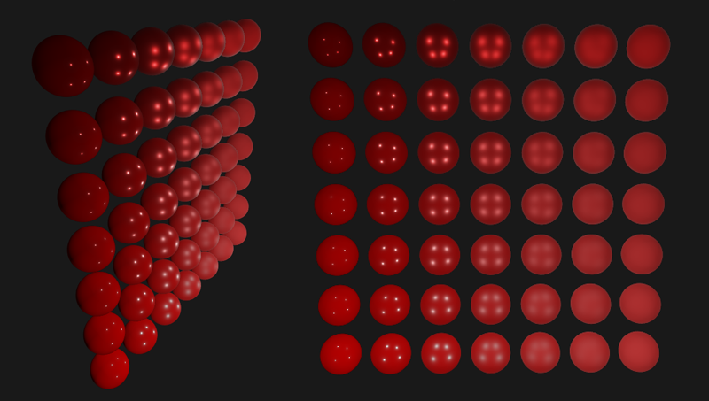
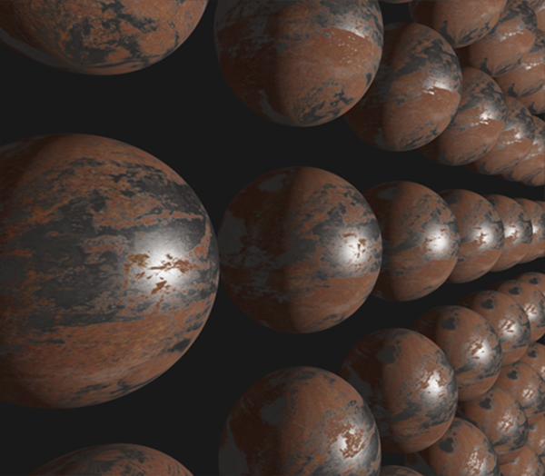

# PBR Aydınlatma (PBR Direct Lighting) 💡

Önceki bölümde öğrendiğimiz Cook-Torrance BRDF teorisini çalışan bir GLSL Fragment Shader'a dönüştürme vakti geldi!

PBR iş akışında geleneksel "ortam, yaygın, aynasal" dokuları yerine, fiziksel malzeme parametreleri kullanılır:
* **Albedo (Temel Renk):** Malzemenin saf yüzey rengi (gölgesiz ve ışıksız).
* **Metallic (Metalsellik):** $0.0$ (Metal olmayan / Dielektrik) ile $1.0$ (Saf metal) arası değer.
* **Roughness (Pürüzlülük):** $0.0$ (Kusursuz pürüzsüz ayna) ile $1.0$ (Zımpara kağıdı gibi mat) arası değer.
* **AO (Ambient Occlusion):** Yüzey çatlaklarının temas gölgeleri.

---

## PBR Fragment Shader Kodlaması 🛠️

```glsl
#version 330 core
out vec4 FragColor;
in vec2 TexCoords;
in vec3 WorldPos;
in vec3 Normal;

// Malzeme parametreleri
uniform vec3 albedo;
uniform float metallic;
uniform float roughness;
uniform float ao;

// Işıklar
uniform vec3 lightPositions[4];
uniform vec3 lightColors[4];
uniform vec3 camPos;

const float PI = 3.14159265359;

// 1. Normal Dağılım Fonksiyonu (GGX)
float DistributionGGX(vec3 N, vec3 H, float roughness) {
    float a = roughness*roughness;
    float a2 = a*a;
    float NdotH = max(dot(N, H), 0.0);
    float NdotH2 = NdotH*NdotH;
    float nom   = a2;
    float denom = (NdotH2 * (a2 - 1.0) + 1.0);
    denom = PI * denom * denom;
    return nom / denom;
}

// 2. Geometri Fonksiyonu (Schlick-GGX)
float GeometrySchlickGGX(float NdotV, float roughness) {
    float r = (roughness + 1.0);
    float k = (r*r) / 8.0;
    return NdotV / (NdotV * (1.0 - k) + k);
}

float GeometrySmith(vec3 N, vec3 V, vec3 L, float roughness) {
    float NdotV = max(dot(N, V), 0.0);
    float NdotL = max(dot(N, L), 0.0);
    float ggx2 = GeometrySchlickGGX(NdotV, roughness);
    float ggx1 = GeometrySchlickGGX(NdotL, roughness);
    return ggx1 * ggx2;
}

// 3. Fresnel Fonksiyonu (Fresnel-Schlick)
vec3 fresnelSchlick(float cosTheta, vec3 F0) {
    return F0 + (1.0 - F0) * pow(clamp(1.0 - cosTheta, 0.0, 1.0), 5.0);
}
```

---

## Nihai Aydınlatma Döngüsü 🔄

Her ışık kaynağı için parlaklığı (*radiance*) hesaplayıp toplarız:

```glsl
void main()
{
    vec3 N = normalize(Normal);
    vec3 V = normalize(camPos - WorldPos);

    vec3 F0 = vec3(0.04); 
    F0 = mix(F0, albedo, metallic);

    vec3 Lo = vec3(0.0);
    for(int i = 0; i < 4; ++i) 
    {
        vec3 L = normalize(lightPositions[i] - WorldPos);
        vec3 H = normalize(V + L);
        float distance = length(lightPositions[i] - WorldPos);
        float attenuation = 1.0 / (distance * distance);
        vec3 radiance = lightColors[i] * attenuation;

        // Cook-Torrance BRDF
        float NDF = DistributionGGX(N, H, roughness);   
        float G   = GeometrySmith(N, V, L, roughness);      
        vec3 F    = fresnelSchlick(clamp(dot(H, V), 0.0, 1.0), F0);
           
        vec3 numerator    = NDF * G * F; 
        float denominator = 4.0 * max(dot(N, V), 0.0) * max(dot(N, L), 0.0) + 0.0001;
        vec3 specular = numerator / denominator;
        
        vec3 kS = F;
        vec3 kD = vec3(1.0) - kS;
        kD *= 1.0 - metallic;	                
            
        float NdotL = max(dot(N, L), 0.0);                
        Lo += (kD * albedo / PI + specular) * radiance * NdotL;
    }   
    
    vec3 ambient = vec3(0.03) * albedo * ao;
    vec3 color = ambient + Lo;

    // HDR Ton Eşleme ve Gama Düzeltmesi
    color = color / (color + vec3(1.0));
    color = pow(color, vec3(1.0/2.2)); 

    FragColor = vec4(color, 1.0);
}
```

Sonuç nefes kesicidir: Farklı metalsellik ve pürüzlülükteki küreler adeta gerçek altın, gümüş, plastik ve kauçuk gibi davranır!




---

Sırada çevre manzarasının fotogerçekçi ışık saçmasını sağlayan **Bölüm 3: "Görüntü Tabanlı Aydınlatma (IBL)"** var!

👉 **[Sonraki Bölüm: IBL Yaygın Işınım](03-yaygin-isima.md)**
