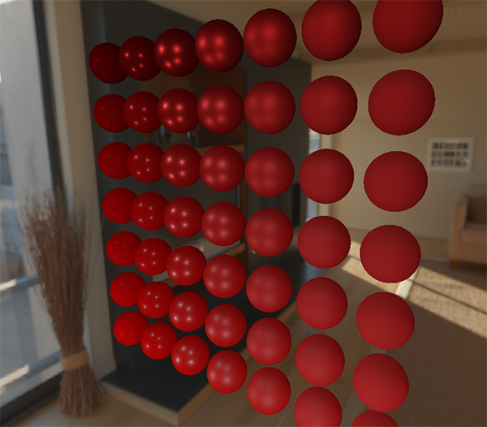

# Görüntü Tabanlı Aydınlatma (IBL) - Yaygın Işınım (Diffuse Irradiance)

Önceki bölümde ortam ışığını sabit bir renkle (`vec3(0.03)`) geçiştirdik. Ancak gerçek dünyada bir nesne, içinde bulunduğu odanın, gökyüzünün ve çevresindeki tüm nesnelerin yaydığı ışıkla aydınlanır.

**Görüntü Tabanlı Aydınlatma (Image Based Lighting - IBL)**, sahneyi çevreleyen $360^\circ$ yüksek dinamik aralıklı bir çevre görselini (HDRI panorama) devasa bir ışık kaynağı olarak kullanma tekniğidir!

---

## Yaygın Işınım (Diffuse Irradiance) Mantığı

Bir yüzey noktası $\mathbf{P}$, yüzey normali $\mathbf{N}$ etrafındaki tüm yarıküreden (hemisphere) gelen ışığı toplar:

$$L_o(p, \phi_o, \theta_o) = \frac{k_d c}{\pi} \int_{0}^{2\pi} \int_{0}^{\frac{\pi}{2}} L_i(p, \phi_i, \theta_i) \cos(\theta) \sin(\theta) d\theta d\phi$$

Bu integrali her piksel için gerçek zamanlı hesaplamak binlerce doku okuması gerektirir ve sistemi dondurur.

Bunun yerine integrali **önceden hesaplarız (Pre-computation / Convolution)**:
Çevre haritasını alıp yarıküre boyunca bulanıklaştırarak her pikseline o yöndeki ortalama gelen ışığı (Irradiance) yazarız!



---

## HDRI Eşdikdörtgen Haritayı Küp Haritasına Çevirme

İnternetten indirilen `.hdr` dosyaları düz 2B eşdikdörtgen (equirectangular) formattadır. Bunu OpenGL küp haritasına çevirmek için bir küp çizer ve küpün içine kamera koyarak 6 yöne render alırız:

```glsl linenums="1" title="equirectangular_to_cubemap.frag"
vec2 SampleSphericalMap(vec3 v)
{
    vec2 uv = vec2(atan(v.z, v.x), asin(v.y));
    uv *= vec2(0.1591, 0.3183); // 1 / 2PI ve 1 / PI
    uv += 0.5;
    return uv;
}
```

---

## Kıvrım (Convolution) Shader'ı

Yarıküre üzerinde Riemann toplamı ile küp haritasını evriştiririz (convolve):

```glsl linenums="1" title="irradiance_convolution.frag"
#version 330 core
out vec4 FragColor;
in vec3 WorldPos;

uniform samplerCube environmentMap;
const float PI = 3.14159265359;

void main()
{		
    vec3 N = normalize(WorldPos);
    vec3 irradiance = vec3(0.0);   
    
    vec3 up    = vec3(0.0, 1.0, 0.0);
    vec3 right = normalize(cross(up, N));
    up         = normalize(cross(N, right));
       
    float sampleDelta = 0.025;
    float nrSamples = 0.0;
    
    // Yarıküre üzerinde döngü
    for(float phi = 0.0; phi < 2.0 * PI; phi += sampleDelta)
    {
        for(float theta = 0.0; theta < 0.5 * PI; theta += sampleDelta)
        {
            // Küresel koordinatları teğet uzaya çevir
            vec3 tangentSample = vec3(sin(theta) * cos(phi),  sin(theta) * sin(phi), cos(theta));
            // Teğet uzaydan dünya uzayına
            vec3 sampleVec = tangentSample.x * right + tangentSample.y * up + tangentSample.z * N; 

            irradiance += texture(environmentMap, sampleVec).rgb * cos(theta) * sin(theta);
            nrSamples++;
        }
    }
    irradiance = PI * irradiance * (1.0 / float(nrSamples));
    
    FragColor = vec4(irradiance, 1.0);
}
```

Oluşan bu **Yaygın Işınım Haritasını (Irradiance Map)** kullanarak artık PBR shader'ında ortam aydınlatmasını tek satırda hesaplayabiliriz:

```glsl
vec3 irradiance = texture(irradianceMap, N).rgb;
vec3 diffuse    = irradiance * albedo;
vec3 ambient    = (kD * diffuse) * ao;
```
