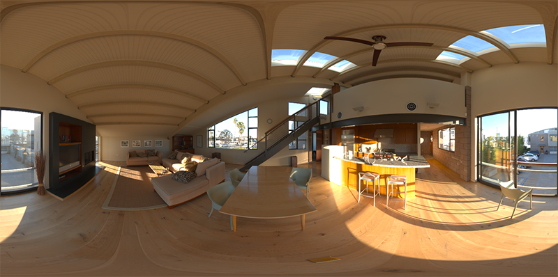
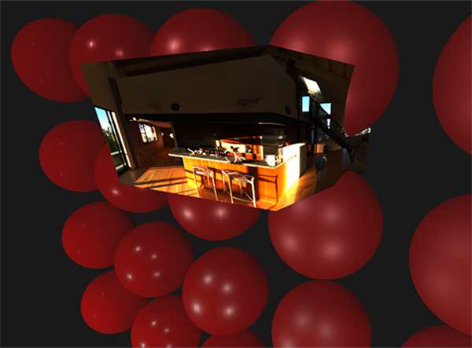
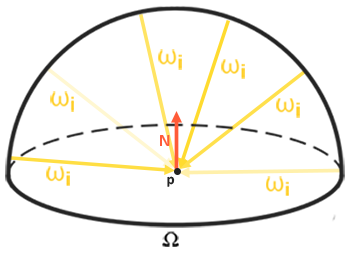

# IBL: Yaygın Işınım (Diffuse Irradiance) 🌐☀️

Gerçek dünyada nesneler sadece 3-4 ampulden ışık almaz; gökyüzünün mavisinden, yerdeki çimlerin yeşilinden, odadaki kırmızı koltuktan seken **çevreleyen tüm evrenden ışık alır**!

İşte gerçek bir 360 derecelik HDR çevre fotoğrafını alıp, sahnedeki nesneler için devasa bir ışık kaynağı olarak kullanma tekniğine **IBL (Image-Based Lighting - Görüntü Tabanlı Aydınlatma)** denir.

---

## 1. Eşit Dikdörtgensel Haritayı Küp Haritasına Çevirme 🔄

Panoramik 2B HDR haritalarını (`.hdr`) küresel bir FBO ile 6 yüzlü bir Küp Haritasına dönüştürürüz:

---

## 2. Işınım Konvolüsyonu (Irradiance Convolution) 🌀

Küre şeklindeki her bir normal yönü için gökyüzünün o yöne denk gelen yarım küresindeki (*hemisphere*) tüm ışık piksellerini integral alarak toplarız:

Ortaya çıkan bu bulanıklaşmış küp haritasına **Işınım Haritası (Irradiance Map)** denir. 

Artık sabit `vec3(0.03)` ortam ışığı yerine, nesnemizin her pikseli doğrudan gökyüzünden gerçekçi ortam ışığı alır:

---

Sırada pürüzsüz metallerin gökyüzünü kusursuz yansıtmasını sağlayan **Bölüm 4: "Aynasal IBL"** var!

👉 **[Sonraki Bölüm: Aynasal IBL](04-aynasal-ibl.md)**
