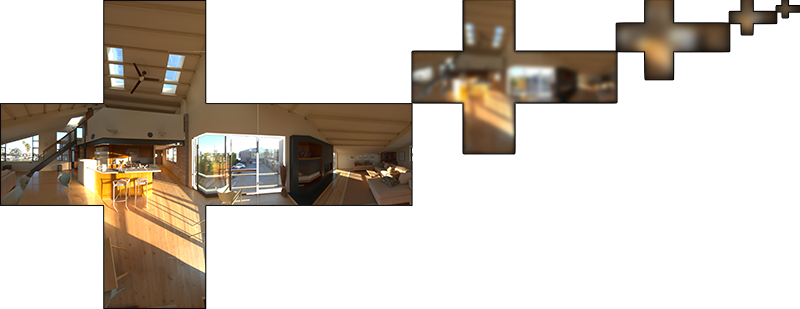
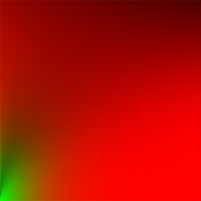
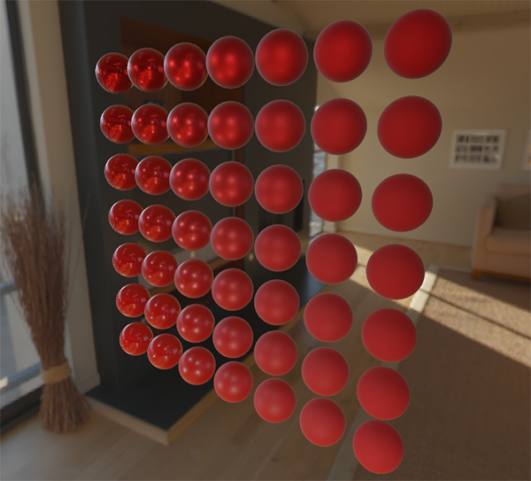
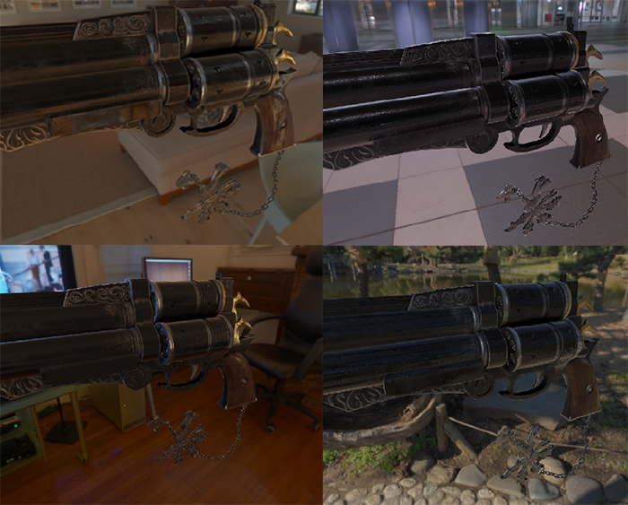

# Aynasal IBL (Specular IBL) 🪞✨

Yaygın ışınım mat nesneler için harikadır; ancak parlak bir altın veya cilalı bir kılıç gökyüzündeki bulutları ve güneşi **ayna gibi yansıtmalıdır**!

Epic Games (Unreal Engine) ekibi tarafından geliştirilen **Bölünmüş Toplam Yaklaşımı (Split-Sum Approximation)** sayesinde, aynasal IBL integralini gerçek zamanlı 60 FPS'te çözebiliriz.

---

## Split-Sum Yaklaşımının 2 Parçası ✌️

1. **Önceden Filtrelenmiş Çevre Haritası (Prefiltered Environment Map):**
   Gökyüzü dokusunun Mipmap piramidine farklı pürüzlülük (*roughness*) seviyelerinde bulanıklaştırılmış kopyalarını kaydederiz. Pürüzlülük arttıkça GPU daha yüksek Mipmap seviyesinden örnekleme yapar!
2. **BRDF Entegrasyon Haritası (2D LUT):**
   Fresnel ve geometri tepkisini önceden hesaplayıp küçük bir 2B dokuya (Lookup Table) yazarız:
   

---

## Nihai PBR + IBL Şaheseri 🏆

Fragment Shader'da yaygın ve aynasal IBL bileşenlerini birleştirdiğimizde, sinema filmlerindeki fotogerçekçiliğe ulaşırız:

Tebrikler! Modern oyun motorlarının en tepe grafik teknolojisini baştan sona fethettiniz!
