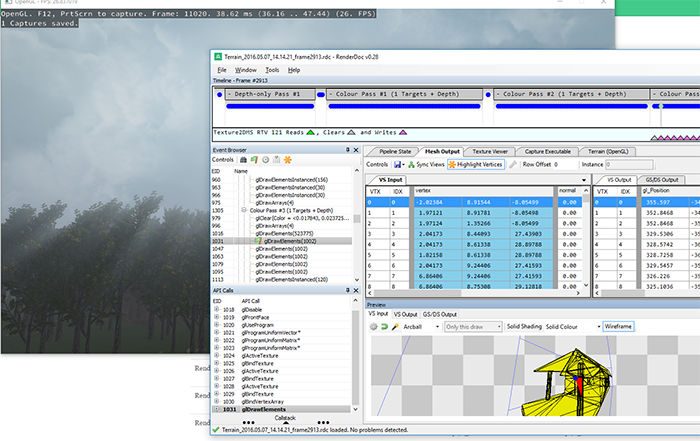
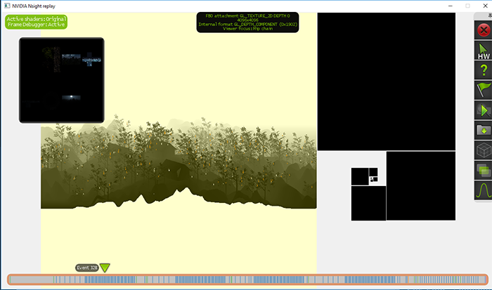

# Grafik Programlamada Hata Ayıklama (Debugging) 🔍🐞

OpenGL'de bir hata yaptığınızda genellikle ekrana hiçbir şey gelmez; sadece kapkara bir pencereyle baş başa kalırsınız! 

Bu bölümde profesyonel grafik mühendislerinin kullandığı hata ayıklama tekniklerini ve araçlarını öğreneceğiz.

---

## 1. `glGetError()`: Klasik Hata Sorgulama ⚠️

Şüphelendiğiniz çağrıların ardına şu fonksiyonu yerleştirerek donanım hata kodlarını yakalayabilirsiniz:

```cpp
GLenum err;
while((err = glGetError()) != GL_NO_ERROR)
{
    std::cout << "OpenGL Hatası: " << err << std::endl;
}
```

---

## 2. Modern OpenGL Hata Çıktısı (`glDebugMessageCallback`) 🚀

OpenGL 4.3+ ile gelen bu harika özellik sayesinde, bir hata oluştuğunda GPU sürücüsü **otomatik olarak sizin C++ fonksiyonunuzu çağırır** ve hatanın hangi satırda, neden oluştuğunu konsola yazdırır:

```cpp
glEnable(GL_DEBUG_OUTPUT);
glEnable(GL_DEBUG_OUTPUT_SYNCHRONOUS); 
glDebugMessageCallback(glDebugOutput, nullptr);
```

---

## 3. Endüstri Standardı Hata Ayıklama Araçları 🛠️

Profesyonel oyun stüdyolarında grafik hatalarını çözmek için harici analiz araçları kullanılır:

* **RenderDoc (Açık Kaynak & En Popüler):** Tek bir karenin tüm çizim çağrılarını (*draw calls*), tampon belleklerini, dokularını ve vertex verilerini adım adım dondurup incelemenizi sağlar!
  
* **NVIDIA Nsight Graphics:** NVIDIA ekran kartları için kare kare performans profilleme ve shader hata ayıklayıcısı.
  

---

Sırada ekrana skor ve metin yazacağımız **Bölüm 2: "Metin Çizimi"** var!

👉 **[Sonraki Bölüm: Metin Çizimi](02-metin-cizimi.md)**
