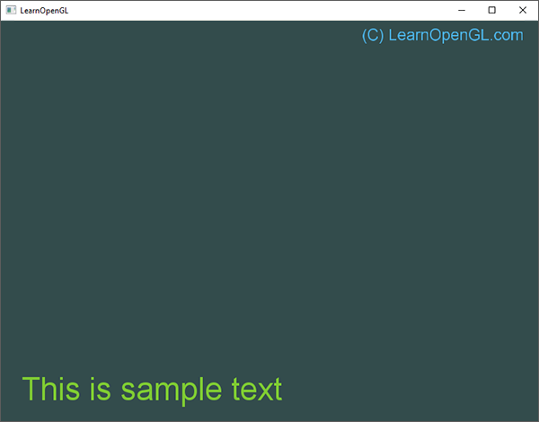
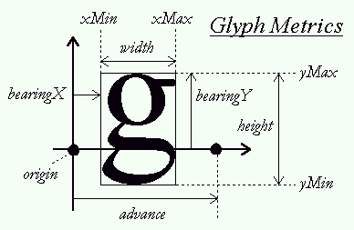

# Metin Çizimi (Text Rendering & FreeType) 🔤

Bir video oyununda ekrana can barı, skor, diyaloglar veya menü seçenekleri yazdırmadan oyun yapmak imkansızdır.

Ancak OpenGL doğrudan "yazı yazma" fonksiyonuna sahip değildir. Metin çizmek için popüler açık kaynaklı font kütüphanesi **FreeType**'ı kullanırız!



---

## Font Glifleri (Glyphs) ve Karakter Metrikleri 📐

FreeType, TrueType (`.ttf`) font dosyalarını okur ve her bir harfin (glif) bitmap görüntüsünü ve metriklerini çıkarır:



```cpp
struct Character {
    unsigned int TextureID; // Glifin doku kimliği
    glm::ivec2   Size;      // Glifin genişlik ve yüksekliği
    glm::ivec2   Bearing;   // Orijinden sol/üst ofset
    unsigned int Advance;   // Bir sonraki harfe yatay uzaklık
};

std::map<char, Character> Characters;
```

---

## Ekrana Dinamik Yazı Yazdırma ✍️

Render döngüsünde istediğiniz koordinata renkli yazılar yazdırabilirsiniz:

```cpp
void RenderText(Shader &s, std::string text, float x, float y, float scale, glm::vec3 color)
{
    // Her bir harf için 2D bir dörtgen oluştur ve dokusunu çiz...
}

// Kullanım:
RenderText(shader, "SKOR: 15400", 25.0f, 25.0f, 1.0f, glm::vec3(0.5, 0.8f, 0.2f));
```

---

Sırada öğrendiğimiz her şeyi birleştirip baştan sona tam bir oyun yapacağımız **Bölüm 3: "2B Breakout Oyunu"** var!

👉 **[Sonraki Bölüm: 2B Breakout Oyunu](03-2b-oyun-breakout.md)**
