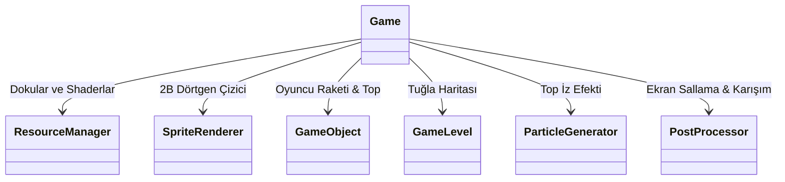

# 2B Breakout Oyunu Mimarisi

LearnOpenGL rehberi boyunca öğrendiğimiz tüm grafik prensiplerini gerçek bir projede taçlandırmak için klasik **Breakout (Tuğla Kırma)** oyununu modern C++ ve saf OpenGL ile sıfırdan inşa ediyoruz!

Bu proje; oyun döngüsü, varlık yönetimi, 2B çizim motoru, fizik çarpışmaları ve görsel efektlerin bir araya geldiği eksiksiz bir oyun mimarisi örneğidir.

---

## Oyun Mimarisi ve Sınıf Yapısı



---

## 1. 2B Sprite Renderer (Sprite Çizici)

Tüm 2B oyunlar ekranı kaplayan dokulu dikdörtgenlerden (Sprite) oluşur. Belleği yormamak için tek bir birim kare VAO oluşturur ve konum/boyut/dönme dönüşümlerini Model Matrisi ile shader'a aktarırız:

```cpp linenums="1" title="sprite_renderer.cpp"
void SpriteRenderer::DrawSprite(Texture2D &texture, glm::vec2 position, 
                               glm::vec2 size, float rotate, glm::vec3 color)
{
    this->shader.Use();
    glm::mat4 model = glm::mat4(1.0f);

    // 1. Öteleme
    model = glm::translate(model, glm::vec3(position, 0.0f));  

    // 2. Kendi merkezi etrafında döndürme
    model = glm::translate(model, glm::vec3(0.5f * size.x, 0.5f * size.y, 0.0f)); 
    model = glm::rotate(model, glm::radians(rotate), glm::vec3(0.0f, 0.0f, 1.0f)); 
    model = glm::translate(model, glm::vec3(-0.5f * size.x, -0.5f * size.y, 0.0f));

    // 3. Boyutlandırma
    model = glm::scale(model, glm::vec3(size, 1.0f)); 

    this->shader.SetMatrix4("model", model);
    this->shader.SetVector3f("spriteColor", color);

    glActiveTexture(GL_TEXTURE0);
    texture.Bind();

    glBindVertexArray(this->quadVAO);
    glDrawArrays(GL_TRIANGLES, 0, 6);
    glBindVertexArray(0);
}
```

---

## 2. AABB - Daire Çarpışma Tespiti (Collision Detection)

Top (bir daire) ile tuğlalar (eksen hizalı dikdörtgenler / AABB) arasındaki çarpışmayı tespit etmek için, daire merkezine en yakın dikdörtgen noktasını **kırparak (clamp)** buluruz:

```cpp linenums="1" title="Çarpışma Algoritması"
Collision CheckCollision(BallObject &one, GameObject &two) // Daire - AABB
{
    glm::vec2 center(one.Position + one.Radius);
    glm::vec2 aabb_half_extents(two.Size.x / 2.0f, two.Size.y / 2.0f);
    glm::vec2 aabb_center(two.Position.x + aabb_half_extents.x, two.Position.y + aabb_half_extents.y);

    glm::vec2 difference = center - aabb_center;
    glm::vec2 clamped = glm::clamp(difference, -aabb_half_extents, aabb_half_extents);

    glm::vec2 closest = aabb_center + clamped;
    difference = closest - center;

    if (glm::length(difference) < one.Radius)
        return std::make_tuple(true, VectorDirection(difference), difference);
    else
        return std::make_tuple(false, UP, glm::vec2(0.0f, 0.0f));
}
```

---

## 3. Görsel Efektler ve Post-Processing

Oyunun profesyonel görünmesi için 3 özel görsel sistem ekleriz:
1. **Parçacık Üreteci (Particle Generator):** Top hareket ederken arkasında sönen ve küçülen ateş parçacıkları bırakır.
2. **PostProcessor (Ekran Sallantısı & Efektler):** Oyuncu can kaybettiğinde veya blok kırıldığında tüm ekranı hafifçe sarsan (Chaos/Shake), renkleri tersine çeviren (Invert) veya bulanıklaştıran Framebuffer efektleri.
3. **Güçlendirmeler (Power-ups):** Tuğlalardan düşen hızlandırma, ekstra can, yapışkan raket ve delici top bonusları.

---

## Sonuç: Başarılı Bir Oyun Geliştiricisi Yolculuğu!

Bu projeyi tamamladığınızda yalnızca OpenGL komutlarını ezberlemiş olmazsınız; gerçek bir oyun mimarisinin veri yapılarını, matematiksel fiziğini, gölgelendirmesini ve performans optimizasyonunu baştan sona bizzat inşa etmiş olursunuz.

Tebrikler, artık modern bilgisayar grafiklerinin zirvesindesiniz! 🚀
